## Page 41

# Architecture

This chapter describes the DWC_ether_qos interfaces, protocols, functionality, and implementation. It
contains the following sections:
“CSR Slave Interface” on page 42
“Application Master Interface” on page 49
“DMA Controller” on page 64
“MAC Transaction Layer” on page 83
“MAC” on page 118
“Interrupts” on page 145

| Synopsys, Inc. | 41 |
| --- | --- |
| 5.10a Synopsys, Inc. SolvNet December 2017 DesignWare.com |  |

## Page 42

### CSR Slave Interface

You can access the CSR space by specifying a CSR slave interface in coreConsultant.
The CSR slave interface provides access to the CSR space.
You can select a slave interface by using the CSR Interface option in coreConsultant. The DWC_ether_qos
can have one of the following slave interfaces:
AHB Slave interface
AXI3 or AXI4-Lite slave interface
APB, APB3, or APB4 slave interface
MCI slave interface
By default, all the slave interfaces of DWC_ether_qos except MCI slave interface (which do not have
provision for providing error response) will provide OKAY response to all CSR accesses. If SEEN bit of
MAC_CSR_SW_Ctrl register is programmed to 1, DWC_ether_qos will provide error response when
reserved registers within the CSR space are accessed.

### 2.1.1

### AHB Slave Interface

The AHB slave is supported in the EQOS-AHB and EQOS-AXI configurations. The 32-bit AHB slave
interface provides access to the DMA, MTL, and MAC CSR space. The AHB slave interface supports the
following features:
Fully AMBA 2.0 Compliant AHB slave—no restrictions
Single and all burst transfers
Busy and early terminations
32-bit, 16-bit, and 8-bit write or read transfers to the CSR
The 32-bit CSR access is recommended to avoid any software synchronization problems.
OKAY response
The SPLIT or RETRY responses are not supported. When a reserved address is read in MAC register
space, it gives all zeros data and generates an OKAY response (When SEEN bit is set, MAC generates
ERROR response). Similarly, when a reserved address is written, the DWC_ether_qos ignores the
write request and generates an OKAY response (When SEEN bit is set, MAC generates ERROR
response).
2.1.1.1
AHB Slave Port Timing
Figure 2-1 shows a register write access (to address 0x001C) followed by a register read access (to address
0x1014) on the AHB slave port. The waveform is as per the AMBA 2.0 specification. The AHB slave port
completes all read and write transfers in three clocks and therefore, hready_o is DE-asserted for two clocks
for any register access. The AHB slave port supports burst operations, and the timing response remains the
same (three clocks for completion of any read or write cycle).

| 42 | Synopsys, Inc. |
| --- | --- |
|  | SolvNet Synopsys, Inc. 5.10a DesignWare.com December 2017 |

## Page 43

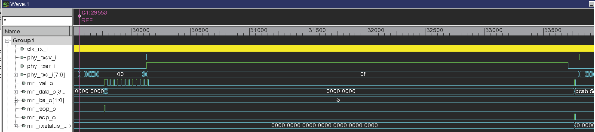

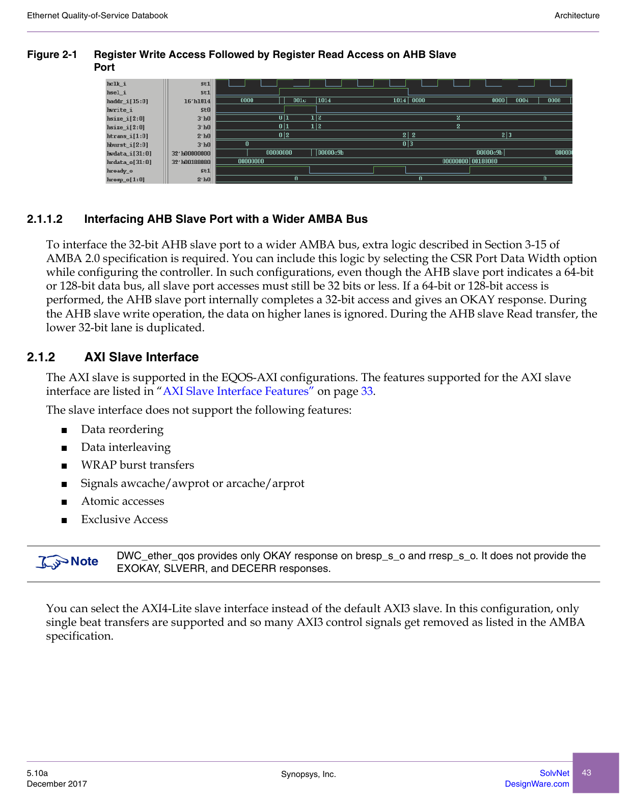

2.1.1.2
Interfacing AHB Slave Port with a Wider AMBA Bus
To interface the 32-bit AHB slave port to a wider AMBA bus, extra logic described in Section 3-15 of
AMBA 2.0 specification is required. You can include this logic by selecting the CSR Port Data Width option
while configuring the controller. In such configurations, even though the AHB slave port indicates a 64-bit
or 128-bit data bus, all slave port accesses must still be 32 bits or less. If a 64-bit or 128-bit access is
performed, the AHB slave port internally completes a 32-bit access and gives an OKAY response. During
the AHB slave write operation, the data on higher lanes is ignored. During the AHB slave Read transfer, the
lower 32-bit lane is duplicated.

### 2.1.2

### AXI Slave Interface

The AXI slave is supported in the EQOS-AXI configurations. The features supported for the AXI slave
interface are listed in “AXI Slave Interface Features” on page 33.
The slave interface does not support the following features:
Data reordering
Data interleaving
WRAP burst transfers
Signals awcache/awprot or arcache/arprot
Atomic accesses
Exclusive Access
DWC_ether_qos provides only OKAY response on bresp_s_o and rresp_s_o. It does not provide the
EXOKAY, SLVERR, and DECERR responses.

|  | Note |
| --- | --- |

You can select the AXI4-Lite slave interface instead of the default AXI3 slave. In this configuration, only
single beat transfers are supported and so many AXI3 control signals get removed as listed in the AMBA
specification.

| Synopsys, Inc. | 43 |
| --- | --- |
| 5.10a Synopsys, Inc. SolvNet December 2017 DesignWare.com |  |

## Page 44

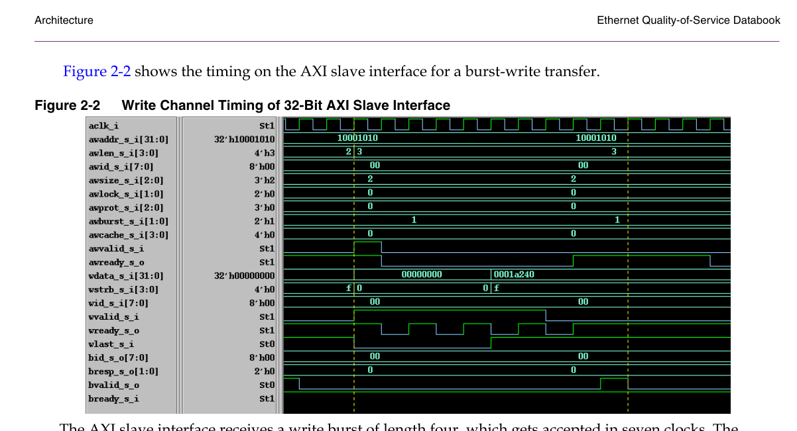

The AXI slave interface receives a write burst of length four, which gets accepted in seven clocks. The
respective write response takes additional three clocks. Similarly, a single write transfer gets completed in
four clocks, as shown in Figure 2-3.

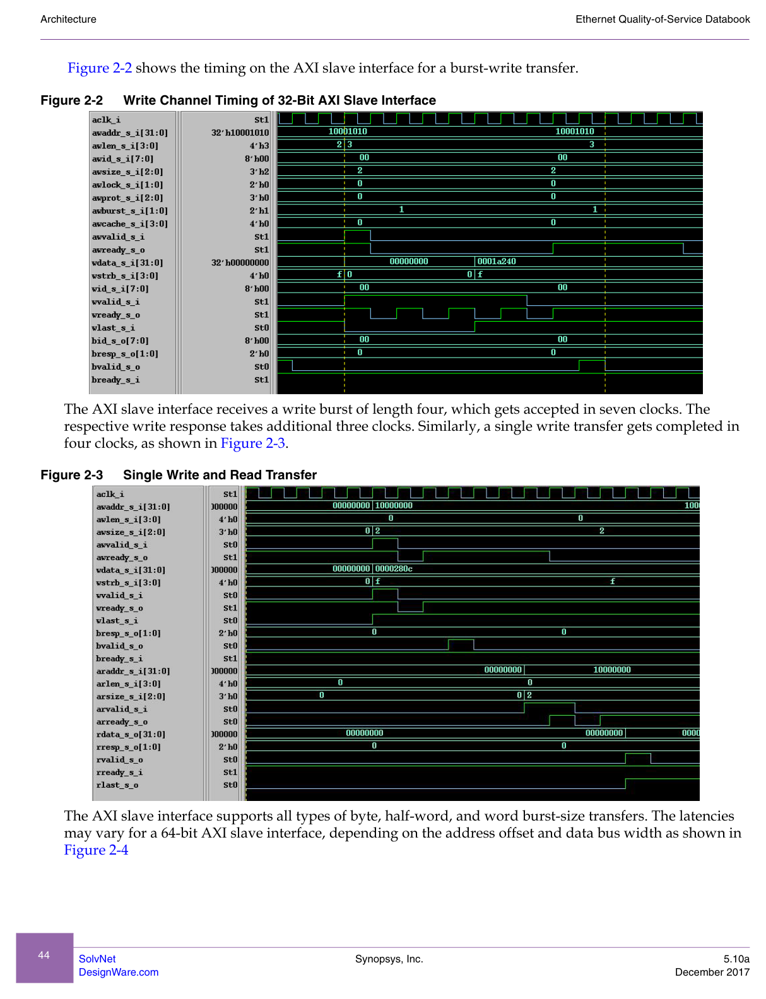

The AXI slave interface supports all types of byte, half-word, and word burst-size transfers. The latencies
may vary for a 64-bit AXI slave interface, depending on the address offset and data bus width as shown in
Figure 2-4

| 44 | Synopsys, Inc. |
| --- | --- |
|  | SolvNet Synopsys, Inc. 5.10a DesignWare.com December 2017 |

## Page 45

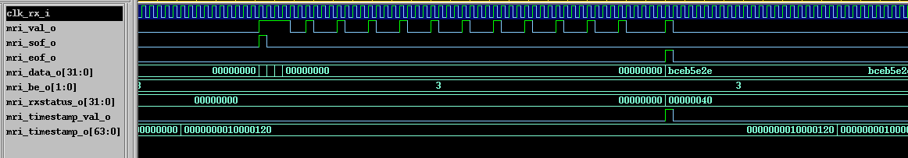

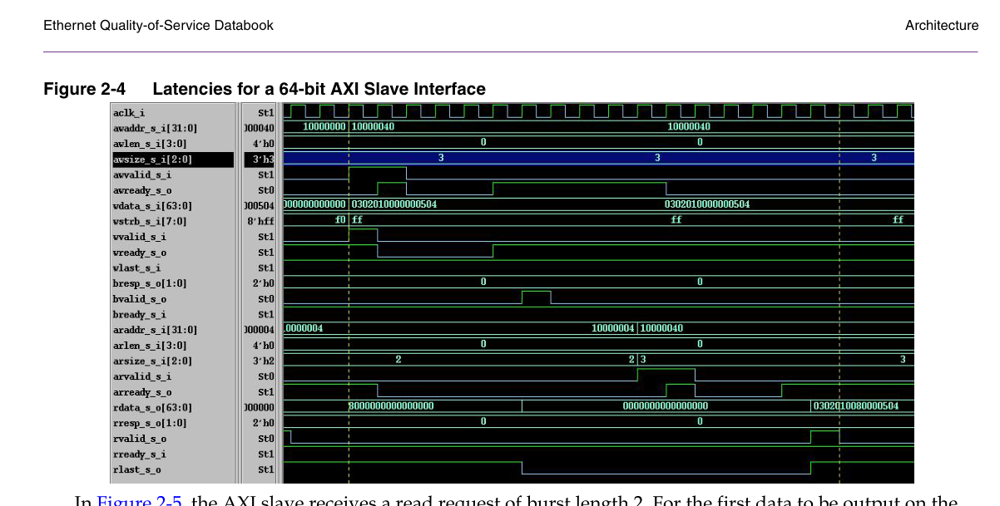

In Figure 2-5, the AXI slave receives a read request of burst length 2. For the first data to be output on the
AXI bus, the latency is four clocks. The remaining beats are output two clocks after the AXI master accepts
the previous beat. In the AXI-read channel, the latencies depend on the burst length, data bus width, and the
address offset.

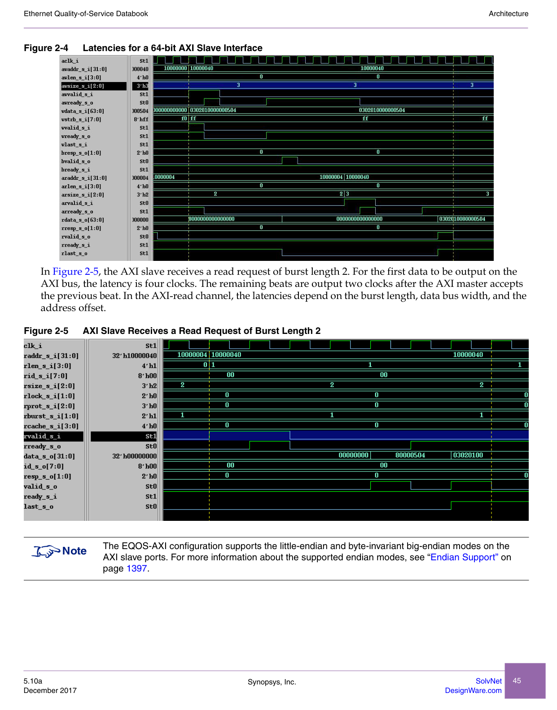

The EQOS-AXI configuration supports the little-endian and byte-invariant big-endian modes on the
AXI slave ports. For more information about the supported endian modes, see “Endian Support” on
page 1397.

|  | Note |
| --- | --- |

| Synopsys, Inc. | 45 |
| --- | --- |
| 5.10a Synopsys, Inc. SolvNet December 2017 DesignWare.com |  |

## Page 46

### 2.1.3

### APB, APB3, and APB4 Slave Interface

The APB, APB3, or APB4 slave interfaces are supported in all configurations. You can enable an APB port to
access the DMA, MTL, and MAC CSR space.
This topic discusses the following sections:
“APB Port Timing” on page 46
“APB3 Port Timing” on page 46
“APB4 Port Timing” on page 47
2.1.3.1
APB Port Timing

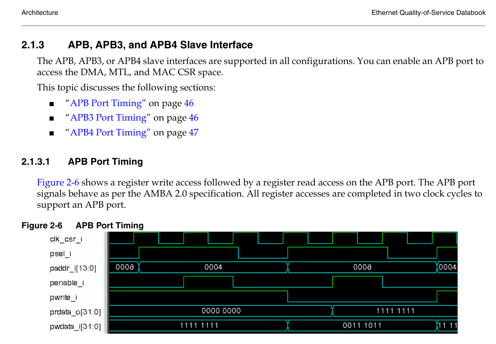

2.1.3.2
APB3 Port Timing

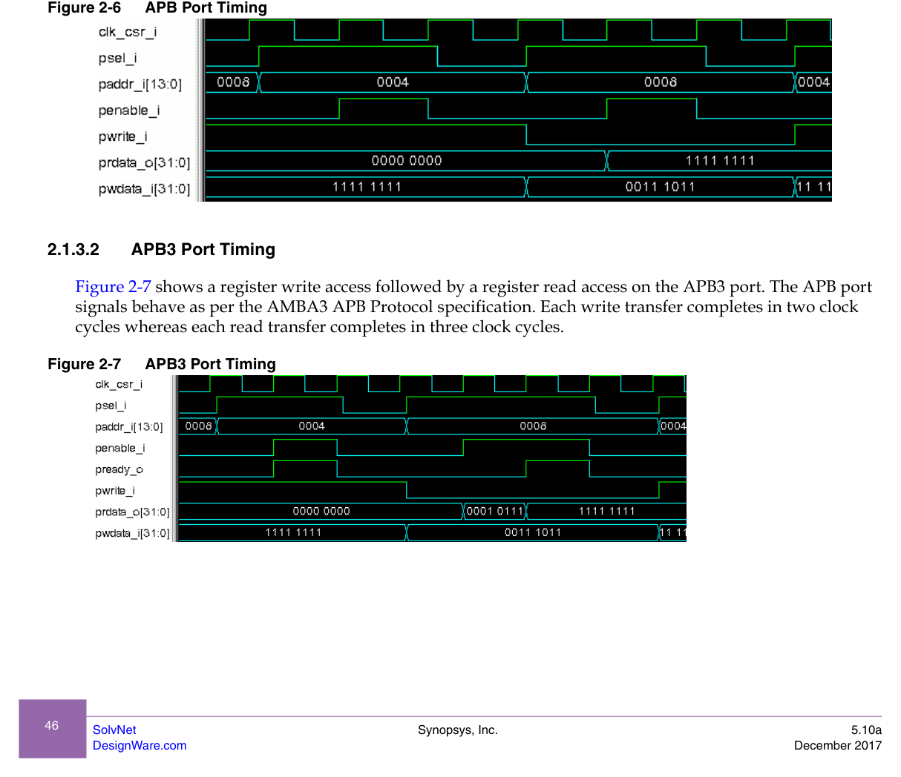

| 46 | Synopsys, Inc. |
| --- | --- |
|  | SolvNet Synopsys, Inc. 5.10a DesignWare.com December 2017 |

## Page 47

2.1.3.3
APB4 Port Timing
Figure 2-8 shows a register write access followed by a register read access on the APB4 port. The APB port
signals behave as per the AMBA4 APB Protocol specification. Each write transfer completes in two clock
cycles whereas each read transfer completes in three clock cycles. The pstrb_i signal enables the byte to be
written.

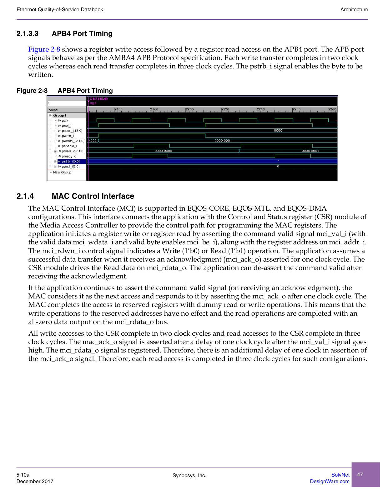

### 2.1.4

### MAC Control Interface

The MAC Control Interface (MCI) is supported in EQOS-CORE, EQOS-MTL, and EQOS-DMA
configurations. This interface connects the application with the Control and Status register (CSR) module of
the Media Access Controller to provide the control path for programming the MAC registers. The
application initiates a register write or register read by asserting the command valid signal mci_val_i (with
the valid data mci_wdata_i and valid byte enables mci_be_i), along with the register address on mci_addr_i.
The mci_rdwn_i control signal indicates a Write (1’b0) or Read (1’b1) operation. The application assumes a
successful data transfer when it receives an acknowledgment (mci_ack_o) asserted for one clock cycle. The
CSR module drives the Read data on mci_rdata_o. The application can de-assert the command valid after
receiving the acknowledgment.
If the application continues to assert the command valid signal (on receiving an acknowledgment), the
MAC considers it as the next access and responds to it by asserting the mci_ack_o after one clock cycle. The
MAC completes the access to reserved registers with dummy read or write operations. This means that the
write operations to the reserved addresses have no effect and the read operations are completed with an
all-zero data output on the mci_rdata_o bus.
All write accesses to the CSR complete in two clock cycles and read accesses to the CSR complete in three
clock cycles. The mac_ack_o signal is asserted after a delay of one clock cycle after the mci_val_i signal goes
high. The mci_rdata_o signal is registered. Therefore, there is an additional delay of one clock in assertion of
the mci_ack_o signal. Therefore, each read access is completed in three clock cycles for such configurations.

| Synopsys, Inc. | 47 |
| --- | --- |
| 5.10a Synopsys, Inc. SolvNet December 2017 DesignWare.com |  |

## Page 48

2.1.4.1
MCI Port Timing

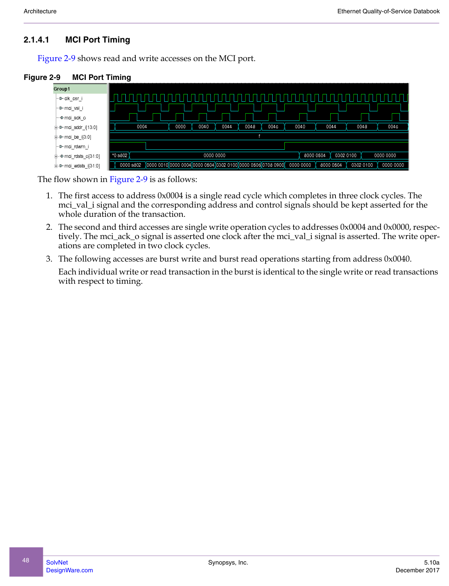

The flow shown in Figure 2-9 is as follows:
1. The first access to address 0x0004 is a single read cycle which completes in three clock cycles. The
mci_val_i signal and the corresponding address and control signals should be kept asserted for the
whole duration of the transaction.
2. The second and third accesses are single write operation cycles to addresses 0x0004 and 0x0000, respec-
tively. The mci_ack_o signal is asserted one clock after the mci_val_i signal is asserted. The write oper-
ations are completed in two clock cycles.
3. The following accesses are burst write and burst read operations starting from address 0x0040.
Each individual write or read transaction in the burst is identical to the single write or read transactions
with respect to timing.

| 48 | Synopsys, Inc. |
| --- | --- |
|  | SolvNet Synopsys, Inc. 5.10a DesignWare.com December 2017 |

## Page 49

### Application Master Interface

The DMA Controller interfaces with the application through one of the following interfaces:
“AHB Master Interface” on page 49
“AXI Master Interface” on page 54
“AXI4 Master Interface” on page 60
“AXI Low-Power Interface” on page 60

### 2.2.1

### AHB Master Interface

In the EQOS-AHB configuration, the DMA controller interfaces with the application through the AMBA
AHB interface. The AHB master interface controls the data transfers and the AHB slave interface accesses
the CSR space.
The DMA can be used in the 32-bit, 64-bit, and 128-bit embedded applications where the DMA is required
to optimize the data transfer between the MAC and the system memory. For information about the data
transfers in little-endian and big-endian modes, see “Area and Power” on page 1387.
This section covers the following topics:
“AHB Master Interface Features” on page 49
“Burst Length Modes” on page 50
“Aligning AHB Burst Transfers to An Address Value” on page 51
“AHB Memory Read” on page 51
“AHB Memory Write” on page 52
“Early Burst Termination” on page 52
“Error Response and Fatal Bus Error Interrupt” on page 52
“Split or Retry Response” on page 53
“Descriptor Write Back” on page 53
2.2.1.1
AHB Master Interface Features
The AHB master interface converts the internal DMA request cycles into AHB cycles. The AHB master
interface has the following features:
The AHB master interface is AMBA 2.0-compliant AHB master with no restrictions
The AHB master interface supports the following burst length modes: fixed, unspecified, and mixed.
These modes are explained in the “Burst Length Modes” on page 50.
The AHB slaves interfacing with the AHB master support the SINGLE and INCR transfers.
The AHB master interface can handle the AHB SPLIT, RETRY, and ERROR conditions. Any ERROR
response halts all further transactions for that DMA and indicates the error as fatal through CSR and
interrupt. The application can choose to give a hard or soft reset to the module to restart the operation.
The AHB master interface can handle the AHB 1K boundary breaking.
The AHB master interface can handle all 32-bit, 64-bit, or 128-bit data transfers (according to the data
bus width configuration), except for Descriptor Status Write accesses (which may be 32-bit).
In any burst data transfer, the address bus value is always aligned to the data bus width and need not
be aligned to the beat size.

| Synopsys, Inc. | 49 |
| --- | --- |
| 5.10a Synopsys, Inc. SolvNet December 2017 DesignWare.com |  |

## Page 50

The AHB master interface can align all AHB burst transfers to an address value. For more information,
see “Aligning AHB Burst Transfers to An Address Value” on page 51.
The DMA requests an AHB Burst Read transfer only when it can completely accept the received burst
data. The data read from the AHB is always pushed into the DMA without any delay or Busy cycles.
However, when multiple channels are selected, there may be some delay and Busy cycles may be
inserted because of the shared-memory architecture for the channels.
The DMA requests an AHB Burst Write transfer only when it has the sufficient data to completely
transfer the burst. The AHB interface always assumes that it has the data available to push into the
AHB bus. However, the DMA can prematurely indicate end-of-valid data (because of the transfer of
EOP of an Ethernet packet) during the burst.
In Fixed Burst Length mode, the AHB master interface continues the burst with dummy data until the
specified length is completed. In INCR mode, it ends the burst transfer prematurely.
2.2.1.2
Burst Length Modes
The AHB master interface supports the following burst length modes:
Fixed Burst Length
In fixed burst length mode, the AHB master always initiates a burst with SINGLE, INCR4, INCR8, or
INCR16 type. However, when such a burst is responded with SPLIT, RETRY, or Early Burst Termina-
tion (EBT), by default, the AHB master again initiates the pending transfers of the burst with INCR or
SINGLE burst length type. When only one beat is remaining, the AHB master performs a SINGLE
transfer. If more than one beat is remaining, the AHB master performs an INCR transfer. The AHB
master terminates such INCR bursts when remaining beats of the original requested fixed burst are
transferred.
To ensure that the AHB master always performs the INCRx and SINGLE transfers even when a part
of the burst is initiated again after a SPLIT, RETRY, or EBT response, use the RIB bit of the DMA_Mode
register. However, when you enable this mode, the pending burst may further get split into multiple
transfers as per the following rules before any new transfer is initiated:
If the DMA requests a burst transfer that is not equal to INCR4, INCR8, or INCR16, the AHB appli-
cation interface splits the transfer into multiple burst transactions. For example, if the DMA
requests a 15-beat burst transfer, the AHB interface splits it into multiple transfers of INCR8 and
INCR4, and three SINGLE transactions.
If the burst length is more than 16, the AHB master interface splits it into multiple burst transfers.
For example, if the burst length is 32 and the DMA starts a 32-beat transfer, the AHB master splits
the burst into two INCR16.
Unspecified Burst Length
In unspecified burst mode, the AHB master always initiates a transfer with INCR and completes the
DMA requested burst in one transfer.
Mixed Burst Mode
In mixed burst mode, the AHB master always initiates the bursts with fixed-size (INCRx) when the
DMA requests transfers of size less than or equal to 16 beats. When the DMA requests bursts of length
more than 16, the AHB master initiates such transfers with INCR and completes the request in one
transfer.
To ensure that the pending burst of a transfer is rebuilt only with INCRx transfers when an INCRx
transfer is interrupted by RETRY, SPLIT, or EBT response, use the RB bit of the DMA_SysBus_Mode

| 50 | Synopsys, Inc. |
| --- | --- |
|  | SolvNet Synopsys, Inc. 5.10a DesignWare.com December 2017 |

## Page 51

register. However, if an INCR burst initiated in this mode is interrupted, the AHB master rebuilds the
burst only with INCR transfers.
You can choose the burst modes by programming the FB bit in the DMA_SysBus_Mode register.
The AHB master does not generate the WRAP bursts, and locked or protected transfers. Therefore,
the DWC_ether_qos does not have the HLOCK or HPROT output signals.

|  | Note |
| --- | --- |

2.2.1.3
Aligning AHB Burst Transfers to An Address Value
The AHB master interface can align all AHB burst transfers to an address value.
You can enable aligning all AHB burst transfers to an address value, by using the AAL bit in the
DMA_SysBus_Mode register. If Bit 0 and Bit 12 of DMA_SysBus_Mode register are set to1, the AHB
interface and the DMA ensure that all initiated beats are aligned to the address, completing the packet
transfer in the minimum number of required beats.
For example, in 32-bit data bus mode, if the start address of a data buffer transfer is 0xF000_0008 and the
DMA is configured for a maximum beat size of 16, the AHB transfers occur in the following sequence:
1. Two SINGLE transfers at addresses 0xF000_0008 and 0xF000_000C
2. One INCR 4 transfer at address 0xF000_0010
3. One INCR 8 transfer at address 0xF000_0020
4. All subsequent beats are INCR 16 transfers starting from address 0xF000_0040
For an address-aligned INCR 16 transfer, the six least-significant bits of the address must be 0.
Similarly, the AHB interface and the DMA split such unaligned address beats for a 64-bit (or 128-bit) data
bus and initiate INCR16 beats only when the seven (or eight) least-significant bits of the address have a zero
value.
2.2.1.4
AHB Memory Read

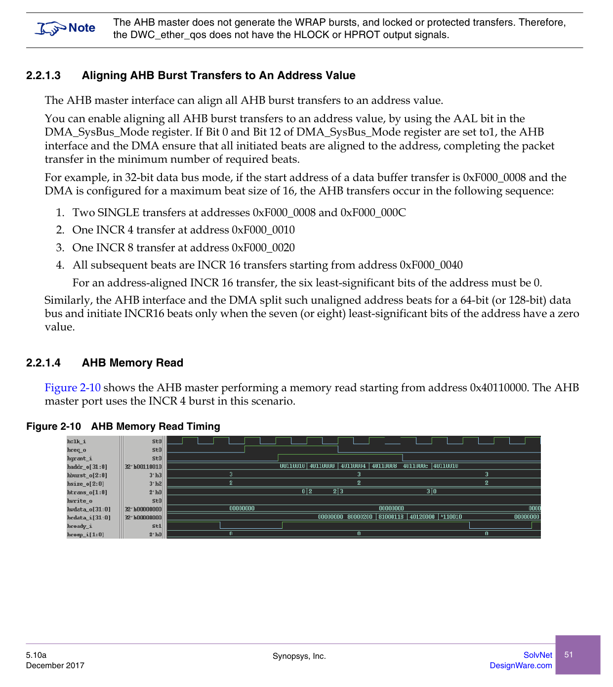

| Synopsys, Inc. | 51 |
| --- | --- |
| 5.10a Synopsys, Inc. SolvNet December 2017 DesignWare.com |  |

## Page 52

2.2.1.5
AHB Memory Write
Figure 2-11 shows the AHB master performing a burst memory write transaction, starting from address
0x401252F4. This data transfer corresponds to an Ethernet packet being written to the system memory by
the Rx DMA. The AHB master uses the INCR4 burst. The data bus does not change values for last two beats
in the INCR4 transaction. This is because the DMA to the AHB master port internally gave the EOP of the
packet with the second beat transfer. Because the AHB master started a fixed INCR4 burst, it completes the
burst with dummy data (same data) for last two beats.

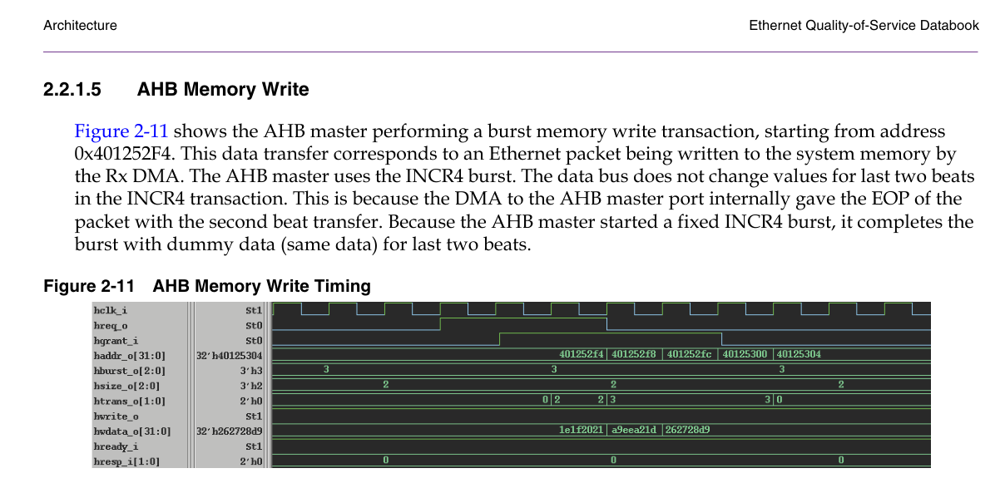

2.2.1.6
Early Burst Termination

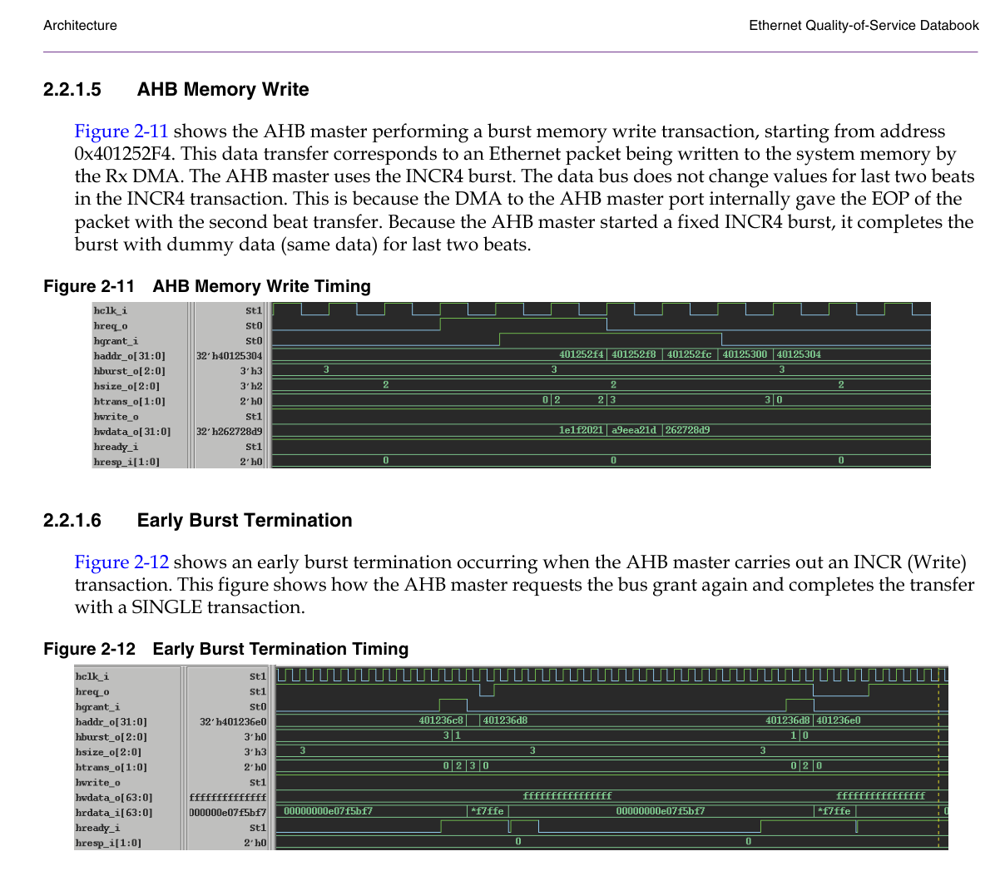

2.2.1.7
Error Response and Fatal Bus Error Interrupt
Figure 2-13 shows the behavior of the AHB master when an error response is received. The DUT tries to
carry out the INCR 4 transaction. However, it receives a two-cycle error response during the data phase of
the first beat. The sbd_intr_o interrupt is asserted as a result of this response. For more information about
the interrupt functions, see “Interrupts” on page 145.

| 52 | Synopsys, Inc. |
| --- | --- |
|  | SolvNet Synopsys, Inc. 5.10a DesignWare.com December 2017 |

## Page 53

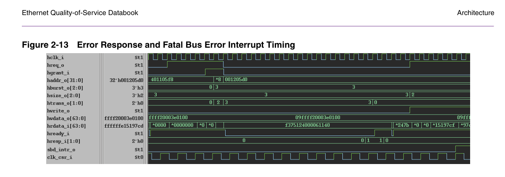

2.2.1.8
Split or Retry Response
Figure 2-14 shows how the AHB master port reacts to a split or retry response (to address 0x00120560)
during a transaction. The AHB master receives a two-cycle retry response and immediately reconstructs the
transaction and requests for the bus by again asserting the hreq_o signal. The hreq_o signal is de-asserted
only for one cycle when the retry or split response is sampled in the first cycle of the two-cycle response.
The behavior remains same for Split response but the second request (hreq_o) from this master is masked in
the AHB arbiter until the corresponding AHB slave is ready with the data.

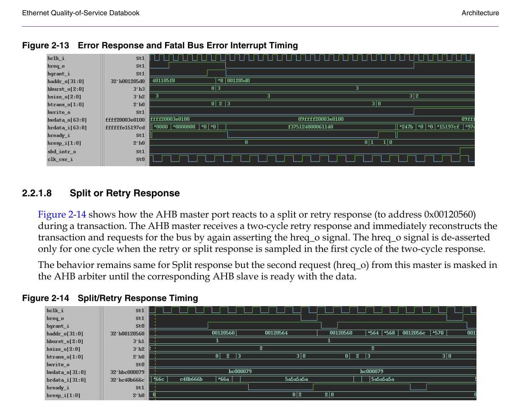

2.2.1.9
Descriptor Write Back
Figure 2-15 shows a descriptor being closed on a 64-bit AHB at address 0x40110050. For a big-endian
configuration, only 32-bit status is written back to the memory and this appears on upper 32-bits of the
hwdata_o bus. For a little-endian configuration, the 32-bit descriptor data appears on lower 32 bits of 64-bit
AHB bus.

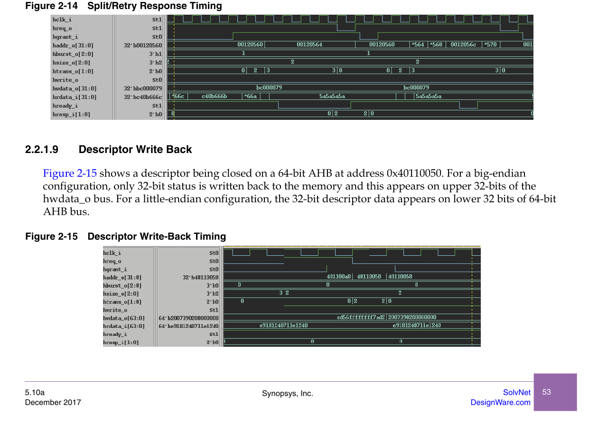

| Synopsys, Inc. | 53 |
| --- | --- |
| 5.10a Synopsys, Inc. SolvNet December 2017 DesignWare.com |  |

## Page 54

### 2.2.2

### AXI Master Interface

In the EQOS-AXI configuration, the DMA controller interfaces with the application through the AMBA 3
AXI interface. The AMBA 3 AXI bus interface provides the characteristics to support highly-effective data
traffic throughput. The system bus utilization is maximized by allowing simultaneous read and write
transfers initiated from different DMA channels. For example, the Tx descriptor read and Rx descriptor
write-back (status update) operations can happen simultaneously. However, the Tx descriptor read and Tx
descriptor write-back operations cannot happen simultaneously because the Tx DMA (or Rx DMA) does not
initiate the next transfer unless the previous one is complete.
The AXI master interface allows multiple numbers of burst requests to be queued for Read or Write
operation. The system bus utilization can be further enhanced by supporting Requests reordering and Data
interleaving. This gives the AXI master the flexibility to dynamically and independently select multiple
slaves for handling Priority Requests and Slow peripheral slaves. The EQOS-AXI configuration also
supports the low-power interface defined in the AXI specification.
You can select AXI4 compatible interface also. This interface has additional signals and capabilities as
compared to the AXI3 signal interface.

|  | Note |
| --- | --- |

“Burst Splitting and Burst Selection” on page 54
“INCR Burst Type” on page 55
“INCR_ALIGNED Burst Type” on page 55
“Outstanding Transactions” on page 56
“Priority of AXI Requests” on page 56
“Bursts Reordering and Data Interleaving” on page 56
“AXI-ID Translation” on page 57
“Endianess Support” on page 57
“Posted Writes” on page 57
“Error Response Handling” on page 58
“AXI Memory Read” on page 58
“AXI Memory Write” on page 59
“AXI Early Burst Termination” on page 59
2.2.2.1
Burst Splitting and Burst Selection
In DWC_ether_eqos, the AXI master can split the DMA requests into multiple bursts, in the AXI system bus.
The AXI master splits the DMA requests into multiple bursts on the AXI system bus. Splitting is based on
the DMA count, the software-controllable burst enable bits (FB, BLEN256, BLEN128, BLEN64, BLEN32,
BLEN16, BLEN8, BLEN4), and the software-controllable burst types (INCR and INCR_ALIGNED). For
more information, see DMA_SysBus_Mode register.
The AXI master also handles splitting the transfers that cross 4 KB address boundary, with an option to limit
it to 1-KB address boundary. The Burst Length Select Priority is in the following sequence: FB, BLEN256,
BLEN128, BLEN64, BLEN32, BLEN16, BLEN8, and BLEN4.

| 54 | Synopsys, Inc. |
| --- | --- |
|  | SolvNet Synopsys, Inc. 5.10a DesignWare.com December 2017 |

## Page 55

The DWC_ether_qos supports the burst length of up to 256 beats in AXI3 and AXI4 modes although
the maximum burst length specified in the AXI3 standard is 16 beats. You can configure the maximum
burst length (16, 32, 64, 128, or 256) allowed on the AXI bus by using the AXI Maximum Burst Length
option in coreConsultant. This feature is provided for the systems which require larger than 16-beats
burst length for optimum utilization of the bus bandwidth.

|  | Note |
| --- | --- |

2.2.2.2
INCR Burst Type
If FB is disabled, the AXI master always chooses the maximum allowed burst length based on the BLEN256,
BLEN128, BLEN64, and BLEN32 bits (possible maximum burst lengths are 256, 128, 64, 32, or 16). The AXI
master chooses a burst length of any value less than the maximum enabled burst length (all lesser burst
length enables are redundant) in the following cases:
The DMA requests are not multiples of the maximum allowed burst length
The 4K/1K address boundary crossing condition is enabled
For example, when only BLEN64, BLEN16, and BLEN4 are enabled, and the DMA requests a burst transfer
of 102 beats size, the AXI master splits it into two bursts of 64 and 38 beats size, respectively.
If FB is enabled, the burst length is based on the priority of the enabled bits in the following order: BLEN256,
BLEN128, BLEN64, BLEN32, BLEN16, BLEN8, and BLEN4. When the DMA requests to transfer a burst, the
AXI interface splits the requested bursts into multiple transfers by using only the enabled burst lengths.
This splitting can occur in following cases:
The requested burst is not a multiple of the maximum enabled burst
The 4K/1K address boundary crossing condition is enabled
If the AXI interface cannot choose any of the enabled burst lengths, it selects the burst length as 1. For
example, if only BLEN64, BLEN16, and BLEN4 are enabled and the DMA requests a burst transfer of
size102 beats, the AXI interface splits it into multiple bursts of size 64, 16, 16, 4, 1, and 1 beats, respectively.
The sequence is in decreasing burst lengths.
2.2.2.3

### INCR_ALIGNED Burst Type

When the address-aligned burst type is enabled, then in addition to the burst splitting conditions explained
in INCR Burst Type, the AXI interface splits the DMA requested bursts such that each burst length is
aligned to the least significant bits of the start address. The AXI interface initially generates smaller bursts so
that the remaining transfers can be transferred with the maximum possible (enabled) fixed burst lengths.
For example, in the same setting as explained earlier for FB (BLEN64, BLEN16 and BLEN4 are enabled), the
DMA requests a burst of size 102 beats at the start address of 0x0000_03A4 (32-bit bus). The AXI master
starts the first transfer with size 23 such that the address of the next burst is aligned (0x0000_0400) for a
burst of 64. Therefore, the sequence of bursts is 23, 64, and 15, respectively.
When FB is set, the sequence of burst transfers is 1, 1, 1, 4, 16, 64, 4, 4, 4, 1, 1, and 1 in same scenario,
respectively. The sequence of smaller bursts at the beginning aligns the address to the next higher enabled
burst lengths programmed in the register.

| Synopsys, Inc. | 55 |
| --- | --- |
| 5.10a Synopsys, Inc. SolvNet December 2017 DesignWare.com |  |

## Page 56

2.2.2.4
Outstanding Transactions
The AXI master supports configurable outstanding read/write requiests on the AXI bus. You can control the
outstanding requests by programming the DMA_SysBus_Mode register.
The AXI master supports up to 4, 8, or 16 (configurable in coreConsultant) outstanding Read or Write
requests on the AXI bus. You can also control these outstanding requests through software by programming
Bits[24:21] and Bits[19:16] in the DMA_SysBus_Mode register. This is a useful workaround for any
system-level issues with handling of multiple requests.
The maximum number of outstanding requests is divided equally between the requests generated by
the two internal masters (Rx DMA and Tx DMA). This means that when you select eight outstanding
AXI requests while configuring the core, each DMA is limited to a maximum of four outstanding
requests in each Read or Write channel. When you reduce the outstanding request (for example, to
four) by programming the respective control bits, all outstanding requests can be from the same DMA.
The minimum number of outstanding requests per channel is two.

|  | Note |
| --- | --- |

2.2.2.5
Priority of AXI Requests
The descriptor transfers have higher priority than the data transfers. Therefore, if there are two requests, Rx
Descriptor Read and Tx Data Read, the Rx Descriptor Read is given higher priority so that the next Rx Data
Write (subsequent to Rx Descriptor Read) need not wait for the Tx Data Read transfer to complete. If there
are descriptor read requests from both DMAs, these requests are serviced based on the first-come first-serve
basis. The Rx DMA has higher priority if descriptor read requests, generated from both DMAs, are in the
same clock. Similarly, in the write channel, descriptor writes from any DMA have higher priority than the
data-write transfers for the Rx DMA.
When you enable the AV or DCB feature, the DMA may contain multiple channels. If the requests are
generated from different channels simultaneously in the same clock, the request priority among the
channels is: Channel 7 (if present), Channel 6,..., Channel 1, and Channel 0.
The Maximum outstanding requests on the AXI is limited to parameter
DWCXG_AXI_GM_MAX_RD_REQUESTS and DWCXG_AXI_GM_MAX_WR_REQUESTS
corresponding to Read and Write Channels respectively. You can limit this by programming
RD_OSR_LMT and WR_OSR_LMT of DMA_SysBus_Mode register.

|  | Note |
| --- | --- |

2.2.2.6
Bursts Reordering and Data Interleaving
The AXI protocol allows reordering of data transfers with different AXI-IDs with respect to the sequence of
requests. It also allows data interleaving between transfers of different AXI-IDs for Read channels.
In EQOS-AXI configurations, the requests from each internal master (Rx DMA and Tx DMA) are generated
with different AXI-ID. Therefore, reordering and data interleaving can be performed as two DMAs operate
independently and are allocated different address space on the slave memory.
The AXI master supports reordering and interleaving from the AXI slaves on the Read channel. Each DMA
internally ensures that a Read request and Write request is never generated at the same time to the same
address (it can occur for only descriptor accesses). The Tx DMA ensures that Tx Descriptor Read, Tx Data
Read, and Tx Descriptor Write-Back requests are generated only after the previous requests are complete.

| 56 | Synopsys, Inc. |
| --- | --- |
|  | SolvNet Synopsys, Inc. 5.10a DesignWare.com December 2017 |

## Page 57

The Rx DMA generates only Descriptor reads on the Read channel with a different ID. Therefore, data
reordering and interleaving on the Read channel does not cause any problems in the MAC.
The AXI master does not support data reordering and interleaving on the Write channel which is
compliant with the latest AXI 4 specification.

|  | Note |
| --- | --- |

2.2.2.7
AXI-ID Translation
The AXI master selects unique IDs for each DMA channel and also for each Tx/Rx DMA channel. The AXI
master selects the IDs as follows:
AXI Master ID[0] = 0
Rx DMA access for Read and Write
AXI Master ID[0] = 1
Tx DMA access for Read and Write
AXI Master ID[3:1] = 0, 1, 2, 3, 4, 5, 6, or 7
DMA channel number when multiple DMA channels are present, that is, when you select the AV or
DCB feature. Otherwise, it is hardwired to zeros.
The AXI system bus ID width is configurable. The default width for the AXI master is 4 bits. The unused
bits are hardwired to zeros. The default width for the AXI slave interface is 8 bits.

|  | Note |
| --- | --- |

2.2.2.8
Endianess Support
The AXI master supports the little-endian and byte-invariant big-endian modes on the AXI master ports.
The AXI master does not support narrow transfers and always performs full data-width transfers. For more
information about the supported endian modes, see “Endian Support”.
2.2.2.9
Posted Writes
In posted writes, the write channel of AXI master transfers an OKAY response to the DMA as soon as the
last cycle or beat of data is accepted by the AXI interconnect. The AXI master sends this response without
waiting for the response from the target AXI slave on the write response channel. In non-posted writes, the
AXI master interface transfers the response received from the AXI slave channel to the DMA.
For transferring the Ethernet data to system memory, the Rx DMA always issues posted write requests to
the AXI master interface. This enables pipelining of the data requests without delays. The AXI master does
not support out-of-order write transfers. However, the Rx DMA ensures that the sequence is maintained for
descriptor writes, descriptor reads, and data transfers.
For writing descriptors (status or timestamp), the DMA always issues the non-posted write requests. This is
needed because the Transfer Complete Interrupt is generated based on the descriptor writes for which the
DMA needs completion response from the memory slave. This ensures no race condition between the
hardware and the software because the interrupt is generated only after the data and descriptor are written
to the slave memory.

| Synopsys, Inc. | 57 |
| --- | --- |
| 5.10a Synopsys, Inc. SolvNet December 2017 DesignWare.com |  |

## Page 58

For data transfer to system memory, the Rx DMA always issues posted writes. So, after the data is
accepted by AXI interconnect, DMA moves out of Buffer data write state to descriptor write state
without waiting for the response from the target AXI slave, on the write response channel. Therefore,
after the ERROR response for the previous buffer write is received, DMA initiates a Descriptor Write
and captures ERROR status (received during Descriptor Write) as bus error, into the CSR space.

|  | Note |
| --- | --- |

2.2.2.10
Error Response Handling
Whenever there is an error response from the AXI slave (as shown in Figure 2-16 with rresp_m_i[1:0] = 3),
the respective DMA channel which generated the request gets disabled. The AXI master asserts the
interrupt (sbd_intr_o in Figure 2-16) when the corresponding “Fatal Bus Error” interrupt is enabled. Only
the DMA whose specific transaction had the error response gets affected and goes to STOP state. The
application can re-initialize that specific DMA and restart the operation. The traffic on the other channels
does not get affected if an error is detected for a DMA Channel.

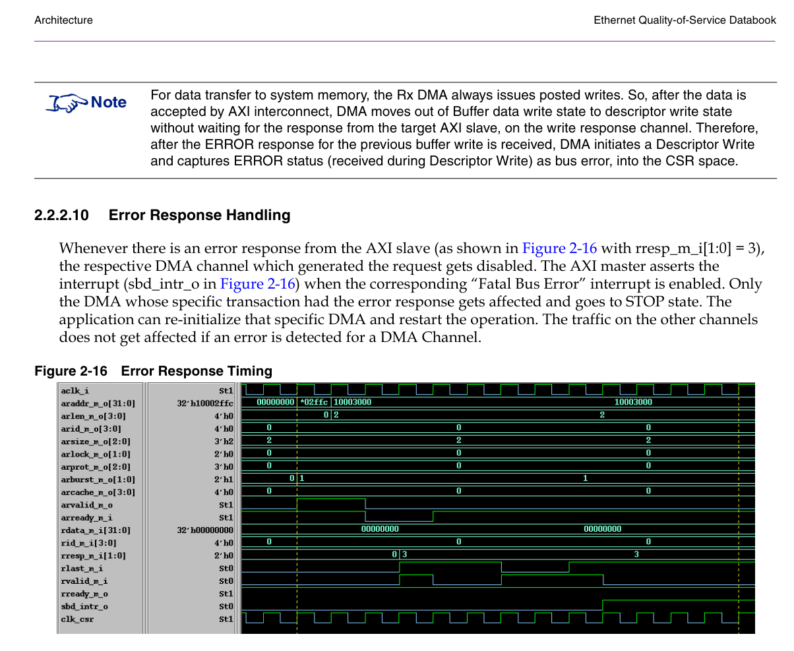

2.2.2.11
AXI Memory Read
Figure 2-17 shows the AXI master read timings. Two requests are placed for ID 0 and ID 1. The Read data is
interleaved by the interconnect (by way of ID 0 and ID 1) and received by the AXI master. The Tx DMA in
AXI master always ensures that it has enough space in its FIFO to accept the requested burst of data.
Therefore, the r_ready_m_o response is always high.

| 58 | Synopsys, Inc. |
| --- | --- |
|  | SolvNet Synopsys, Inc. 5.10a DesignWare.com December 2017 |

## Page 59

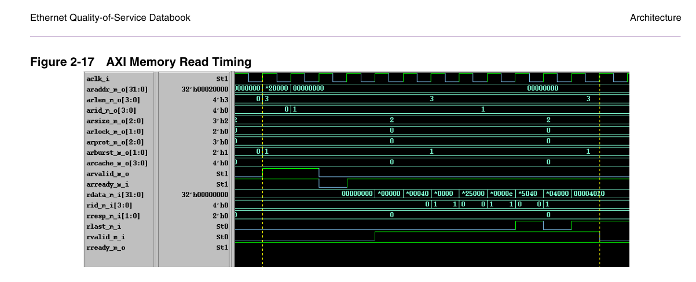

2.2.2.12
AXI Memory Write
Figure 2-18 shows the AXI write interface diagram. There are two requests for ID0. These requests are
issued with burst lengths of 16 and 2. The latency between the first write request and the corresponding first
data is two clocks. The Rx DMA ensures that it always has the requested burst of data available in its FIFO
before the request is generated. Therefore, there are no further latencies or delays in the data transfer. The
complete 18 beats of write data of the two requests are transferred in 18 clocks, provided there is no delay in
the acceptance of that data by the AXI slave, as shown in Figure 2-18.

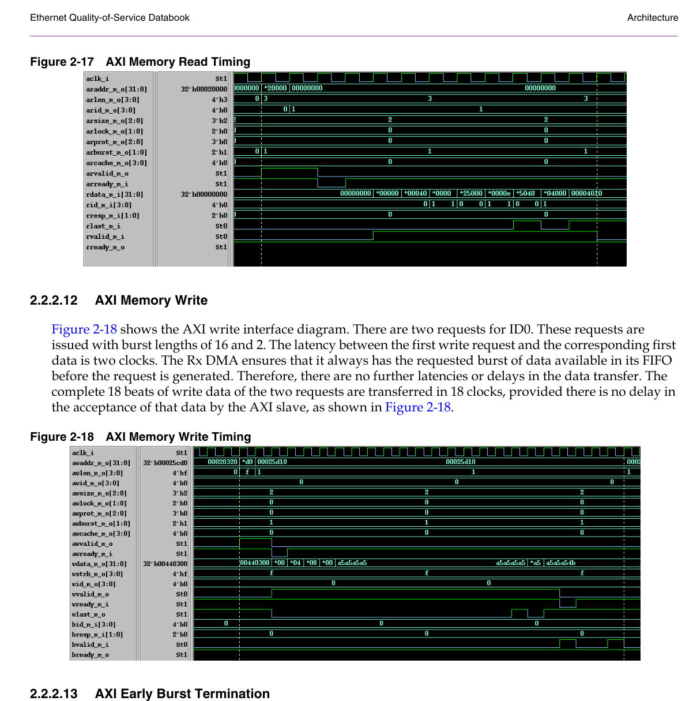

2.2.2.13
AXI Early Burst Termination
Figure 2-19 shows the early burst termination on Write channel. This can happen during data transfer when
the EOP is read out of the Rx queue before the requested burst transfer is completed. Five requests are
issued, but the EOP gets transferred in the middle of the first burst. The AXI master still continues the data
phases of the outstanding requested bursts but does not allow further data to be written to the slave
memory by de-asserting the write-strobes (as indicated by wstrb_m_o[3:0] = 0).

| Synopsys, Inc. | 59 |
| --- | --- |
| 5.10a Synopsys, Inc. SolvNet December 2017 DesignWare.com |  |

## Page 60

Two extra request commands (@address 0x00026e18 and 0x00026e58) are active when the write-strobes are
de-asserted after EOP transfer. The first request has already been issued to the slave. Therefore, it is not
changed. The second request is a dummy request with a single beat required to generate a last data transfer
(with wlast high).
After transferring the EOP data to the system memory, a lot of AXI bandwidth may be wasted because
of dummy writes. Therefore, it is recommended to have two or less than two outstanding requests on
the AXI master write channel by appropriately programming DMA_SysBus_Mode.

|  | Note |
| --- | --- |

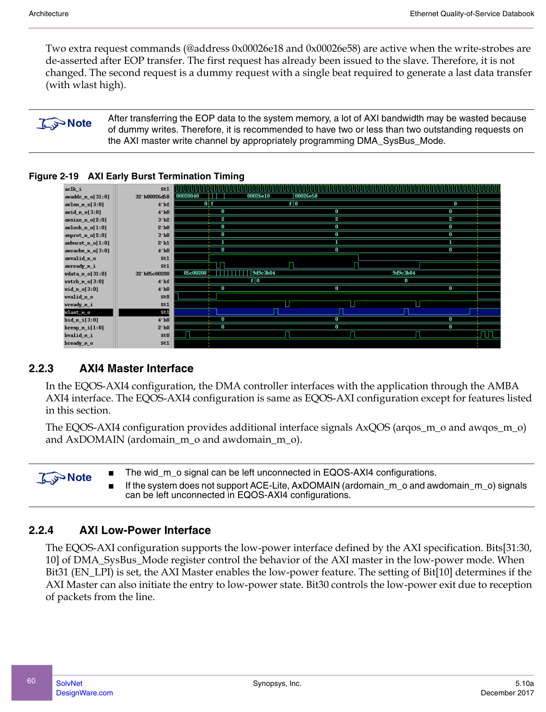

### 2.2.3

### AXI4 Master Interface

In the EQOS-AXI4 configuration, the DMA controller interfaces with the application through the AMBA
AXI4 interface. The EQOS-AXI4 configuration is same as EQOS-AXI configuration except for features listed
in this section.
The EQOS-AXI4 configuration provides additional interface signals AxQOS (arqos_m_o and awqos_m_o)
and AxDOMAIN (ardomain_m_o and awdomain_m_o).
The wid_m_o signal can be left unconnected in EQOS-AXI4 configurations.

|  | Note |
| --- | --- |

If the system does not support ACE-Lite, AxDOMAIN (ardomain_m_o and awdomain_m_o) signals
can be left unconnected in EQOS-AXI4 configurations.

### 2.2.4

### AXI Low-Power Interface

The EQOS-AXI configuration supports the low-power interface defined by the AXI specification. Bits[31:30,
10] of DMA_SysBus_Mode register control the behavior of the AXI master in the low-power mode. When
Bit31 (EN_LPI) is set, the AXI Master enables the low-power feature. The setting of Bit[10] determines if the
AXI Master can also initiate the entry to low-power state. Bit30 controls the low-power exit due to reception
of packets from the line.

| 60 | Synopsys, Inc. |
| --- | --- |
|  | SolvNet Synopsys, Inc. 5.10a DesignWare.com December 2017 |

## Page 61

This means that the AXI master accepts the low-power request and goes into the low-power mode in which
the application can remove the AXI clock when the following conditions are true for a duration equal to the
value programmed in the AXI_LPI_Entry_Interval register.
The MAC transmitter and receiver are in the Idle mode
Both DMA engines are in Idle mode
There is no data in the Transmit or Receive data path or queue
Slave interface is idle
If the MAC is in the active state (not idle) at the time of low-power initiation request, the AXI master waits
for a period of 16 AXI clock cycles. If the MAC is still in the active state at the end of this period, the
low-power request is denied.
If the MAC goes to idle (inactive) within 16 clock cycles, the AXI master monitors the inactive state for a
further period indicated by the AXI_LPI_Entry_Timer. If the MAC remains inactive for this period, the
low-power request is accepted and acknowledged by going into the low-power state. Otherwise (if the
MAC becomes active before the expiry of this interval), the request is denied.
After the MAC goes into low-power state and acknowledges it (csysack_o is made low), the AXI system can
gate-off or remove the AXI clock when cactive_o is made low,
The timing and behavior of the EQOS-AXI low-power interface signals is according to the Figure
12-2 of the AXI Specification.

|  | Note |
| --- | --- |

2.2.4.1

### AXI System Initiated Low-Power Entry

The AXI system initiates a low-power mode request to the AXI master by setting csysreq_i to 0. When
EN_LPI is set, the AXI master checks the active state of the data paths within the controller before giving a
response.

| Synopsys, Inc. | 61 |
| --- | --- |
| 5.10a Synopsys, Inc. SolvNet December 2017 DesignWare.com |  |

## Page 62

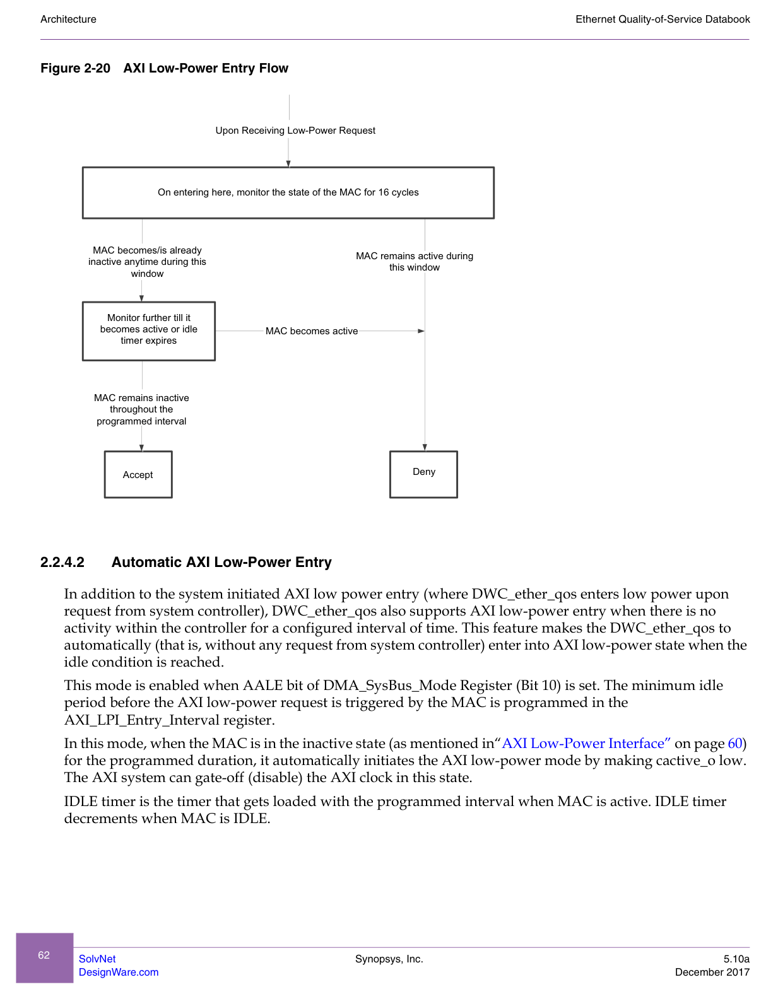

Upon Receiving Low-Power Request
Upon Receiving Low-Power Request
On entering here, monitor the state of the MAC for 16 cycles
On entering here, monitor the state of the MAC for 16 cycles
MAC becomes/is already
inactive anytime during this
window
MAC becomes/is already
inactive anytime during this
window
this window
MAC remains active during
this window
MAC remains active during
MAC remains active during
Monitor further till it
becomes active or idle
timer expires
Monitor further till it
becomes active or idle
timer expires
MAC becomes active
MAC becomes active
MAC remains inactive
throughout the
programmed interval
MAC remains inactive
throughout the
programmed interval
Accept
Accept
Deny
Deny
2.2.4.2
Automatic AXI Low-Power Entry
In addition to the system initiated AXI low power entry (where DWC_ether_qos enters low power upon
request from system controller), DWC_ether_qos also supports AXI low-power entry when there is no
activity within the controller for a configured interval of time. This feature makes the DWC_ether_qos to
automatically (that is, without any request from system controller) enter into AXI low-power state when the
idle condition is reached.
This mode is enabled when AALE bit of DMA_SysBus_Mode Register (Bit 10) is set. The minimum idle
period before the AXI low-power request is triggered by the MAC is programmed in the
AXI_LPI_Entry_Interval register.
In this mode, when the MAC is in the inactive state (as mentioned in“AXI Low-Power Interface” on page 60)
for the programmed duration, it automatically initiates the AXI low-power mode by making cactive_o low.
The AXI system can gate-off (disable) the AXI clock in this state.
IDLE timer is the timer that gets loaded with the programmed interval when MAC is active. IDLE timer
decrements when MAC is IDLE.

| 62 | Synopsys, Inc. |
| --- | --- |
|  | SolvNet Synopsys, Inc. 5.10a DesignWare.com December 2017 |

## Page 63

2.2.4.3
Coming Out of Low-Power Mode
AXI Master comes out of low-power mode when one of the following occurs:
AXI system restores the AXI clock and initiates the exit by removing the low-power request (csysreq_i
is made high); the AXI Master acknowledges it (by making csysack_o and cactive_o high) and exits
the low-power state.
The MAC itself initiates a low-power exit by making cactive_o high when it receives a packet from the
line. If Bit[30] of DMA_SysBus_Mode  register is set, it initiates the exit only if a valid magic packet or
remote wake-up packet is received. In this scenario the request signal assertion (cactive_o) is synchro-
nous to the clk_rx_i clock because the AXI clock is assumed to be absent.
If the CSR slave port is operates with a different clock than AXI Master clock, the MAC initiates the
low-power exit when any read/write access is made to any of the DMA or MTL registers. In this
scenario the request signal assertion (cactive_o) is synchronous to the clk_csr_i clock because the AXI
(aclk_i) clock is assumed to be absent.
In case of AXI system initiated exit (due to csysreq_i assertion), the clock controller should enable
the clock immediately along with csysreq_i. The cactive_o & csysack_o assertion is synchronous to
this clock
For MAC initiated low-power exits, the clock controller must restore the AXI clock immediately after
the cactive_o is made high. Otherwise, it can affect the CSR register operations due to misbehavior
of CDC synchronization circuit especially for back-2-back register writes.

|  | Note |
| --- | --- |

| Synopsys, Inc. | 63 |
| --- | --- |
| 5.10a Synopsys, Inc. SolvNet December 2017 DesignWare.com |  |

## Page 64

### DMA Controller

The DMA has independent Transmit (Tx) and Receive (Rx) engines, and a CSR space. The Tx engine
transfers data from the system memory to the device port (MTL), whereas the Rx engine transfers data from
the device port to the system memory. The DMA engine uses descriptors to efficiently move data from
source to destination with minimal application CPU intervention. The DMA is designed for packet-oriented
data transfers such as packets in Ethernet. The DMA controller can be programmed to interrupt the
application CPU for situations such as Packet Transmit and Receive Transfer completion, and other normal
or error conditions.
The DMA and the application communicate through the following two data structures:
Control and Status registers (CSR)
Descriptor lists and data buffers
The DMA supports up to 8 Tx and 8 Rx Descriptor lists (or DMA channels). The base address of each list is
written to the respective Tx Descriptor List Address register and Rx Descriptor List Address register. The
descriptor list is forward linked and the next descriptor is always considered at a fixed offset to the current
one. The offset is controlled by the DSL field of DMA_Ch[n]_Control register. The number of descriptors in
the list is programmed in the respective Tx (or Rx) Descriptor Ring Length register. Once the DMA
processes the last descriptor in the list, it automatically jumps back to the descriptor in the List Address
register to create a descriptor ring.
The descriptor lists reside in the physical memory address space of the application. Each descriptor can
point to a maximum of two buffers in the system memory. This enables two buffers to be used, physically
addressed, rather than contiguous buffers in memory.
When DWC_ether_qos is configured with an address greater than 32 bits, the DMA considers that
all the descriptors in a list are present in a memory page with maximum size of 4GB. In other words,
address bits greater than 32 are taken to be constant and equal for all the descriptors in the ring.
However, the upper bits of the various buffer addresses can be different and independent.

|  | Note |
| --- | --- |

When DWC_ether_qos is operated with an address greater than 32 bits, the Tx Descriptor can have
only one buffer address. However, the Rx Descriptor can still have two buffer addresses.
A data buffer resides in the application physical memory space and consists of an entire packet or part of a
packet but cannot exceed a single packet. Buffers contain only data. Buffer status is maintained in the
descriptor. Data chaining refers to packets that span multiple data buffers. However, a single descriptor
cannot span multiple packets. The DMA skips to the data buffer of next packet when EOP is detected.
The DWC_ether_qos supports the ring structure for the DMA descriptor. For more information on the
descriptor, see “Descriptors” on page 1315 that describes the descriptor structure and how the DMA
accesses the descriptors.
The following sections discuss in detail the various operations of a DMA controller:
“DMA Application Bus Burst Access” on page 65
“DMA Application Data Buffer Alignment” on page 66
“DMA Buffer Size Calculations” on page 66
“DMA Arbiter (EQOS-DMA and EQOS-AHB Configurations)” on page 67
“Transmission” on page 68
“Transmit DMA Operation: Default (Non-OSP) Mode” on page 68

| 64 | Synopsys, Inc. |
| --- | --- |
|  | SolvNet Synopsys, Inc. 5.10a DesignWare.com December 2017 |

## Page 65

“DMA Transmit Operation: OSP Mode” on page 71
“Transmit Packet Processing” on page 73
“Transmit Polling Suspended” on page 73
“DMA Transmit Channel Arbitration” on page 74
“DMA Receive Operation” on page 75
“Receive Descriptor Acquisition” on page 78
“Receive Packet Processing” on page 78
“Interrupts” on page 145
“Periodic Scheduling of Transmit and Receive Interrupt” on page 149
“Per Channel Transfer Complete Interrupt” on page 149
“Error Response to DMA” on page 79
“DMA Native Interface” on page 79

### 2.3.1

### DMA Application Bus Burst Access

The DMA engines attempts to transfer data in a burst of maximum size as programmed in the PBL fields of
Transmit Control and Receive Control registers of the respective DMA. The Rx and Tx descriptors are
always accessed in the maximum possible (limited by PBL or 16 * 8/bus width) burst length for 16 bytes to
be read. The burst transfers initiated by the DMA can be split into multiple burst transfers as per the
Application Interface protocol (AHB or AXI) requirements and the settings of DMA_SysBus_Mode register.
The Tx DMA initiates a data transfer only when sufficient space is available in the MTL Tx Queue to
accommodate either of the following:
Bytes corresponding to the configured burst (PBL * bus_width/8)
Remaining bytes in Tx Buffer without EOP
Number of bytes till EOP
The Rx DMA initiates a data transfer in the following conditions:
Sufficient data is available in MTL Rx Queue to accommodate the configured burst
EOP (when it is less than the configured burst length) is detected in the Rx Queue
The DMA indicates the start address and the number of transfers required to the AHB or AXI master
interface. When the AHB or AXI Interface is configured for fixed-length burst, it transfers the data by using
the best combination of INCR4, INCR8, or INCR16 and SINGLE transactions. If EOP is reached before the
fixed-burst ends on the AHB or AXI interface, dummy transfers are performed in-order to complete the
fixed-burst. Otherwise [Bit 0 of DMA_SysBus_Mode register is reset], the DMA transfers the data using
INCR (undefined length) and SINGLE transactions.
When the AHB or AXI interface is configured for address-aligned beats, both DMA engines ensure that the
first burst transfer initiated by the AHB or AXI is less than or equal to the size of the configured PBL.
Therefore, all subsequent beats start at an address that is aligned to the configured PBL. The DMA can only
align the address for beats up to size 16 (for PBL > 16) for AHB interface because it does not support more
than INCR16.
Similarly, the DMA can only align the address for beats up to 256 size (for PBL > 256) because the AXI
interface does not support more than BLEN 256.

| Synopsys, Inc. | 65 |
| --- | --- |
| 5.10a Synopsys, Inc. SolvNet December 2017 DesignWare.com |  |

## Page 66

2.3.1.1
DMA Application Data Buffer Alignment
The Tx and Rx data buffers do not have any restrictions on start address alignment. For example, in systems
with 32-bit memory, the start address for buffers can be aligned to any of the four bytes. However, the DMA
always initiates write transfers with address aligned to the bus width and dummy data (old data) in the
invalid byte lanes. This typically happens during the transfer of the beginning or end of an Ethernet packet.
The software driver should discard the dummy bytes based on the start address of the buffer and size of the
packet.
Table 2-1
Application Data Buffer Alignment Examples

| Examples |  |
| --- | --- |
| Buffer Read | If the Tx buffer address is 32’h00000FF2 (for 32-bit data bus), and 15 bytes need to be transferred, the DMA reads five full words from address 32’h00000FF0, but when transferring data to the MTL Tx queue, the extra bytes (the first two bytes) are dropped or ignored. Similarly, the last 3 bytes of the last transfer are also ignored. The DMA always ensures that it transfers a full 32-bit data to the MTL Tx queue, unless it is the end of packet. |
| Buffer Write | If the Rx buffer address is 32’h0000FF2 (for 64-bit data bus) and 16 bytes of a received packet need to be transferred, the DMA writes 3 full words from address 32’h00000FF0. However, the first 2 bytes of the first transfer and the last 6 bytes of the third transfer have dummy data. The DMA considers the offset address only if it is the first Rx buffer of the packet. The DMA ignores the offset address and performs full word writes for the middle and the last Rx buffer of the packet. |

2.3.1.2
DMA Buffer Size Calculations
The DMA does not update the size fields in the Tx and Rx descriptors. The DMA updates only the status
fields (RDES and TDES) of the descriptors. The driver has to perform the size calculations.
The Tx DMA transfers the exact number of bytes (indicated by buffer size field of TDES2) towards the MAC.
If a descriptor is marked as first (FD bit of TDES3 is set), the DMA marks the first transfer from the buffer as
SOP. If a descriptor is marked as last (LD bit of TDES3), the DMA marks the last transfer from that data
buffer as EOP to the MTL.
The Rx DMA transfers data to a buffer until the buffer is full or the end of packet is received from the MTL.
When the FD bit of a descriptor is set, the amount of valid data in a buffer is accurately indicated by the
buffer size field (programmed in DMA Channel Receive Control register) minus the data buffer pointer
offset. The offset is zero when the data buffer pointer is aligned to the data bus width. If a descriptor is
marked as last, the buffer may not be full (as indicated by the buffer size in Bits[14:1] of Receive Control
register). To compute the amount of valid data in this final buffer, the driver must read the packet length
(PL bits of RDES3[14:0]) and subtract the sum of the buffer sizes of the preceding buffers in this packet. The
Rx DMA always transfers the start of next packet with a new descriptor.
Even when the start address of a Rx buffer is not aligned to the data width of system bus, the system
should allocate a Rx buffer of a size aligned to the system bus width. For example, if the system
allocates a Rx buffer of 1,024 bytes (1 KB) starting from address 0x1000, the software can program the
buffer start address in the Rx descriptor to have a 0x1002 offset.The Rx DMA writes the packet to this
buffer with dummy data in the first two locations (0x1000 and 0x1001). The actual packet is written
from location 0x1002. Therefore, the actual useful space in this buffer is 1,022 bytes, even though the
buffer size is programmed as 1,024 bytes, because of the start address offset.

|  | Note |
| --- | --- |

| 66 | Synopsys, Inc. |
| --- | --- |
|  | SolvNet Synopsys, Inc. 5.10a DesignWare.com December 2017 |

## Page 67

2.3.1.3
DMA Arbiter (EQOS-DMA and EQOS-AHB Configurations)
The arbiter inside the DMA module performs the arbitration between the Tx and Rx channel accesses to the
AHB master interface. The following two types of arbitrations are supported:
Round-Robin Arbitration
When Bit 1 of the DMA_Mode register is reset and both Tx and Rx DMAs are simultaneously
requesting for access, the arbiter allocates the data bus in ratio set by Bits[14:12] of DMA_Mode
register.
Fixed-Priority Arbitration
When Bit 1 of the DMA_Mode register is set, the Rx DMA always gets priority over the Tx DMA for
data access by default. When Bit 11 of DMA_Mode Register is also set, the Tx DMA gets priority over
the Rx DMA as explained in Table 8-3 on page 286.
The Rx DMA places the next request only after the earlier request is complete. There is delay to find
data availability in the MTL queue (ari_rdy and ari_pbl is enabled, if data equal to PBL is available; MTL
asserts ari_rxwatermark which indicates required data availability) and place the request.
So, there is no overlap of Rx DMA request with Tx DMA request when operating in single DMA mode.
However, this is possible with multiple Rx DMA enabled.

|  | Note |
| --- | --- |

2.3.1.4
DMA Start/Stop Control Through Sideband Signals
The DMA can be started/stopped by performing any or both of the following operations:
Programming ST bit in DMA_CH[n]_Tx_Control and SR bit in DMA_CH[n]_Rx_Control register for
Tx and Rx DMA respectively
Appropriately driving the sbd_txdma_start_i[n] and sbd_rxdma_start_i[n] inputs for Tx and Rx DMA
respectively
The DMA Start/Stop through Sideband Signals has higher precedence.

| Synopsys, Inc. | 67 |
| --- | --- |
| 5.10a Synopsys, Inc. SolvNet December 2017 DesignWare.com |  |

## Page 68

Table 2-2 shows the behavior when the above operations are performed simultaneously or distinctly:
Table 2-2
DMA Start/Stop Through Sideband Signals

| Start(1)/Stop(0) through Sideband Signals | Start(1)/Stop(0) through software programming | Current State | New State | Comments |
| --- | --- | --- | --- | --- |
| 0 | 0 | 0 | 0 | Default/Reset value |
| 0 -> 1 | 0 | 0 | 1 | DMA Started by Sideband |
| 0 | 0 -> 1 | 0 | 1 | DMA Started by SW |
| 1 | 1 | x | 1 | DMA Started by both Sideband Signals and software programming |
| 1 -> 0 | 1, 0 | 1 | 0 | DMA Stopped by Sideband Signals |
| 1, 0 | 1 -> 0 | 1 | 0 | DMA Stopped by SW programming |
| 0 -> 1 | 1 -> 0 | x | 1 | Sideband Signals Start DMA and SW programming Stop DMA in same clock cycle |
| 1 -> 0 | 0 -> 1 | x | 0 | Sideband Signals Stop DMA and SW programming Start DMA in same clock cycle |

### 2.3.2

### Transmission

2.3.2.1
Transmit DMA Operation: Default (Non-OSP) Mode
The Tx DMA engine in default mode proceeds as follows:
1. The application sets up the Transmit descriptor (TDES0–TDES3) and sets the Own bit (TDES3[31]) after
setting up the corresponding data buffer(s) with Ethernet Packet data.
2. The application advances the Descriptor Tail pointer offset value of the Transmit Channel.
3. While in the Run state, the DMA runs an Arbitration cycle to select the next Tx DMA channel from
which the packets requiring transmission should be processed.
4. The DMA fetches the descriptor from the application memory.
5. If the DMA detects one of the following conditions, the transmission from that channel is suspended
and Bit 2 and Bit 16 of Status Register of corresponding DMA channel are set and the Tx Engine
proceeds to step 11:
The descriptor is flagged as owned by the application (TDES3 [31] = 1'b0)
The Descriptor Tail pointer is equal to the Current Descriptor pointer in Ring Descriptor list Mode
An error condition occurs
6. If the acquired descriptor is flagged as owned by the DMA (TDES3[31] = 1’b1), the DMA decodes the
Transmit Data Buffer address from the acquired descriptor.
7. The DMA fetches the Transmit data from the system memory and transfers the data to the MTL for
transmission.

| 68 | Synopsys, Inc. |
| --- | --- |
|  | SolvNet Synopsys, Inc. 5.10a DesignWare.com December 2017 |

## Page 69

8. If an Ethernet packet is stored over data buffers in multiple descriptors, the DMA closes the interme-
diate descriptor and fetches the next descriptor. Steps 3 through 7 are repeated until the end of-
Ethernet-packet data is transferred to the MTL.
9. When packet transmission is complete, if IEEE 1588 Timestamp feature was enabled for the packet (as
indicated in the Tx status), the timestamp value obtained from MTL is written to the Tx descriptor
(TDES0 and TDES1) that contains the EOP buffer. The status information is written to this Tx descriptor
(TDES3). The application now owns this descriptor because the Own bit is cleared during this step.
If timestamp feature is not enabled for this packet, the DMA does not alter the contents of TDES0 and
TDES1.
By default, the Tx DMA places subsequent request after the current descriptor write request is
completed to the descriptor memory. If posted descriptor write is enabled by setting DSPW bit in
DMA_Mode register, the Tx DMA will place subsequent request after the current descriptor write
request is placed without waiting for its completion, thereby improving the throughput.

|  | Note |
| --- | --- |

10. Bit 0 of Status Register of corresponding channel is set after completing transmission of a packet that
has Interrupt on Completion (TDES2[31]) set in its Last Descriptor. The DMA engine returns to step 3.
11. In the Suspend state, the DMA tries to acquire the descriptor again (and thereby return to step 3). A poll
demand command is triggered by writing any value to the DMA_CH0_TxDesc_Tail_Pointer when it
receives a Transmit Poll demand and the Underflow Interrupt Status bit is cleared. If the application
stopped the DMA by clearing Bit 0 of Transmit Control Register of corresponding DMA channel, the
DMA enters the Stop state.
The Tx DMA transmission flow in default mode is shown in Figure 2-21.

| Synopsys, Inc. | 69 |
| --- | --- |
| 5.10a Synopsys, Inc. SolvNet December 2017 DesignWare.com |  |

## Page 70

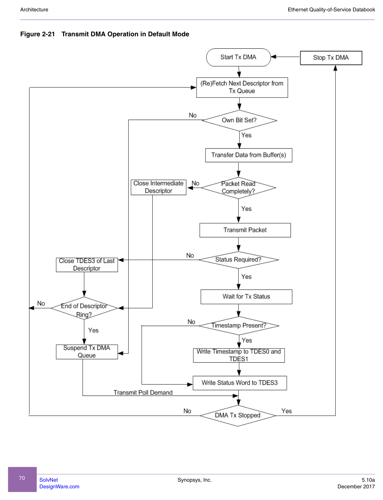

| 70 | Synopsys, Inc. |
| --- | --- |
|  | SolvNet Synopsys, Inc. 5.10a DesignWare.com December 2017 |

## Page 71

2.3.2.2
DMA Transmit Operation: OSP Mode
In the Run state, if Bit 4 is set in the Transmit Control Register of corresponding DMA channel, the Transmit
process can simultaneously acquire two packets without closing the Status descriptor of the first packet. As
the Transmit process finishes transferring the first packet, it immediately polls the Transmit Descriptor list
for the second packet. If the second packet is valid, the Transmit process transfers this packet before writing
the status information of the first packet.
In OSP mode, the Run state Tx DMA operates in the following sequence:
1. The DMA operates as described in step 1 to step 7 of the Tx DMA (default mode).
2. The DMA fetches the next descriptor without closing the last descriptor of previous packet.
3. If the DMA owns the acquired descriptor, the DMA decodes the transmit buffer address in this
descriptor. If the DMA does not own the descriptor, the DMA goes into Suspend mode and skips to
step 7.
4. The DMA fetches the Transmit packet from the system memory and transfers the packet to the MTL
until the EOP data is transferred, closing the intermediate descriptors if this packet is split across
multiple descriptors.
5. The DMA waits for the packet transmission status and timestamp of previous packet. When the status
is available, the DMA writes the timestamp to TDES0 and TDES1 if such timestamp was captured (as
indicated by a status bit). The DMA writes the status, with a cleared Own bit, to the corresponding
TDES1, thus closing the descriptor.
If Timestamp feature is not enabled for the previous packet, the DMA does not alter the contents of
TDES2 and TDES3.
6. The Transmit interrupt is set (if enabled). The DMA fetches the next descriptor and proceeds to step 3
(when Status is normal). If the previous transmission status shows an underflow error, the DMA goes
into Suspend mode (step 7).
7. In Suspend mode, if a pending status and timestamp are received from the MTL, the DMA does the
following:
Writes the timestamp (if enabled for the current packet) to TDES0 and TDES1
Writes the status to the corresponding TDES1
Sets relevant interrupts and returns to Suspend mode
If no status is pending and the application stopped the DMA by clearing Bit 0 of Transmit Control
Register of corresponding DMA channel, the DMA enters the Stop state.
8. The DMA can exit Suspend mode and enter the Run state (goes to step 1 or step 2 depending on
pending status) only after receiving a Transmit Poll demand in Transmit Descriptor Tail Pointer
register of corresponding channel.
The DMA fetches the next descriptor before closing the current descriptor. Therefore, the descriptor
ring length must be more than two. Synopsys recommends having a minimum descriptor length of four.

|  | Note |
| --- | --- |

The basic flow is described in Figure 2-22.

| Synopsys, Inc. | 71 |
| --- | --- |
| 5.10a Synopsys, Inc. SolvNet December 2017 DesignWare.com |  |

## Page 72

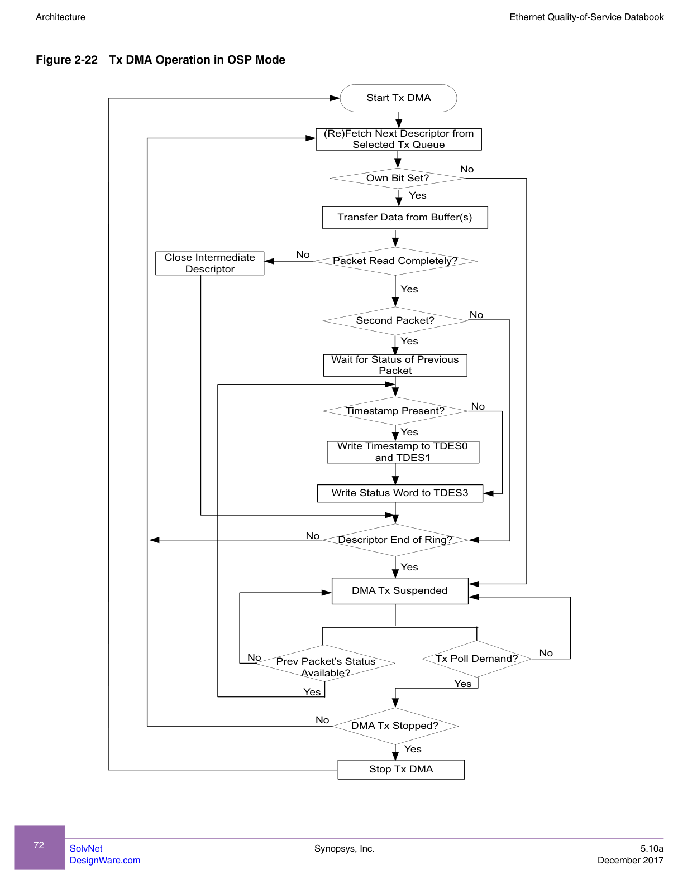

Start Tx DMA
(Re)Fetch Next Descriptor from
Selected Tx Queue
Own Bit Set?
Transfer Data from Buffer(s)
Close Intermediate
Descriptor
Packet Read Completely?
Second Packet?
Wait for Status of Previous
Packet
Timestamp Present?
Write Timestamp to TDES0
and TDES1
Write Status Word to TDES3
Descriptor End of Ring?
DMA Tx Suspended
Prev Packet’s Status
Available?
Tx Poll Demand?
DMA Tx Stopped?
Stop Tx DMA

| 72 | Synopsys, Inc. |
| --- | --- |
|  | SolvNet Synopsys, Inc. 5.10a DesignWare.com December 2017 |

## Page 73

2.3.2.3
Transmit Packet Processing
The Tx DMA expects that the data buffers contain complete Ethernet packets, excluding preamble, pad
bytes, and FCS fields. The DA, SA, and Type/Length fields contain valid data. If the Tx Descriptor indicates
that the MAC must disable CRC or PAD insertion, the buffer must have complete Ethernet packets
(excluding preamble), including the CRC bytes.
Packets can be data-chained and can span several buffers. Packets must be delimited by the First Descriptor
(TDES3[29]) and the Last Descriptor (TDES3[28]). As transmission starts, the First Descriptor must have
TDES3[29] set. When this occurs, the packet data is transferred from the application buffer to the MTL Tx
Queue. Concurrently, if the current packet has the Last Descriptor (TDES3[28]) clear, the Tx Process
attempts to acquire the Next Descriptor. The Tx Process expects this descriptor to have TDES3[29] clear. If
TDES3[28] is clear, it indicates an intermediary buffer. If TDES3[28] is set, it indicates the last buffer of the
packet.
After the last buffer of the packet has been transmitted, the DMA writes back the final status information to
the Transmit Descriptor 3 (TDES3) word of the descriptor that has the Last Descriptor Bit set in Transmit
Descriptor 3 (TDES3[28]). At this time, if Interrupt on Completion (TDES2[31]) is set, Bit 0 of Status Register
of corresponding DMA channel is set, the Next Descriptor is fetched, and the process repeats. The actual
packet transmission begins after either of the following:
The MTL Tx Queue has reached a programmable Transmit threshold (Bits[6:4] of Transmit Operation
Mode register of corresponding MTL Transmit Queue)
A full packet is contained in the FIFO
You can also use the store-and-forward mode (Bit 1 of MTL Transmit Operation Mode Register of a queue).
In this mode, descriptors are released (Own bit TDES0[31] clears) when the DMA finishes transferring the
packet.
To ensure proper transmission of a packet and the next packet, you must specify a non-zero buffer size
for the Transmit descriptor that has the Last Descriptor (TDES3[28]) set.

|  | Note |
| --- | --- |

2.3.2.4
Transmit Polling Suspended
Transmit polling can be suspended by any of the following conditions:
The DMA detects a descriptor owned by the application (TDES3[31]=0).
To resume, the driver must give descriptor ownership to the DMA and then issue a Poll Demand
command by writing the Tail Pointer register. If the DMA goes into SUSPEND state because of this
condition, Bit 15 and Bit 2 of Status Register of corresponding DMA channel are set.
A packet transmission is aborted when a Transmit error is detected because of underflow.
The appropriate Transmit Descriptor 3 (TDES3) bit is set. When this condition occurs, the following
bits are set and the information is written to Transmit Descriptor 0, causing the suspension:
Bit 14 of Status Register of corresponding DMA channel
Transmit Underflow bit of corresponding queue in MTL_Interrupt_Status
The DMA detects that the Tail Pointer is equal to the Current descriptor closed by the it.
To resume, the software driver must modify the Tail Pointer register.

| Synopsys, Inc. | 73 |
| --- | --- |
| 5.10a Synopsys, Inc. SolvNet December 2017 DesignWare.com |  |

## Page 74

In all conditions, the position in the Transmit List is retained. The retained position is that of the descriptor
following the Last Descriptor closed by the DMA. The driver must explicitly issue a Transmit Poll Demand
command after rectifying the suspension cause.
2.3.2.5
DMA Transmit Channel Arbitration
An arbiter provides access to multiple DMAs trying to access the Bus Interface Unit (BIU). Figure 2-23shows
the arbitration process.

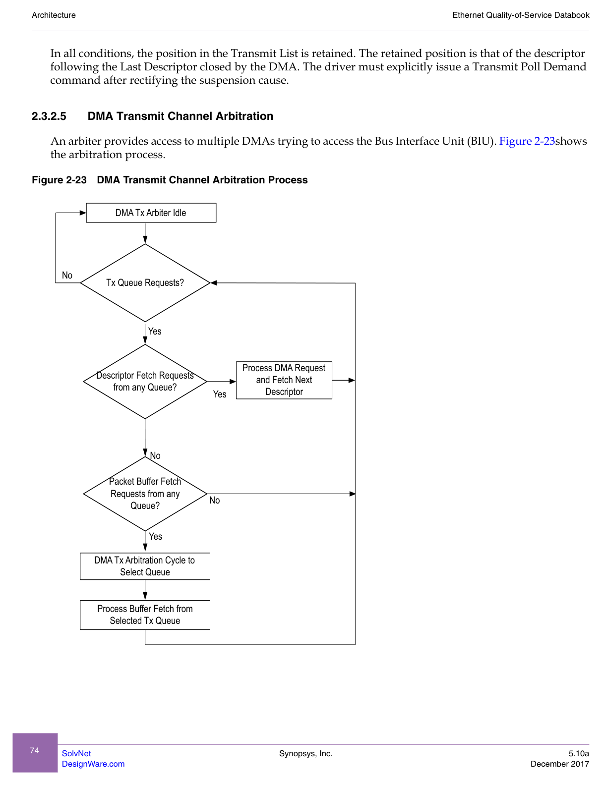

DMA Tx Arbiter Idle
Tx Queue Requests?
Process DMA Request
and Fetch Next
Descriptor
Descriptor Fetch Requests
from any Queue?
Packet Buffer Fetch
Requests from any
Queue?
DMA Tx Arbitration Cycle to
Select Queue
Process Buffer Fetch from
Selected Tx Queue

| 74 | Synopsys, Inc. |
| --- | --- |
|  | SolvNet Synopsys, Inc. 5.10a DesignWare.com December 2017 |

## Page 75

When there is any request in the Tx queue, the DMA arbiter checks the type of the request: packet buffer
fetch or descriptor fetch request. The descriptor fetch requests have higher priority than the buffer
requests.Therefore, when there is a descriptor fetch request, the DMA arbiter acknowledges the DMA
channel that is requesting for a descriptor fetch. If there is no descriptor fetch request, the arbiter looks for
packet buffer fetch requests.
The DMA arbiter acknowledges the descriptor fetch request of one DMA channel at a time. Descriptor fetch
requests are granted using a fixed priority with the higher channel having higher priority (Channel 1 having
priority over Channel 0, Channel 2 having priority over Channel 1 and so on). For packet buffer fetches, the
DMA arbiter uses the programmed channel weight and priority to decide which channel to acknowledge.
The DMA arbiter performs a burst-by-burst arbitration based on one of the following algorithms:
Weighted Strict Priority (WSP): In WSP arbitration mode, the arbiter first processes Channel 7 (or the
last enabled channel) and then Channel 6, Channel 5, and so on. If any channel does not have a frame
to transmit, the weight of that channel gets reassigned to Channel7 (or last enabled channel). If
Channel 7 has no frames to transmit, the remaining weight is assigned to Channel 6 and so on.
Weighted Round Robin (WRR): In WRR arbitration mode, the arbiter first selects the channel with the
highest weight programmed, and then the channel with next highest weight, and so on. If any channel
does not have a frame to transmit, the weight of that channel gets equally distributed to all channels
that have frames to transmit.
Fixed priority (FP): In Fixed priority mode, Channel 0 has the lowest priority and the last selected
channel has the highest priority. The weight programmed in the Transmit Control register of a channel
is ignored.
In WSP or WRR arbitration, the channel weight corresponds to the number of DMA burst transfers for
which the DMA arbiter grants the bus to a channel. When a channel completes all the DMA burst transfers,
the arbiter grants the bus to the next channel.

### 2.3.3

### DMA Receive Operation

In the Receive path, the DMA reads a packet from the MTL receive queue and writes it to the packet data
buffers of the corresponding DMA channel. The ARI data at the start of the frame indicates the channel
number to which the current frame must be written. If only one DMA channel is selected, this information is
not provided.

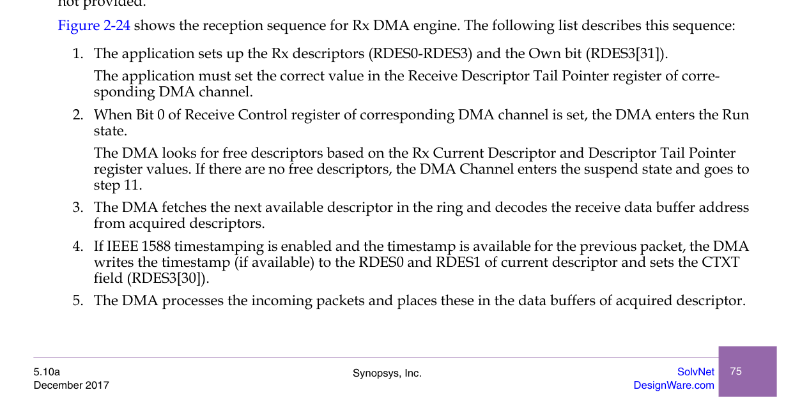

1. The application sets up the Rx descriptors (RDES0-RDES3) and the Own bit (RDES3[31]).
The application must set the correct value in the Receive Descriptor Tail Pointer register of corre-
sponding DMA channel.
2. When Bit 0 of Receive Control register of corresponding DMA channel is set, the DMA enters the Run
state.
The DMA looks for free descriptors based on the Rx Current Descriptor and Descriptor Tail Pointer
register values. If there are no free descriptors, the DMA Channel enters the suspend state and goes to
step 11.
3. The DMA fetches the next available descriptor in the ring and decodes the receive data buffer address
from acquired descriptors.
4. If IEEE 1588 timestamping is enabled and the timestamp is available for the previous packet, the DMA
writes the timestamp (if available) to the RDES0 and RDES1 of current descriptor and sets the CTXT
field (RDES3[30]).
5. The DMA processes the incoming packets and places these in the data buffers of acquired descriptor.

| Synopsys, Inc. | 75 |
| --- | --- |
| 5.10a Synopsys, Inc. SolvNet December 2017 DesignWare.com |  |

## Page 76

6. If the current packet transfer is not complete, the DMA closes the current descriptor as intermediate and
goes to step 10.
7. The DMA takes the status of the Receive frame from the MTL and writes the status word to current
descriptor with the Own bit cleared and the Last Descriptor bit set.
8. The DMA writes the Frame Length to RDES3 and VLAN Tag to RDES0. The DMA also writes the MAC
control frame opcode, OAM control frame code, and extended status information (if available) to
RDES1 of the last descriptor.
9. If IEEE 1588 Timestamp feature is enabled, the DMA stores the timestamp (if available). The DMA
writes the context descriptor after the last descriptor for the current packet (in the next available
descriptor).
10. If more descriptors are available in the Rx DMA Descriptor Ring, go to step 3; otherwise, go to the
Suspend state (step 11).
11. The Receive DMA exits the Suspend state when a Receive Poll demand is given and the application
advances the Receive Tail Pointer register of a channel.
The engine proceeds to step 2 and re-fetches the next descriptor.

| 76 | Synopsys, Inc. |
| --- | --- |
|  | SolvNet Synopsys, Inc. 5.10a DesignWare.com December 2017 |

## Page 77

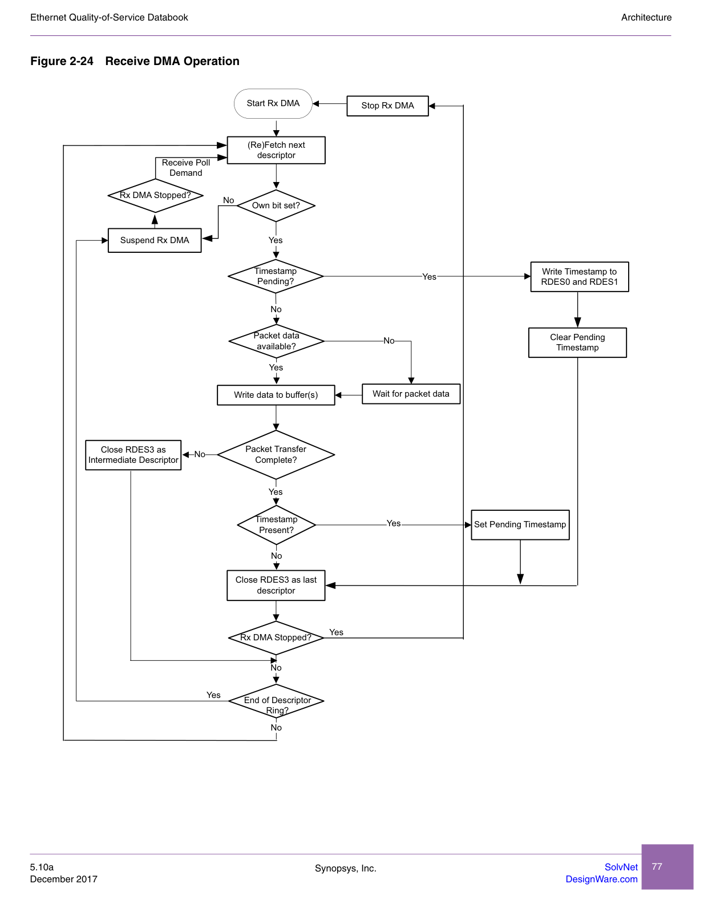

Start Rx DMA
Stop Rx DMA
(Re)Fetch next
descriptor
Receive Poll
Demand
Rx DMA Stopped?
Own bit set?
Suspend Rx DMA
Timestamp
Pending?
Write Timestamp to
RDES0 and RDES1
Packet data
available?
Clear Pending
Timestamp
Wait for packet data
Write data to buffer(s)
Packet Transfer
Complete?
Close RDES3 as
Intermediate Descriptor
Timestamp
Present?
Set Pending Timestamp
Close RDES3 as last
descriptor
Rx DMA Stopped?
End of Descriptor
Ring?

| Synopsys, Inc. | 77 |
| --- | --- |
| 5.10a Synopsys, Inc. SolvNet December 2017 DesignWare.com |  |

## Page 78

2.3.3.1
Receive Descriptor Acquisition
The Receive Engine always attempts to acquire an extra descriptor in anticipation of an incoming packet.
Descriptor acquisition is attempted if any of the following conditions is satisfied:
Bit 0 of Receive Control Register of corresponding DMA channel is set immediately after being placed
in the Run state.
The Descriptor Tail pointer register value is ahead of the Current Descriptor acquired by the Rx DMA.
The controller has completed packet reception, but the current Receive Descriptor is not yet closed.
A Receive poll demand is issued (update of the Tail Pointer register).
2.3.3.2
Receive Packet Processing
The sequence for processing a Receive packet is as follows:
1. The MAC transfers the received packets to the MTL memory only if the packet passes the address filter.
If the packet fails the address filtering, it is dropped in the MAC block (unless Bit 31 of MAC_Packet_-
Filter register is set).
2. If packet size is greater than or equal to configurable threshold bytes set for Rx Queue of MTL, or when
the complete packet is written to the queue in the store-and-forward mode, the MTL block requests the
DMA block to begin transferring the packet data to the Receive Buffer pointed by the current descriptor.
Packets smaller than 64 bytes, because of collision or premature termination, are removed from the
MTL Receive Queue.
3. When the DMA application Interface (AHB/AXI or MDC) becomes ready, it transfers the data and sets
the following:
If the packet fits in a single descriptor, the DMA sets both Last Descriptor (RDES3[28]) and First
Descriptor (RDES3[29]).
If the packets fits into more than one descriptor, the DMA sets the First Descriptor (RDES3[29]) to
delimit the packet.
4. The DMA releases the descriptors by resetting the Own (RDES3[31]) bit to 1’b0, either because the
Receive buffer filled up or the last segment of the packet is transferred to the Receive buffer. The
received packets status is updated in the last descriptor.
5. If Interrupt Enabled on Completion (RDES3[30]) bit is set in any of the Descriptors between the First
and Last Descriptor of the Packet and Bit 6 of Interrupt Enable Register of corresponding DMA channel
is set, the DMA sets Bit 6 of Status register of corresponding DMA channel.
The same process repeats unless the DMA encounters a descriptor flagged as being owned by the appli-
cation or when there are no more descriptors in the ring. When the DMA finds a descriptor owned by
the application and if Bit 7 of Interrupt Enable Register of corresponding DMA channel is set, the
Receive Process sets Bit 7 of Status register of corresponding DMA channel and then enters the Suspend
state. The position in the receive list is retained.

| 78 | Synopsys, Inc. |
| --- | --- |
|  | SolvNet Synopsys, Inc. 5.10a DesignWare.com December 2017 |

## Page 79

### 2.3.4

### Error Response to DMA

For any data transfer initiated by a DMA channel, if the slave replies with an error response, the DMA stops
all operations and updates the error bits and the Fatal Bus Error bit in the Status Register of corresponding
DMA channel. The application can either perform a reset to DWC_ether_qos or re-initialize the DMA
descriptor list and start again. The rest of the DMA channels are not affected by such errors. This is
applicable for the following configurations:
EQOS-DMA: In this configuration, the DMA receives the error response through mdc_error_i signal
(shown in Figure 2-31 on page 82).
EQOS-AHB: In this configuration, the DMA receives the error response through hresp_i signal
(shown in Figure 2-13 on page 53).
EQOS-AXI: In this configuration, the DMA receives the error response through rresp_m_i (shown in
Figure 2-16 on page 58) or bresp_m_i signal.

### 2.3.5

### DMA Native Interface

The subsystem can be configured (EQOS-DMA) to have DMA with a native FIFO-like interface on the
application side and an MCI (Optionally APB) interface for CSR port. All functions and features of the DMA
remain the same as described in earlier sections.
On the native interface, the DMA uses a simple hardware protocol to initiate the data or descriptor
transfers. The DMA always starts a transaction with the proper values on the address bus, transfer size,
burst length, and type of transfer (whether read or write). For read transfers, the application can provide
valid data by asserting the mdc_rdata_val_i signal. For write transfers, the DMA can provide valid data by
asserting the mdc_wdata_val_i signal. The application can pause the transfers by de-asserting the respective
mdc_rdata_val_i or mdc_wdata_rdy_i control signals.
The values on the address bus, burst length, and transfer size are not updated immediately on
receiving the mdc_rdata_val_i or mdc_wdata_rdy_i signals. The address, burst length, and transfer
size are valid only at the start of the transfer. In certain types of access, the burst length may not even
change during the transfers as shown in Figure 2-25. Before asserting the mdc_xfer_done_i signal for
proper transfer of data, the application must assert the mdc_rdata_val_i or mdc_wdata_rdy_i signal for
clocks equal to the burst length requested at the start of transfer (unless a premature write transfer is
indicated by DMA as explained in the next section).

|  | Note |
| --- | --- |

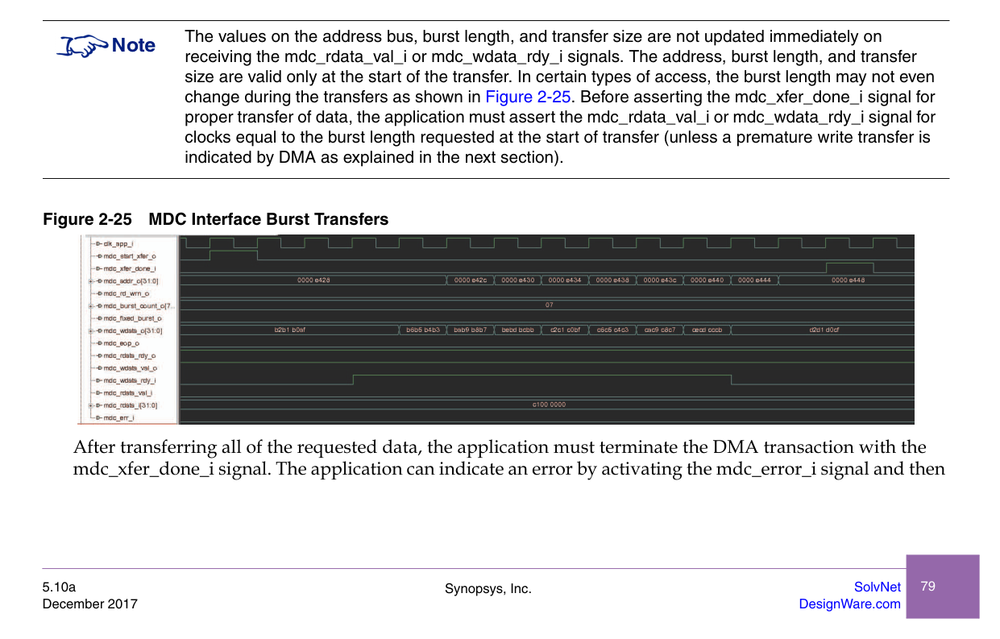

After transferring all of the requested data, the application must terminate the DMA transaction with the
mdc_xfer_done_i signal. The application can indicate an error by activating the mdc_error_i signal and then

| Synopsys, Inc. | 79 |
| --- | --- |
| 5.10a Synopsys, Inc. SolvNet December 2017 DesignWare.com |  |

## Page 80

the respective DMA (Rx or Tx) goes to the Fatal Error state and all operations stop. The application must
provide a soft reset to restart the DMA operation.
2.3.5.1
Write Data Transfer

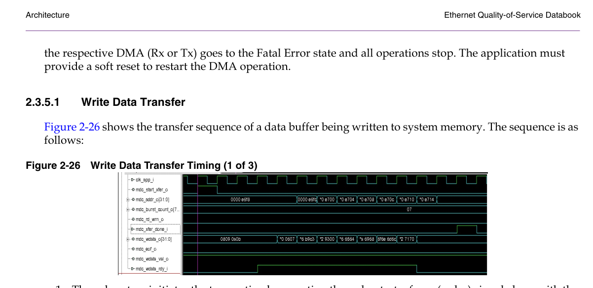

1. The subsystem initiates the transaction by asserting the mdc_start_xfer_o (pulse) signal along with the
following:
System memory address (mdc_addr_o)
Read/Write control signal (mdc_rd_wrn_o = 0)
Number of beats (mdc_burst_count_o)
Transfer size (mdc_xfer_size_o)
It also drives the first data beat of the burst on the mdc_wdata_o bus along with mdc_wdata_val_o
asserted.
2. The application asserts the mdc_wdata_rdy_i signal to accept the data.
3. If the application is not ready to handle the data, it can de-assert mdc_wdata_rdy_i and delay the data
transfer. The DMA holds the values on the data bus when the “rdy” control is de-asserted.
4. After all of the data has been transferred as indicated by mdc_burst_count_o, the application must end
the DMA transfer by asserting the mdc_xfer_done_i (pulse) signal.
5. The DMA can prematurely end the burst transfer if an EOP is being transferred to the application. The
DMA marks the EOP data on mdc_wdata_o with the assertion of mdc_eop_o. The application must
then complete the transaction by asserting the mdc_xfer_done_i signal after accepting the EOP data
even if the initial burst length given at start of transaction is not completed.
Figure 2-27 shows the transfer sequence when a data buffer is written to system memory with the burst
transfer ending prematurely because of the assertion of mdc_eop_o. The DMA terminates the burst by
asserting mdc_eop_o after completing 3 cycles of the requested 4-cycle burst. The application must respond
by asserting the mdc_xfer_done_i signal without asserting any more mdc_wdata_rdy_i.
The application should sample mdc_eop_o along with the corresponding data being accepted, that is,
mdc_eop_o should be sampled when mdc_wdata_rdy_i is high. The mdc_eop_o signal can go high when
the data on mdc_wdata_o is updated with the EOP data even before the start of next transfer indicated
bymdc_start_xfer_o. It need not go low immediately after the application accepts the EOP data because the
MDC may not have new data to update. It can go low anytime before the start of next write transfer. The
mdc_eop_o signal may also go high with the last beat of the requested burst transfer if it coincides with the
EOP data being presented to the application.

| 80 | Synopsys, Inc. |
| --- | --- |
|  | SolvNet Synopsys, Inc. 5.10a DesignWare.com December 2017 |

## Page 81

When the mdc_eop_o signal goes high, it may remain high even if the DMA inserts a single descriptor write
transfer (which has higher priority) before completing the EOP data transfer. If a descriptor write occurs
with two or more beats, the mdc_eop_o signal is removed.

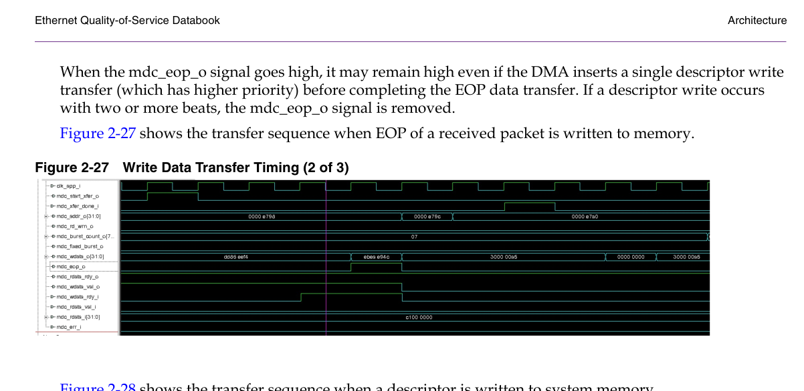

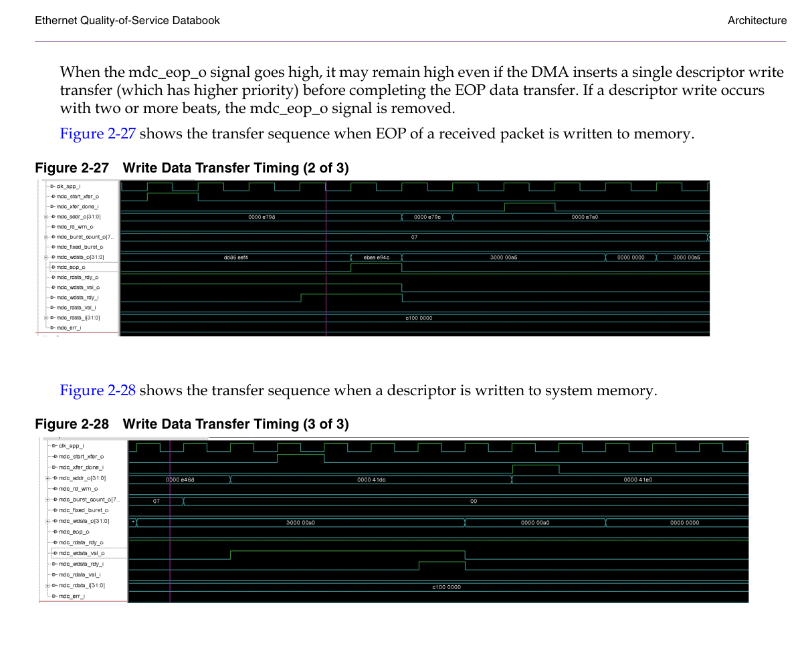

2.3.5.2
Read Data Transfer

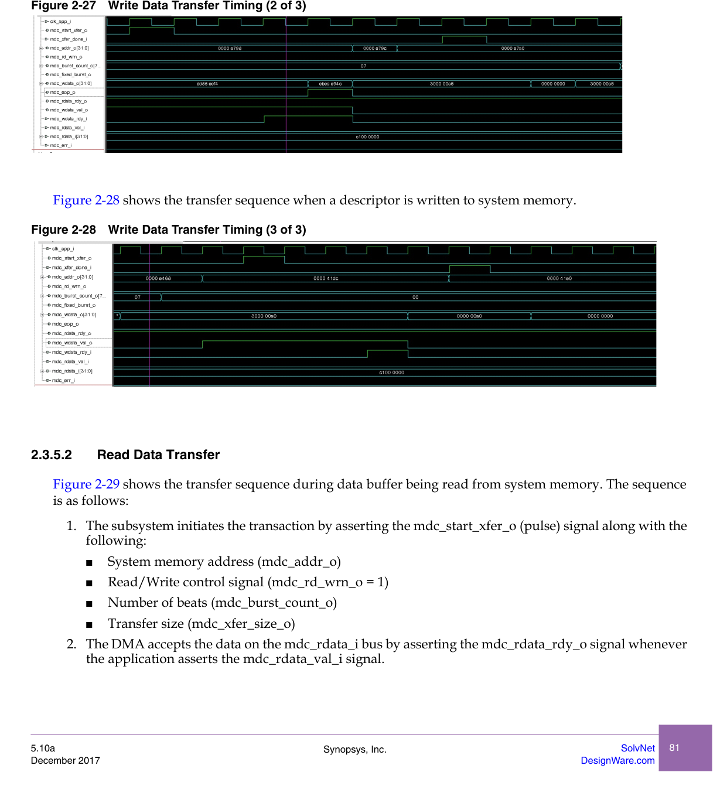

1. The subsystem initiates the transaction by asserting the mdc_start_xfer_o (pulse) signal along with the
following:
System memory address (mdc_addr_o)
Read/Write control signal (mdc_rd_wrn_o = 1)
Number of beats (mdc_burst_count_o)
Transfer size (mdc_xfer_size_o)
2. The DMA accepts the data on the mdc_rdata_i bus by asserting the mdc_rdata_rdy_o signal whenever
the application asserts the mdc_rdata_val_i signal.

| Synopsys, Inc. | 81 |
| --- | --- |
| 5.10a Synopsys, Inc. SolvNet December 2017 DesignWare.com |  |

## Page 82

3. If the application is not ready with the data, it can de-assert mdc_rdata_val_i and delay the data
transfer.
4. After all of the data has been transferred as indicated by mdc_burst_count_o, the application must end
the DMA transfer by asserting the mdc_xfer_done_i (pulse) signal.

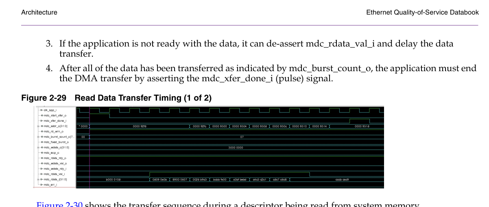

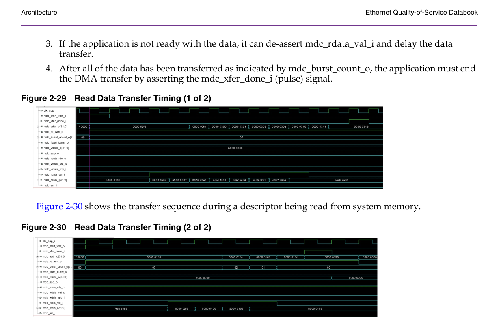

2.3.5.3
Data Transfer With Error
For any write or read transfer started by the DMA, the application can assert mdc_error_i if it cannot
complete the transaction as shown in Figure 2-31. The application should also complete the transfer by
asserting mdc_xfer_done_i in a different clock cycle. If the application asserts both signals together, the
DMA may restart the transfer to the same address and the behavior of the DMA is not predictable in such
scenario.

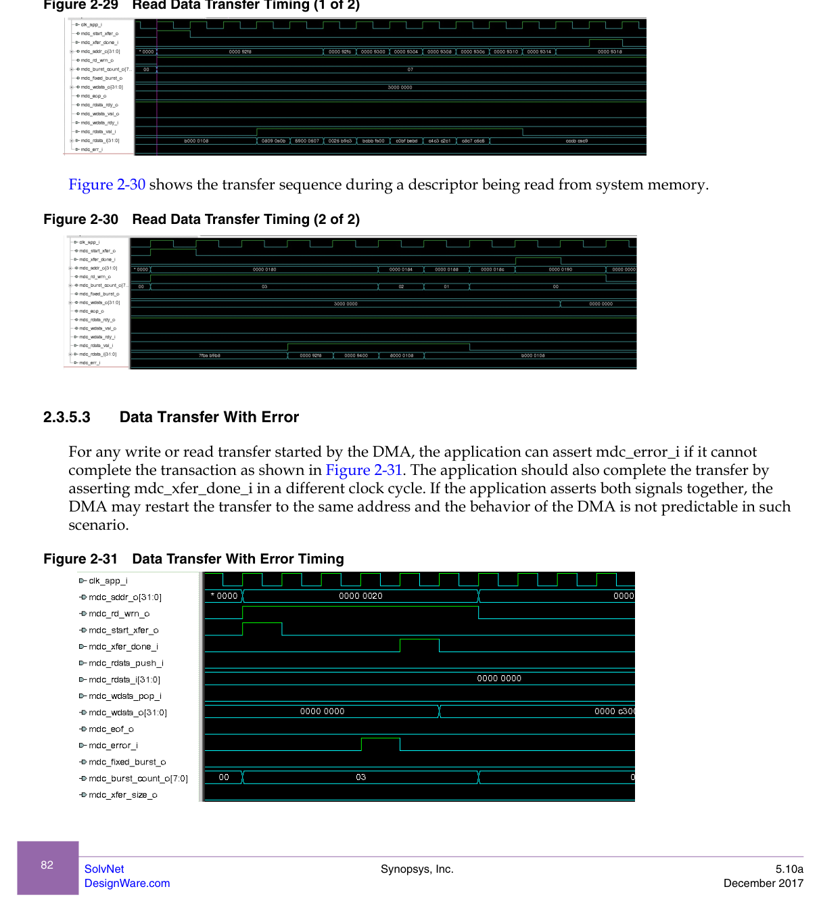

| 82 | Synopsys, Inc. |
| --- | --- |
|  | SolvNet Synopsys, Inc. 5.10a DesignWare.com December 2017 |

## Page 83

### MAC Transaction Layer

The MAC Transaction Layer (MTL) provides the FIFO memory Interface to buffer and regulate the packets
between the application system memory and the MAC. It also enables the data to be transferred between the
application clock and MAC clock domains. The MTL layer has two data paths: Transmit path and Receive
Path. The data path for both directions can be 32-bit, 64-bit, or 128-bit wide.
The MTL communicates with the application through Application Transmit Interface (ATI) on the Transmit
path and Application Receive Interface (ARI) on the Receive path. The MTL also provides the MAC Control
Interface (MCI) as a control path. The default and optional I/O signals for the ATI, ARI, and MCI interfaces
are described in “Signal Descriptions” on page 471.

### 2.4.1

### Transmit Path

In EQOS-MTL configurations, the application module drives all transactions related to the Transmit path
through ATI. In EQOS-AHB, EQOS-AXI, and EQOS-DMA configurations, the internal DMA handles all
transactions for the Transmit path through ATI.
The application or internal DMA pushes the Ethernet packets read from the application or system memory
into the corresponding queue. The packet is then popped out and transferred to the MAC when the queue
threshold is reached (threshold mode) or complete packet is in the queue (store-and-forward mode). When
EOP is transferred, the status of the transmission is taken from the MAC and transferred back to the
application or internal DMA.
The Tx queue has a default size of 2K bytes. The fill level of the queue is indicated to the application or
internal DMA (using PBL and watermark) so that it can initiate a data fetch in required bursts from the
application or system memory. The application or internal DMA indicates the SOP and EOP as packet
delimiters through ATI interface. In configurations with multiple queues, the application or internal DMA
should also indicate the queue number for which the transaction is being addressed.
2.4.1.1
Transmit Control Word
The following control information related to packet transmission is provided as a part of the Control Word
through ATI interface:
Packet Length (if DCB is enabled with WFQ scheduling algorithm)
CRC Pad Control
Source Address Insertion Control (if Enable SA and VLAN Insertion on Tx option is selected)
VLAN Insertion and Replacement Control and VLAN Tag for Outer and Inner VLAN Tags (if only
Enable SA and VLAN Insertion on Tx option is enabled. Inner VLAN Tag is supported if both Enable
SA and VLAN Insertion on Tx and Enable Double VLAN Processing options are enabled)
TCP/IP Checksum Insertion Control (if Enable Transmit TCP/IP Checksum Offload option is
selected)
One-step Timestamping Control Correction (if Enable One-Step Timestamp Feature option is
selected)
Transmit Timestamp Enable (if Enable IEEE 1588 Timestamp Support option is selected)

| Synopsys, Inc. | 83 |
| --- | --- |
| 5.10a Synopsys, Inc. SolvNet December 2017 DesignWare.com |  |

## Page 84

2.4.1.1.1
Transmit Control Word Format
The control word format for 32-bit datawidth configuration is shown in Figure 2-31. Control Word 0 is
always present, when per packet control is needed. Control Words 1, 2, and 3 (in 32-bit configuration) are
present based on the packet control field of Control Word 0.
Control Word 1 is present in the following configurations:
When only Enable SA and VLAN Insertion on Tx option is selected and VTV bit is set.
When both Enable SA and VLAN Insertion on Tx and Enable Double VLAN Processing options are
enabled and VTV or IVTV bits are set
When Enable One-Step Timestamp Feature is selected, and OSTC bit is set
When Enable One-Step Timestamp for PTP over UDP/IP Feature is selected, and both OSTC and
OST_AVAIL bits are set
Table 2-3 lists and describes the contents of Control Word 1 based on different configurations and register
bit settings.
Table 2-3
Content of Control Word 1 Depending on Configuration and Register Bit Settings

| Contents of Control Word 1 | Enable SA and VLAN Insertion on TX | Enable Double VLAN Processing | Enable One-Step Timestamp Feature | VTV | IVTV | OSTC and OST AVAIL _ |
| --- | --- | --- | --- | --- | --- | --- |
| VLAN Tags are present | Yes | No | Dont care | Yes | No | Dont care |
| Inner VLANTag | Yes | Yes | Dont care | No | Yes | Dont care |
| Outer VLANTag | Yes | Yes | Dont care | Yes | No | Dont care |
| Inner and Outer VLANTags are present | Yes | Yes | Dont care | Yes | Yes | Dont care |
| Timestamp Low (lower 32-bit value) | Yes | Yes | Yes | No | No | Yes |
| Timestamp High (higher32-bit value) | No | Not configurable | Yes | Not configur able | Not configur able | Yes |

Control Word 2 is present only when Enable One-Step Timestamp Feature is selected and OSTC bit is set or
when Enable One-Step Timestamp for PTP over UDP/IP Feature is selected and both OSTC and
OST_AVAIL bits are set.

| 84 | Synopsys, Inc. |
| --- | --- |
|  | SolvNet Synopsys, Inc. 5.10a DesignWare.com December 2017 |

## Page 85

Table 2-4 lists and describes the contents of Control Word 2 depending on the configuration and register bit
settings.
Table 2-4
Content of Control Word 2 Depending on Configuration and Register Bit Settings

| Contents of Control Word 2 | Enable One-Step Timestamp Feature | Enable SA and VLAN Insertion on TX | OSTC and OST AV _ AIL | VTV | ITV |
| --- | --- | --- | --- | --- | --- |
| Timestamp Low (lower 32-bit value) | Yes | Yes | Yes | Yes | Yes |
| Timestamp High (higher 32-bit value) | Yes | No | Yes | No | No |

If Enable SA and VLAN Insertion on Tx is not selected, it contains the higher 32-bit value. If Enable SA and
VLAN Insertion on Tx is selected and VTV bit is set, it contains the lower 32-bit value.
Control Word 3 is present only when Enable SA and VLAN Insertion on Tx, Enable Double VLAN
Processing, and Enable One-Step Timestamp Feature is selected and OSTC, (Enable One-Step Timestamp
for PTP over UDP/IP Feature is selected and both OSTC and OST_AVAIL bits are set), VTV, and IVTV bits
are set. Its value is Timestamp High (higher 32-bit value).
Control Word 1 is present when bits VTV (when Enable SA and VLAN Insertion on Tx option is selected)
and/or IVTV (when both Enable SA and VLAN Insertion on Tx and Enable Double VLAN Processing
options are enabled) is/are set, and contains the Inner and/or Outer VLAN Tags, based on the VTV/SVTV
bits respectively.
Control Word 1 is also present when OSTC (when Enable One-Step Timestamp Feature is selected) bit is set
and both VTV and SVTV bits are not set. In this case, Control Word 1 contains the lower 32-bit value and
Control Word 2 contains the higher 32-bit value of the 64 -bit timestamp. When both OSTC and VTV and/or
SVTV bits are set, Control Word 1 contains the Inner and/or Outer VLAN Tags, Control Word 2 contains
the lower 32-bit value, and Control Word 3 contains the higher 32-bit value of the 64 bit timestamp. The
Control Word number is indicated through the ati_ctrl_type_i signal of the ATI interface.

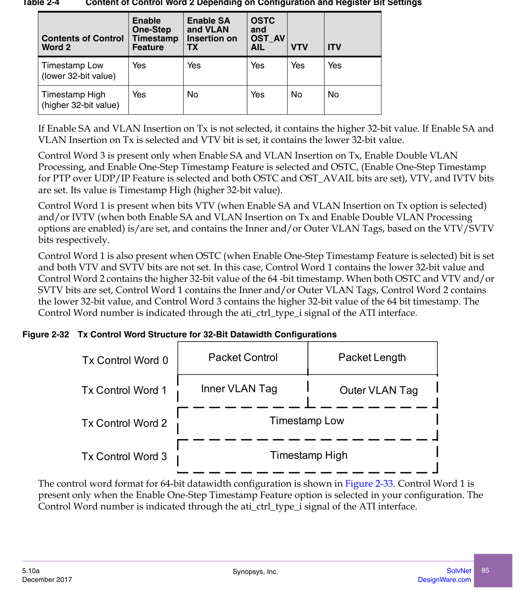

| Packet Control Packet Length Tx Control Word 0 Tx Control Word 1 Inner VLAN Tag Outer VLAN Tag Timestamp Low Tx Control Word 2 Tx Control Word 3 Timestamp High | Packet Control | Packet Length |
| --- | --- | --- |

The control word format for 64-bit datawidth configuration is shown in Figure 2-33. Control Word 1 is
present only when the Enable One-Step Timestamp Feature option is selected in your configuration. The
Control Word number is indicated through the ati_ctrl_type_i signal of the ATI interface.

| Synopsys, Inc. | 85 |
| --- | --- |
| 5.10a Synopsys, Inc. SolvNet December 2017 DesignWare.com |  |

## Page 86

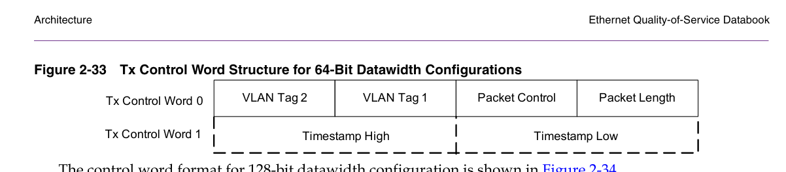

| Tx Control Word 0 VLAN Tag 2 VLAN Tag 1 Packet Control Packet Length Tx Control Word 1 Timestamp High Timestamp Low | VLAN Tag 2 | VLAN Tag 1 | Packet Control | Packet Length |
| --- | --- | --- | --- | --- |

The control word format for 128-bit datawidth configuration is shown in Figure 2-34.

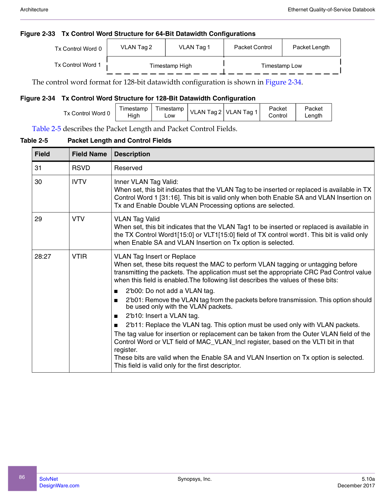

| Tx Control Word 0 | Timestamp High | Timestamp Low | VLAN Tag 2 | VLAN Tag 1 | Packet Control | Packet Length |
| --- | --- | --- | --- | --- | --- | --- |

Table 2-5 describes the Packet Length and Packet Control Fields.
Table 2-5
Packet Length and Control Fields

| Field | Field Name | Description |
| --- | --- | --- |
| 31 | RSVD | Reserved |
| 30 | IVTV | Inner VLAN Tag Valid: When set, this bit indicates that the VLAN Tag to be inserted or replaced is available in TX Control Word 1 [31:16]. This bit is valid only when both Enable SA and VLAN Insertion on Tx and Enable Double VLAN Processing options are selected. |
| 29 | VTV | VLAN Tag Valid When set, this bit indicates that the VLAN Tag1 to be inserted or replaced is available in the TX Control Word1[15:0] or VLT1[15:0] field of TX control word1. This bit is valid only when Enable SA and VLAN Insertion on Tx option is selected. |
| 28:27 | VTIR | VLAN Tag Insert or Replace When set, these bits request the MAC to perform VLAN tagging or untagging before transmitting the packets. The application must set the appropriate CRC Pad Control value when this field is enabled.The following list describes the values of these bits: ■ 2'b00: Do not add a VLAN tag. ■ 2'b01: Remove the VLAN tag from the packets before transmission. This option should be used only with the VLAN packets. ■ 2'b10: Insert a VLAN tag. ■ 2'b11: Replace the VLAN tag. This option must be used only with VLAN packets. The tag value for insertion or replacement can be taken from the Outer VLAN field of the Control Word or VLT field of MAC VLAN Incl register, based on the VLTI bit in that _ _ register. These bits are valid when the Enable SA and VLAN Insertion on Tx option is selected. This field is valid only for the first descriptor. |

| 86 | Synopsys, Inc. |
| --- | --- |
|  | SolvNet Synopsys, Inc. 5.10a DesignWare.com December 2017 |

## Page 87

| Field | Field Name | Description |
| --- | --- | --- |
| 26:24 | SAIC | SA Insertion Control These bits request the MAC to insert or replace the Source Address field in the Ethernet packet with the value given in the MAC Address 0 register. If the Source Address field is modified in a packet, the MAC automatically recalculates and replaces the CRC bytes. Bit 26 specifies the MAC Address Register (1 or 0) value that is used for Source Address insertion or replacement. The following list describes the values of Bits[25:24] ■ 2'b00: Do not include the source address ■ 2'b01: Include or insert the source address. For reliable transmission, the application must provide frames without source addresses. ■ 2'b10: Replace the source address. For reliable transmission, the application must provide frames with source addresses. ■ 2'b11: Reserved SA Insertion Control can also be controlled by programming the SARC bits of MAC Configuration register. SARC bits determine whether the SA insertion control is _ through the control word or register. These bits are valid when the Enable SA and VLAN Insertion on Tx option is selected. |
| 23:22 | IVTIR | Inner VLAN Tag Insert or Replace These bits control the inner VLAN tagging or untagging before transmitting the packets. The outer VLAN tag must be present for this operation. The application must set appropriate CRC Pad Control value when this control is enabled. The following list describes the values of these bits. ■ 2'b00: Do not add inner VLAN tag. ■ 2'b01: Remove the inner VLAN tag from the packets before transmission. This option should be used only with the stacked VLAN packet ■ 2'b01: Remove the inner VLAN tag from the packets before transmission. This option should be used only with the stacked VLAN packets ■ 2'b10: Insert inner VLAN tag with the tag value programmed in MAC Register 25 (MAC Inner VLAN Incl register). _ _ _ ■ 2'b11: Replace the inner VLAN tag in packets with the Tag value programmed in MAC Register 25 (MAC Inner VLAN Incl register). This option must be used only with _ _ _ stacked VLAN packets. The tag value for insertion or replacement can be taken from the Inner VLAN field of the Control Word or VLT field of MAC Inner VLAN Incl register, based on the VLTI bit in that _ _ _ register. These bits are valid when the Double VLAN and SA-VLAN Insertion options are selected during core configuration. |
| 21:20 | CIC | Checksum Insertion Control. These bits control the checksum calculation and insertion. The following list describes the bit encoding: ■ 2'b00: Checksum Insertion Disabled. ■ 2'b01: Only IP header checksum calculation and insertion are enabled ■ 2'b10: IP header checksum and payload checksum calculation and insertion are enabled but pseudo-header checksum is not calculated in hardware ■ 2'b11: IP Header checksum and payload checksum calculation and insertion are enabled and pseudo-header checksum is calculated in hardware. This field is valid when the Enable Transmit TCP/IP Checksum Offload option is selected. |

| Synopsys, Inc. | 87 |
| --- | --- |
| 5.10a Synopsys, Inc. SolvNet December 2017 DesignWare.com |  |

## Page 88

| Field | Field Name | Description |
| --- | --- | --- |
| 19 | OSTC | One-Step Timestamp Correction When this bit is set, the MAC performs the one-step timestamp correction with reference to the timestamp values provided in Tx Control Word 1/2 and Tx Control Word 2/3.This bit is valid when the Enable One-Step Timestamp Feature option is selected. |
| 18 | TTSE | Transmit Timestamp Enable When set, this bit enables the IEEE1588 hardware time stamping for this Transmit frame.This bit is valid when the Enable IEEE 1588 Timestamp Support option is selected. |
| 17:16 | CPC | CRC Pad Control This field controls the CRC and Pad insertion for Tx frame.The following list describes the bit encoding: ■ 2'b00: CRC and Pad Insertion The MAC appends the cyclic redundancy check (CRC) at the end of the transmitted packet of length greater than or equal to 60 bytes. The MAC automatically appends padding and CRC to a packet with length less than 60 bytes. ■ 2'b01: CRC Insertion (Disable Pad Insertion) The MAC appends the CRC at the end of the transmitted packet but it does not append padding. The application should ensure that the padding bytes are present in the packet being transferred from the Transmit Buffer, that is, the packet being transferred from the Transmit Buffer is of length greater than or equal to 60 bytes. ■ 2'b10: Disable CRC Insertion The MAC does not append the CRC at the end of the transmitted packet. The applica- tion should ensure that the padding and CRC bytes are present in the packet being transferred from the Transmit Buffer. ■ 2'b11: CRC Replacement The MAC replaces the last four bytes of the transmitted packet with recalculated CRC bytes. The application should ensure that the padding and CRC bytes are present in the packet being transferred from the Transmit Buffer. When checksum insertion (CIC), SA-VLAN insertion (SAIC), or one-step timestamp (OSTC) features are enabled, the application must provide appropriate CRC Pad Control. |
| 15 | OST AVAIL _ | One-step Timestamp Available When OSTC bit and this bit are set, it indicates that the reference Timestamp is available in the TTSH and TTSL fields of TX control word.The Tx control word corresponding to TTSH and TTSL fields must not be provided if this bit is reset.This bit is valid when the Enable One-Step Timestamp for PTP over UDP/IP Feature option is selected. |
| 14:0 | PL | Transmit Packet Length This field is equal to the length of the packet to be transmitted in bytes. This field is needed only when DCB is enabled in your configuration and WFQ scheduling algorithm is selected. Note: If CRC and padding is done by the MAC, the application must provide the appropriate length, which is (approximately) equal to the length of the transmitted packet by the MAC. This information is used by the Transmit scheduler. |

| 88 | Synopsys, Inc. |
| --- | --- |
|  | SolvNet Synopsys, Inc. 5.10a DesignWare.com December 2017 |

## Page 89

Table 2-6 provides description of Outer VLAN Tag and Inner VLAN Tag fields of ATI Control Word.
Table 2-6
Outer VLAN Tag  and Inner VLAN Tag Fields of ATI Control Word

| Field | Field Name | Description |
| --- | --- | --- |
| 31:16 | VLT2 | Inner VLAN Tag: This field contains the inner VLAN Tag to be inserted or replaced in the transmitted packet.This field is valid when the following are true: ■ The Enable SA and VLAN Insertion on Tx and Enable Double VLAN Processing options are selected. ■ The VLTI bit is set in MAC Inner VLAN Incl register _ _ _ ■ The IVTIR field in Tx Control Word 0 indicates inner VLAN Tag insertion or replace- ment. |
| 15:0 | VLT1 | Outer VLAN Tag: This field contains the outer VLAN Tag to be inserted or replaced in the transmitted packet. This field is valid when the following are true: ■ The Enable SA and VLAN Insertion on Tx option is selected. ■ The VLTI bit is set in the MAC VLAN Incl register. _ _ ■ The VTIR field in Tx Control Word 0 indicates VLAN Tag insertion or replacement. |

Table 2-7 provides description of Timestamp Low field of ATI Control Word.
Table 2-7
Timestamp Low Field of ATI Control Word

| Field | Field Name | Description |
| --- | --- | --- |
| 31:0 | TSSL | Transmit Packet Timestamp Low This field contains the lower 32-bits of timestamp when one-step timestamp correction is enabled. This field is validated by OSTC bit in Tx Control Word 0. This field is valid when the Enable One-Step Timestamp Feature option is selected. |

Table 2-8 provides description of Timestamp High field of ATI Control Word.
Table 2-8
Timestamp High Field of ATI Control Word

| Field | Field Name | Description |
| --- | --- | --- |
| 31:0 | TSSH | Transmit Packet Timestamp High This field contains the higher 32-bits of timestamp when one-step timestamp correction is enabled. This field is validated by the OSTC bit in Tx Control Word 0. This field is valid when the Enable One-Step Timestamp Feature option is selected. |

2.4.1.2
Transmit Operation
The following two modes of operation trigger reading of the data towards the MAC:
Threshold mode:
In Threshold (or cut-through) mode, as soon as the number of bytes in the Queue cross the configured
threshold level (or when the end of packet is written before the threshold is crossed), the data is ready
to be popped out and forwarded to the MAC. The threshold level is configured by using the TTC bits
of MTL_TxQ0_Operation_Mode register corresponding to an MTL queue.

| Synopsys, Inc. | 89 |
| --- | --- |
| 5.10a Synopsys, Inc. SolvNet December 2017 DesignWare.com |  |

## Page 90

Store-and-forward mode:
In store-and-forward mode, the MTL pops out the packet towards the MAC only when one or more
of the following conditions are true:
A complete packet is stored in the Queue
The Tx FIFO becomes almost full
The ATI watermark becomes low
The watermark becomes low when the requested Queue does not have space to accommodate the
requested burst length on the ATI. Therefore, the MTL when operating in the store-and-forward mode
allows packet transmission even if the packet length is bigger than the Tx Queue size.
The application can flush complete content of the Tx Queue by setting Bit 0 (FTQ) of Transmit Operation
Mode register corresponding to an MTL queue. This bit is self-clearing and initializes the Queue pointers to
the default state. If the FTQ bit is set during a packet transfer from the MTL to the MAC, the MTL stops
further transfer because the queue is considered to be empty. Therefore, an underflow event occurs at the
MAC transmitter.
For information about the initialization and transmit operations for the MTL Layer, see Section 2.4.1.3
through Sections 2.4.1.5. The timing diagrams are provided in “Transmit Path Timing” on page 93.
2.4.1.3
Initialization Flow
Upon reset, the MTL is ready to manage the flow of data to and from the application or DMA, and MAC.
For configurations with a single Transmit Queue, there are no initialization requirements for enabling the
MTL. For configurations with multiple Transmit Queues, you need to initialize the Queue size for each of
the queues by programming the TQS bits of MTL_TxQ0_Operation_Mode register corresponding to a
Transmit queue. You also need to initialize the MAC block. For EQOS-AHB, EQOS-AXI, and EQOS-DMA
configurations, the internal DMA controllers must be individually enabled through their respective CSRs.
2.4.1.4
Data Flow Between DMA and MTL
This section describes the interaction process between the MTL and the DMA in the EQOS-AHB, EQOSAXI,
and EQOS-DMA configurations.
2.4.1.4.1
Single-Packet Transmit Operation
The following flow is valid when the core is operating in non-OSP mode, that is, when bit 4 (OSP) of the
DMA_CH(#i)_TX_Control (for i = 0; i <= DWC_EQOS_NUM_DMA_TX_CH-1) register of the DMA
channel is set to 0.
During a Transmit operation, the MTL block is a slave for the DMA controller. The general sequence of
events for a Transmit operation is as follows:
1. If the system has data to be transferred, the DMA controller (if enabled) fetches the data from the appli-
cation through the AHB, AXI, or Native DMA master interface and starts forwarding it to the MTL. The
DMA descriptor memory contains the information related to packet control which is used to drive the
ATI Control Word. The DMA data buffer memory contains the packet data.
2. The MTL pushes the data received from the DMA into the corresponding queue. This process continues
until the EOP is transferred.

| 90 | Synopsys, Inc. |
| --- | --- |
|  | SolvNet Synopsys, Inc. 5.10a DesignWare.com December 2017 |

## Page 91

3. When the threshold level is crossed or a full packet of data is received into the queue, the MTL reads
the packet data and drives it to the MAC.
4. The queue controller continues to transfer data from the queue until a complete packet is transferred to
the MAC.
5. When the packet transfer is complete, the MTL receives the status from the MAC and notifies the DMA
controller.

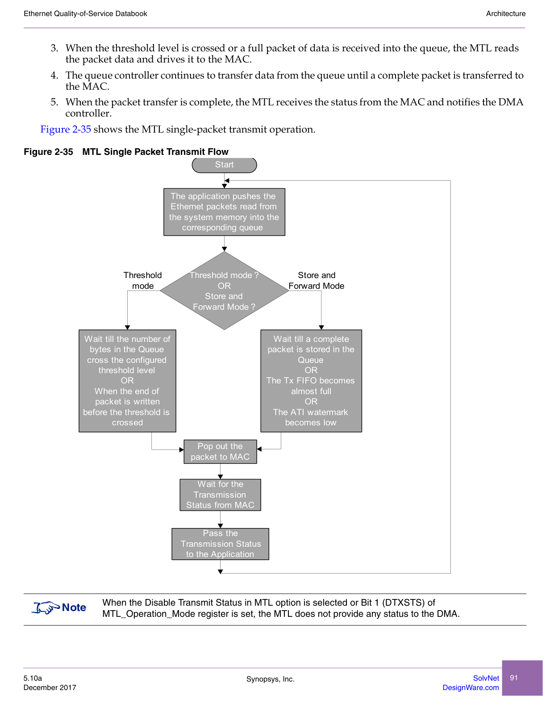

Start
The application pushes the
Ethernet packets read from
the system memory into the
corresponding queue
Threshold mode ?
Store and
Forward Mode ?
Threshold
mode
Store and
Forward Mode
Wait till the number of
bytes in the Queue
cross the configured
threshold level
When the end of
packet is written
before the threshold is
crossed
Wait till a complete
packet is stored in the
Queue
The Tx FIFO becomes
almost full
The ATI watermark
becomes low
Pop out the
packet to MAC
Wait for the
Transmission
Status from MAC
Pass the
Transmission Status
to the Application
When the Disable Transmit Status in MTL option is selected or Bit 1 (DTXSTS) of
MTL_Operation_Mode register is set, the MTL does not provide any status to the DMA.

|  | Note |
| --- | --- |

| Synopsys, Inc. | 91 |
| --- | --- |
| 5.10a Synopsys, Inc. SolvNet December 2017 DesignWare.com |  |

## Page 92

2.4.1.4.2
Transmit Operation - Two Packets in the Buffer
The following flow is valid when the core is operating in OSP mode, that is, when bit 4 (OSP) of the
DMA_CH(#i)_TX_Control (for i = 0; i <= DWC_EQOS_NUM_DMA_TX_CH-1) register of the DMA
channel is set to 1.
The flow is similar to the flow described in “Single-Packet Transmit Operation” on page 90”. However after
fetching a packet DMA instead of waiting for the status, it continues to fetch another packet if available in
the system memory. So, MTL can receive the second packet while it is processing the first packet. This flow
improves the performance because the DMA can process two packets back to back before waiting for the
status of the first packet.
2.4.1.4.3
Relationship Between the Number of Tx DMA Channels and Tx Queues
The number of Tx DMA channels is always equal to the Tx queues selected in your configuration. This is
because the DMA is designed to arbitrate among multiple channels (to fetch the descriptor and packet data
from the system memory) in terms of PBLs (Programmable Bursts Lengths). However, the Tx queues are
packet-based storage memory. Therefore, one to one mapping is required between the DMA channels and
Tx queues to maintain the packet-level coherency.
2.4.1.4.4
Transmit Operation - Multiple Packets in Buffer
In the EQOS-MTL configuration, the Tx FIFO can be configured to accept more than two packets at a time.
This option limits the number of status words that can be stored in the MTL before it is transferred to the
DMA or application. By default, this number is limited to two but it can be configured for 4 or 8. When the
MTL queue accepts the number of packets equal to the depth of the Status FIFO, it stops accepting further
packets unless the Tx Status is given and accepted by the application.
2.4.1.4.5
Retransmission During Collision
While a packet is being transferred from the MTL to the MAC, a collision event can occur on the MAC line
interface in half-duplex mode. The MAC indicates a Retry attempt to the MTL by giving the status even
before the EOP is transferred from the MTL. The MTL then enables the retransmission by popping out the
packet again from the queue.
After more than 96 bytes (or 548 bytes in 1000-Mbps mode) are read out towards the MAC, the Queue
Controller frees up that space and makes it available to the application or the DMA to push in more data.
This means that the retransmission is not possible after this threshold is crossed or when the MAC indicates
a late-collision event.
When a packet transmission is aborted because of underflow and a collision event immediately follows
(initiating a retry), retry has higher priority than abort, as described in Table 2-15.
2.4.1.5
Transmit Status Word
At the end of transfer of the Ethernet packet to the MAC and after the MAC completes the transmission of
the packet, the MTL provides the Transmit status validity by asserting ati_txstatus_val_o[] on respective
queues.For configurations with a single queue, ati_txstatus_o indicates the status of the queue when
ati_txstatus_val_o is asserted. The application can read the status by asserting the ati_txstatus_ack_i signal.
For configurations with multiple Tx queues, the ati_txstatus_val_o signal indicates the availability of status
on individual queues and application should read the status on ati_txstatus_o[17:0] by driving the Tx queue
number on ati_txsqnum_i and by asserting ati_txstatus_ack_i.

| 92 | Synopsys, Inc. |
| --- | --- |
|  | SolvNet Synopsys, Inc. 5.10a DesignWare.com December 2017 |

## Page 93

The detailed description of the Transmit Status is the same as for Bits[17:0] of TDES3 normal descriptor in
write-back format, given in Table 21-10. If IEEE 1588 Timestamp feature is enabled, the MTL returns 64-bit
timestamp of the packet, along with the Transmit status of ATI on ati_txstatus_o[81:18]. A valid timestamp
is indicated by an active high on ati_txstatus_o[17].
If the Disable Transmit Status in MTL option is selected while configuring the core, the Transmit Status is
not provided to the application or DMA. When this option is selected, the application (or DMA) can push as
many packets as possible into the Tx queues because the application or DMA is not required to read the
status words from the Status FIFO. If this option is not selected, you can program Bit 1 (DTXSTS) of
MTL_Operation_Mode register to disable the dependency of the application or DMA to read the status
words from the status FIFO.
If the Enable IEEE 1588 Timestamp Support option is not selected, the width of ati_txstatus_o[] is 18.
If this options is selected, the width of the ati_txstatus_o is 82. The upper 64-bits indicate the
timestamp captured for that packet if the IEEE 1588 timing stamping is enabled for the packet through
Packet Control Word (Bit 19).

|  | Note |
| --- | --- |

2.4.1.6
Transmit Path Timing
This section describes the timing specifications for the MAC Transaction layer (MTL) interface signals in the
Transmit path.
2.4.1.6.1
Application Transmit Interface

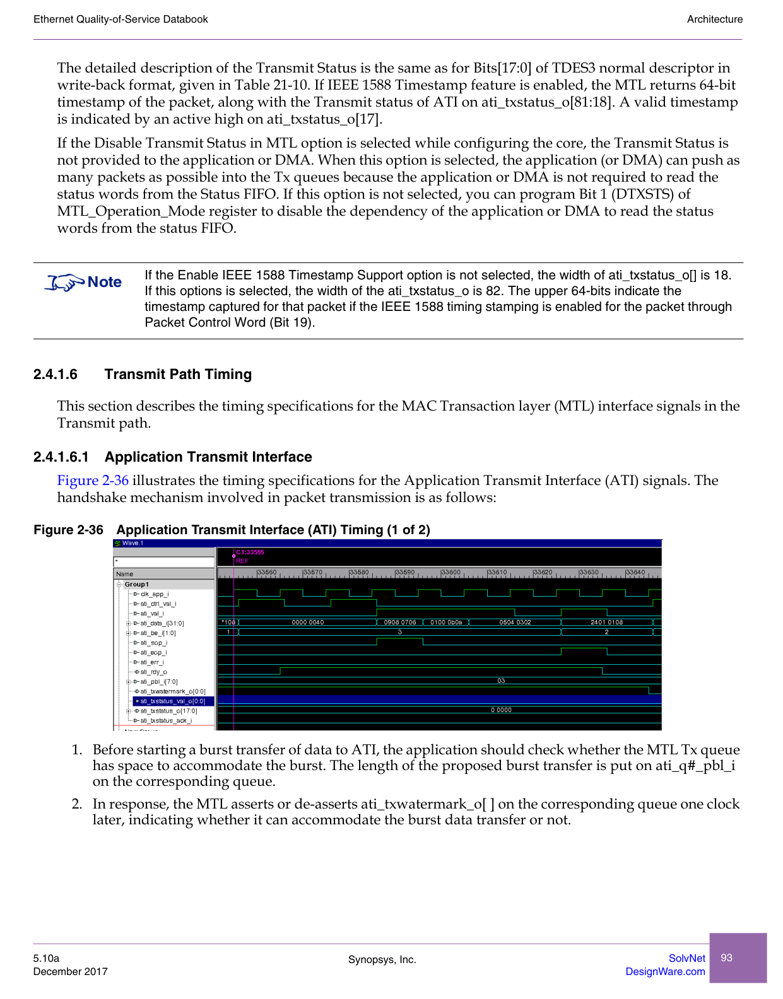

1. Before starting a burst transfer of data to ATI, the application should check whether the MTL Tx queue
has space to accommodate the burst. The length of the proposed burst transfer is put on ati_q#_pbl_i
on the corresponding queue.
2. In response, the MTL asserts or de-asserts ati_txwatermark_o[ ] on the corresponding queue one clock
later, indicating whether it can accommodate the burst data transfer or not.

| Synopsys, Inc. | 93 |
| --- | --- |
| 5.10a Synopsys, Inc. SolvNet December 2017 DesignWare.com |  |

## Page 94

3. At any point during the transfer, the MTL can alert the application to stop the transfer by de-asserting
the ati_rdy_o signal. The ati_rdy_o signal is de-asserted only when either of the following happens:
The queue is almost full
The Tx queue is being flushed or checksum is being written if the Enable Transmit TCP/IP
Checksum Offload option is selected
The Tx queue-full event does not occur if the application ensures that enough space is available
before the start of data transfer, as described in step 1 and step 2.
4. The application starts a packet transfer by asserting the ati_ctrl_val_i and ati_ctrl_type_i signals (for
writing the control word) followed by the ati_val_i and ati_sop_i signals. The MTL accepts the control
word or data whenever ati_rdy_o is asserted along with ati_ctrl_val_i or ati_val_i.
In configurations with multiple Tx queues, the ati_qnum_i[] signal should be associated with the ati_c-
trl_val_i and ati_val_i signals to indicate the Tx queue to which the control word or data is addressed.
5. When the application wants to transfer the last bytes of a packet, ati_eop_i should be asserted along
with the byte enables (ati_be_i), indicating the valid number of data bytes on the bus. All data transfers
except the EOP transfer must have the byte-enables as all-ones.
6. After transferring the packet to the Ethernet PHY, the MAC gives the transmission status to the MTL
(not shown in the diagram).
7. In configurations with a single queue, the MTL gives the Transmit status of the packet to the application
through ati_txstatus_o by asserting ati_txstatus_val_o. The application accepts the status by asserting
ati_ack_i.
In configurations with multiple queues, the MTL asserts the ati_txstatus_val_o[] to indicate the status
availability on the corresponding queue. The application should read the status on ati_txstatus_o[] by
driving Tx queue number on ati_txsqnum_i[] and asserting ati_txstatus_ack_i.
8. The application need not wait for step 6 and step 7 to start the transfer of next packet on the ATI. It can
go to step 2 by driving the new PBL on ati_q#_pbl_i to check for the watermark.

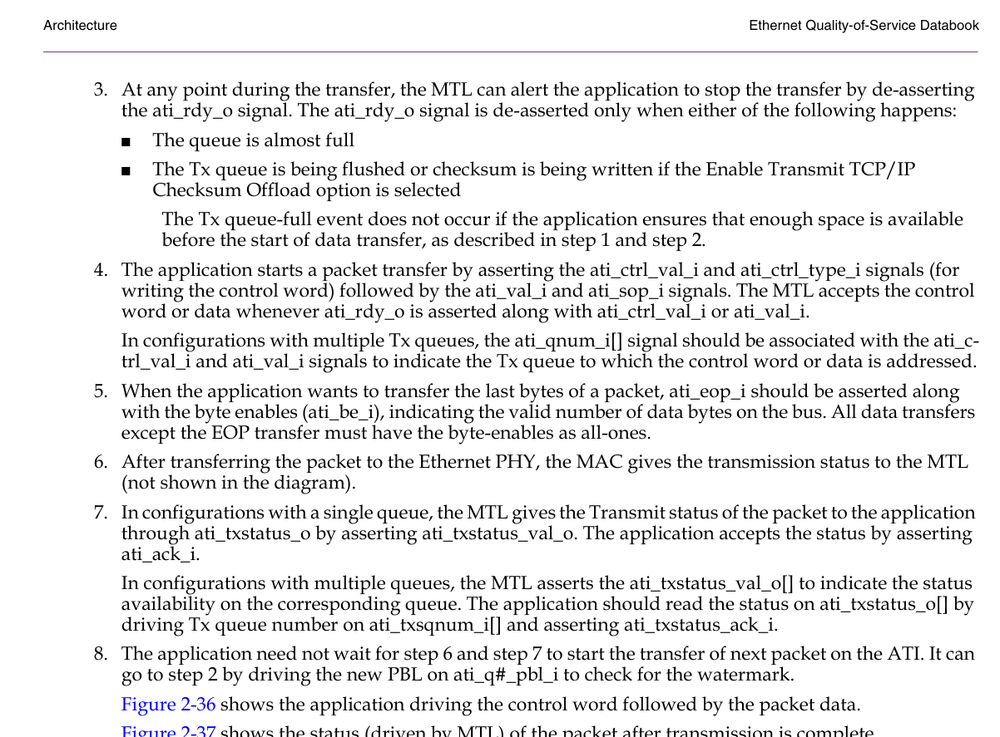

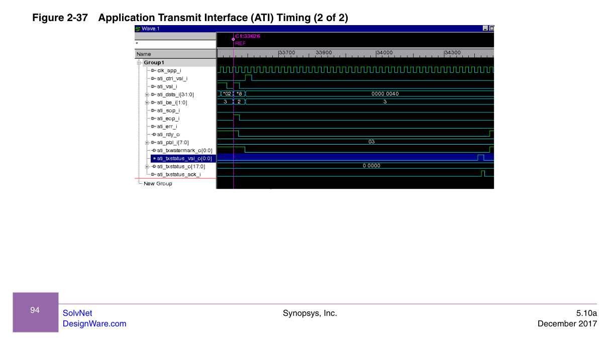

| 94 | Synopsys, Inc. |
| --- | --- |
|  | SolvNet Synopsys, Inc. 5.10a DesignWare.com December 2017 |

## Page 95

2.4.1.6.2
Transmit Queue Write Interface
The MTL Tx Queue controller transfers the data accepted through ATI to the external memory. Timing
specifications for the memory interface signals (twc_wr_* signals) are shown in Figure 2-38. This figure also
shows the timing relationship of the memory interface signals with respect to the ATI signals.

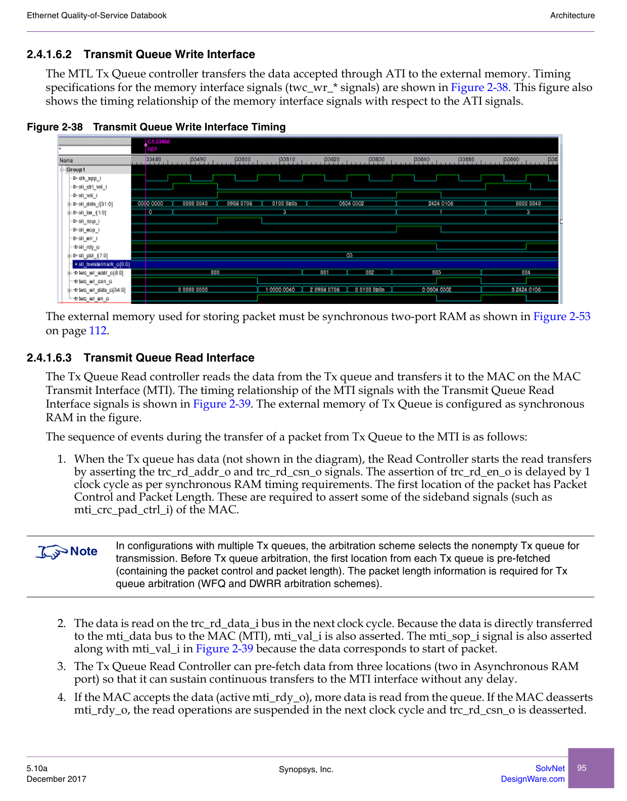

The external memory used for storing packet must be synchronous two-port RAM as shown in Figure 2-53
on page 112.
2.4.1.6.3
Transmit Queue Read Interface
The Tx Queue Read controller reads the data from the Tx queue and transfers it to the MAC on the MAC
Transmit Interface (MTI). The timing relationship of the MTI signals with the Transmit Queue Read
Interface signals is shown in Figure 2-39. The external memory of Tx Queue is configured as synchronous
RAM in the figure.
The sequence of events during the transfer of a packet from Tx Queue to the MTI is as follows:
1. When the Tx queue has data (not shown in the diagram), the Read Controller starts the read transfers
by asserting the trc_rd_addr_o and trc_rd_csn_o signals. The assertion of trc_rd_en_o is delayed by 1
clock cycle as per synchronous RAM timing requirements. The first location of the packet has Packet
Control and Packet Length. These are required to assert some of the sideband signals (such as
mti_crc_pad_ctrl_i) of the MAC.
In configurations with multiple Tx queues, the arbitration scheme selects the nonempty Tx queue for
transmission. Before Tx queue arbitration, the first location from each Tx queue is pre-fetched
(containing the packet control and packet length). The packet length information is required for Tx
queue arbitration (WFQ and DWRR arbitration schemes).

|  | Note |
| --- | --- |

2. The data is read on the trc_rd_data_i bus in the next clock cycle. Because the data is directly transferred
to the mti_data bus to the MAC (MTI), mti_val_i is also asserted. The mti_sop_i signal is also asserted
along with mti_val_i in Figure 2-39 because the data corresponds to start of packet.
3. The Tx Queue Read Controller can pre-fetch data from three locations (two in Asynchronous RAM
port) so that it can sustain continuous transfers to the MTI interface without any delay.
4. If the MAC accepts the data (active mti_rdy_o), more data is read from the queue. If the MAC deasserts
mti_rdy_o, the read operations are suspended in the next clock cycle and trc_rd_csn_o is deasserted.

| Synopsys, Inc. | 95 |
| --- | --- |
| 5.10a Synopsys, Inc. SolvNet December 2017 DesignWare.com |  |

## Page 96

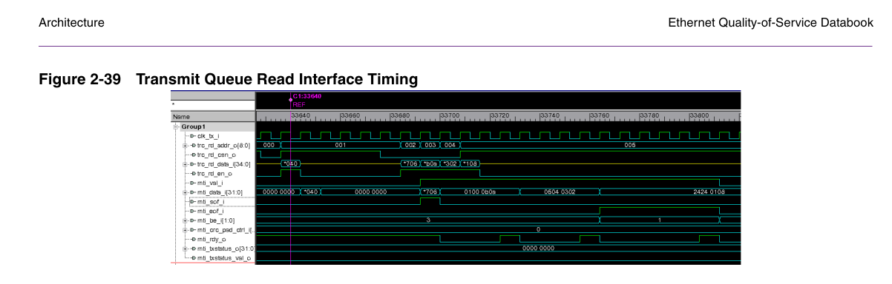

2.4.1.6.4
Transmit Packet Retransmission
The MAC transmitter may abort the transmission of a packet because of collision, Tx Queue underflow, loss
of carrier, jabber timeout, no carrier, excessive deferral, and late collision. When packet transmission is
aborted because of collision, the MAC requests retransmission of the packet. The sequence of events shown
in Figure 2-40 is as follows:
1. The MTL starts the transfer of a packet to the MAC by asserting mti_val_i and mti_sop_i.
The subsequent data is sent when the MAC asserts the mti_rdy_o signal.
2. When the MAC experiences a collision on the Ethernet bus (not shown in diagram), packet transmission
is suspended first by keeping mti_rdy_o de-asserted.
3. The MAC transfers the transmission status on mti_txstatus, and requests retransmission by asserting
Bit 31 of mti_txstatus.
4. The MTL retransmits the packet. The Tx Queue read address (trc_rd_addr) rewinds back to the start of
packet address 0x000 for retransmission.

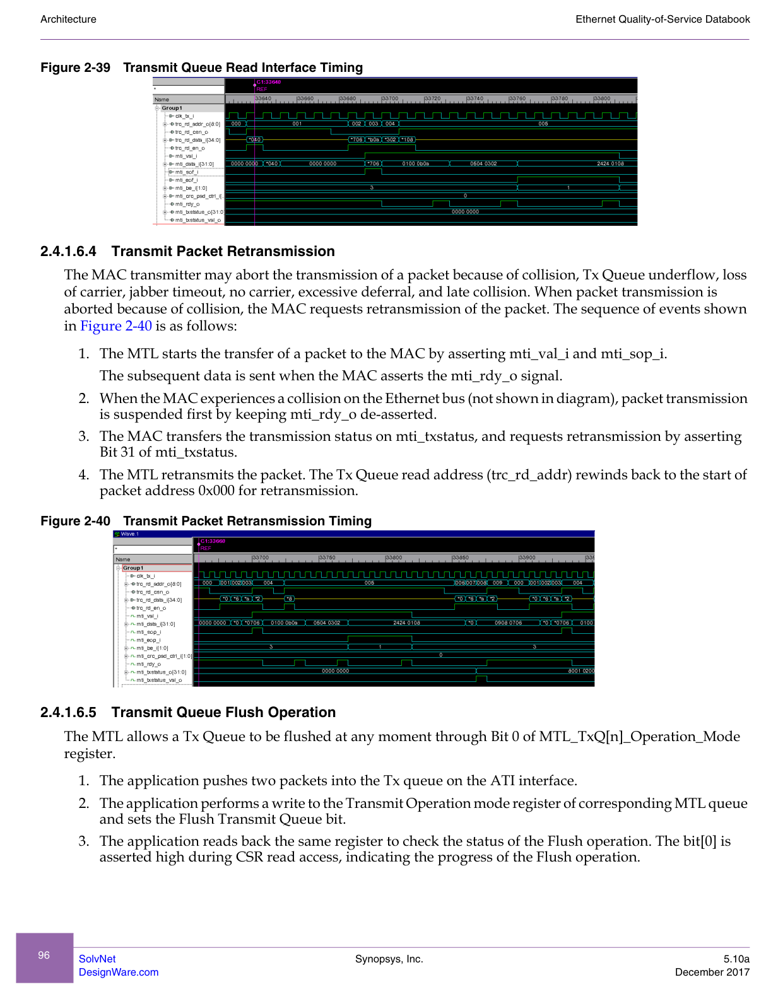

2.4.1.6.5
Transmit Queue Flush Operation
The MTL allows a Tx Queue to be flushed at any moment through Bit 0 of MTL_TxQ[n]_Operation_Mode
register.
1. The application pushes two packets into the Tx queue on the ATI interface.
2. The application performs a write to the Transmit Operation mode register of corresponding MTL queue
and sets the Flush Transmit Queue bit.
3. The application reads back the same register to check the status of the Flush operation. The bit[0] is
asserted high during CSR read access, indicating the progress of the Flush operation.

| 96 | Synopsys, Inc. |
| --- | --- |
|  | SolvNet Synopsys, Inc. 5.10a DesignWare.com December 2017 |

## Page 97

4. If the MTL has already transferred a (partial) packet to the MAC, then it terminates that immediately
and clears the Tx Queue. The MTL waits for the status of the partial/full packet transfers to the MAC.
5. The MTL indicates the completion of the Flush operation by asserting ati_txfifoflush_clr (internal),
which clears Bit 0 in Transmit Operation Mode register of corresponding MTL queue.

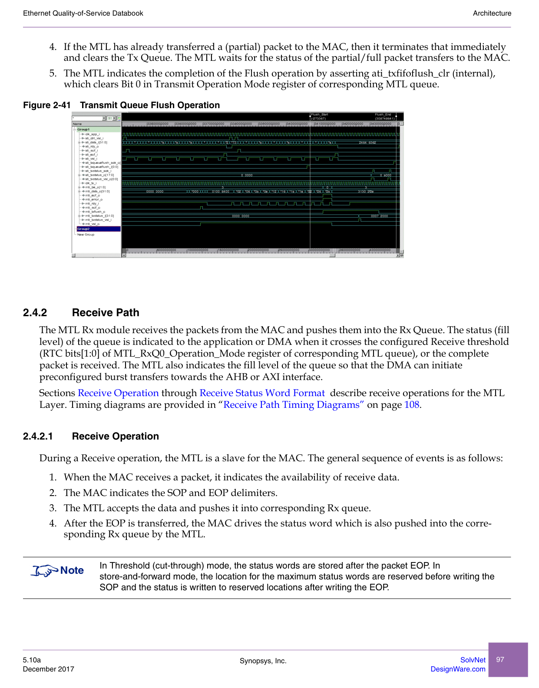

### 2.4.2

### Receive Path

The MTL Rx module receives the packets from the MAC and pushes them into the Rx Queue. The status (fill
level) of the queue is indicated to the application or DMA when it crosses the configured Receive threshold
(RTC bits[1:0] of MTL_RxQ0_Operation_Mode register of corresponding MTL queue), or the complete
packet is received. The MTL also indicates the fill level of the queue so that the DMA can initiate
preconfigured burst transfers towards the AHB or AXI interface.
Sections Receive Operation through Receive Status Word Format  describe receive operations for the MTL
Layer. Timing diagrams are provided in “Receive Path Timing Diagrams” on page 108.
2.4.2.1
Receive Operation
During a Receive operation, the MTL is a slave for the MAC. The general sequence of events is as follows:
1. When the MAC receives a packet, it indicates the availability of receive data.
2. The MAC indicates the SOP and EOP delimiters.
3. The MTL accepts the data and pushes it into corresponding Rx queue.
4. After the EOP is transferred, the MAC drives the status word which is also pushed into the corre-
sponding Rx queue by the MTL.
In Threshold (cut-through) mode, the status words are stored after the packet EOP. In
store-and-forward mode, the location for the maximum status words are reserved before writing the
SOP and the status is written to reserved locations after writing the EOP.

|  | Note |
| --- | --- |

| Synopsys, Inc. | 97 |
| --- | --- |
| 5.10a Synopsys, Inc. SolvNet December 2017 DesignWare.com |  |

## Page 98

5. If IEEE 1588 timestamp feature is enabled and the 64-bit timestamp is available along with the packet
status, it is pushed into the Rx queue as a part of the status word. Therefore, in 32-bit data bus mode,
two additional locations are taken per packet to store the timestamp in the Rx queue. In 64-bit, 128-bit,
or 256-bit mode, one additional location is taken.
6. The MTL takes the data out of the queue and sends it to the DMA depending on the mode:
2.4.2.2
Threshold Mode
In the (default) Threshold mode, the MTL reads the data and indicates its availability to the application or
DMA when one of the following occurs:
data bytes equal to the threshold amount are written to the Rx queue (RTC bits[1:0] of MTL_RxQ0_Op-
eration_Mode register of corresponding MTL queue)
a full packet of data is received into the queue
When the split header feature is enabled or when multiple Rx DMA is present in a configuration, the
MTL operates in dynamic threshold mode even though it is programmed for threshold mode. In
dynamic threshold mode, MTL starts forwarding to the application only after it receives threshold
number of bytes, split-header length, and DMA number from MAC.

|  | Note |
| --- | --- |

Single Queue Configuration:
1. (Optional) The application asserts ari_q#_pbl_i and waits for ari_rxwatermark_o.
2. The MTL indicates data availability by asserting ari_val_o along with the data on ari_data_o, and byte
enables on ari_be_o. During first transfer MTL also asserts ari_sop_o to indicate the start of the packet.
3. In turn, the application or DMA can accept the data by asserting ari_ack_i. Steps step b and step c are
repeated till the end of the packet delimiter is received (as indicated by ari_eop_o).
4. After the entire packet data is received the MTL asserts ari_rxstatus_val_o and the first status word on
ari_data_o. The first status word also indicates the number of status words that follow.
5. The application accepts the status by asserting ari_ack_i. Steps step d and step e are repeated till all the
status words are sent out.
When Rx timestamp status is available then the transfer takes place as described in steps 4 and 5
where the MTL indicates the timestamp availability by asserting ari_timestamp_val_o.

|  | Note |
| --- | --- |

Multiple Queue Configuration
1. (Optional) The application can assert ari_q#_pbl_i signal and wait for ari_rxwatermark_o on the corre-
sponding queue. The assertion of ari_rxwatermark_o assures the application that the MTL has
ari_q#_pbl_i amount of data ready in the corresponding Queue.
2. The application asserts the ari_ready_i (per Queue) signal, which indicates that the application is ready
to accept the ari_q#_pbl_i amount of data from the MTL on the corresponding Rx Queue.
3. The MTL then internally arbitrates among Queues on which ari_ready_i is asserted and selects one of
the Queues and indicates the Queue number on ari_qnum_o.

| 98 | Synopsys, Inc. |
| --- | --- |
|  | SolvNet Synopsys, Inc. 5.10a DesignWare.com December 2017 |

## Page 99

4. The MTLindicates the data availability on the selected Queue by asserting ari_val_o along with the data
on ari_data_o, and byte enables on ari_be_o. During the first transfer, MTL also asserts ari_sop_o to
indicate the start of the packet.
2.4.2.3
Store-and-Forward Mode
In the store-and-forward mode (when Bit 5 of MTL_RxQ0_Operation_Mode register of a queue is set to 1),
the initial Rx queue locations are reserved for the status words before writing the SOP. A packet is read out
only after it is completely written into the Rx queue. In this mode, all error packets are dropped (if
configured through Bit 4 of MTL_RxQ0_Operation_Mode register of a queue) such that only valid packets
are read and forwarded to the application.
Single Queue Configuration
1. (Optional) The application asserts ari_q#_pbl_i and waits for ari_rxwatermark_o.
2. The MTL indicates the status availability by asserting ari_rxstatus_val_o along with the status on ari_-
data_o. The first status word also indicate the number of status words that follow.
3. The application accepts the status word by asserting ari_ack_i.
4. Steps step b and step c are repeated till the end of the packet delimiter is received (as indicated by
ari_eop_o).
When Rx timestamp status is available the transfer happens as described in steps 2 and 3 where the
MTL indicates the timestamp availability by asserting ari_timestamp_val_o.

|  | Note |
| --- | --- |

5. After transferring all the status words, the MTL indicates the data availability by asserting ari_val_o
along with the data on ari_data_o, and byte enables on ari_be_o. During the first transfer, MTL also
asserts ari_sop_o to indicate the start of the packet.
6. The application or DMA accepts the data by asserting ari_ack_i.
7. step e and step f are repeated till all the status words are sent out.
Multiple Queue Configuration
1. (Optional) The application asserts ari_q#_pbl_i and waits for ari_rxwatermark_o on the corresponding
queue. The assertion of ari_rxwatermark_o assures the application that the MTL has ari_q#_pbl_i
amount of data ready in the corresponding Queue.
2. The application asserts the ari_ready_i (per Queue) signal, which indicates that the application is ready
to accept ari_q#_pbl_i amount of data from the MTL on the corresponding Rx Queue.
3. The MTL then internally arbitrates among Queues on which ari_ready_i is asserted and selects one of
the Queues and indicates the Queue number on ari_qnum_o.
step d and step e are applicable only when the currently selected queue has a new packet to transfer.
The status word transfer in step d and step e are not a part of the current PBL (as indicated by
ari_q#_pbl_i of the currently selected Queue) requests. Instead it is additional information provided
before the PBL amount of data transfer that begins in step f.

|  | Note |
| --- | --- |

| Synopsys, Inc. | 99 |
| --- | --- |
| 5.10a Synopsys, Inc. SolvNet December 2017 DesignWare.com |  |

## Page 100

4. The MTL indicates the status availability by asserting ari_rxstatus_val_o, along with the status on ari_-
data_o for the selected queue as indicated by ari_qnum_o. The first status word also indicates the
number of status words that follow.
5. The application accepts the status word by asserting ari_ack_i.
When Rx timestamp status is available then the transfer happens as described in step d and step e
where the MTL indicates the timestamp availability by asserting ari_timestamp_val_o.

|  | Note |
| --- | --- |

6. The MTL indicates the data availability on the selected Queue by asserting ari_val_o along with the
data on ari_data_o, and byte enables on ari_be_o. During first transfer, MTL also asserts ari_sop_o to
indicate the start of the packet.
7. The application or DMA accepts the data by asserting ari_ack_i.
8. step f and step g are repeated till the requested PBL amount of the data is transferred (as indicated by
ari_q#_pbl_i for the currently selected Queue) or end of the packet delimiter is accepted (as indicated
by ari_eop_o).
All steps are repeated till all the status words are sent out.
2.4.2.4
Multi-Packet Receive Operation
In Threshold mode, the packet status is available immediately after the packet data. In store-and-forward
mode, the packet data is available after the packet status. The MTL is capable of storing any number of
packets into the queue as long as it is not full.
If the MAC receives a packet when the corresponding Rx queue is full, the MTL ignores that packet and the
ari_fifo_ovf_o[] output pulse is generated on the corresponding Rx queue. In addition, the MTL increments
the overflow counter in the MTL_RxQ0_Missed_Packet_Overflow_Cnt of corresponding queue.
2.4.2.5
Error Handling in Receive Operation
If the MTL Rx queue is full before it receives the EOP data from the MAC, the following happens:
1. An overflow is declared
2. The whole packet (including the status word) is dropped
3. The overflow counter in the DMA (Overflow Counter register of corresponding MTL queue) is incre-
mented.
This is true even if Bit 4 (FEP) of MTL_RxQ0_Operation_Mode register of corresponding MTL queue is set.
If the start address of such a packet has already been transferred to the Read Controller, the rest of the
packet is dropped and a dummy EOP is written to the queue along with the status word with overflow
status. The status indicates a partial packet because of overflow. In such packets, the Packet Length field is
invalid. If the MTL Receive Queue is configured to operate in the store-and-forward mode and the length of
the received packet is more than the queue size, overflow occurs and all such packets are dropped.
The MTL Rx Control logic can filter error and undersized packets, if enabled by using the FEP and FUP bits
of MTL_RxQ0_Operation_Mode register of corresponding MTL queue. If the start address of such a packet
has already been transferred to the Rx Queue Read Controller, that packet is not filtered. The start address

| 100 | Synopsys, Inc. |
| --- | --- |
|  | SolvNet Synopsys, Inc. 5.10a DesignWare.com December 2017 |

## Page 101

of the packet is transferred to the Read Controller after the packet crosses the receive threshold set by
Bits[1:0] of MTL_RxQ0_Operation_Mode register of corresponding MTL queue.
If the MTL Receive Queue is configured to operate in the store-and-forward mode, all error packets can be
filtered and dropped. For the application or DMA to flush the error packet being read from the queue, it
must assert the ari_pkt_flush_i signal. The MTL then stops transferring data to the application (DMA). It
internally reads the rest of the packet and drops it. The MTL then starts the transfer of next packet (if
available).
2.4.2.6
Receive Status Word Format
The Rx packet status words are sent to the application after the packet data in Threshold mode and before
the packet data in the Store and Forward Mode as explained in “Multi-Packet Receive Operation” on page
100. Figure 2-42 illustrates the format of the Receive Status Word order for 32-bit data width configuration.

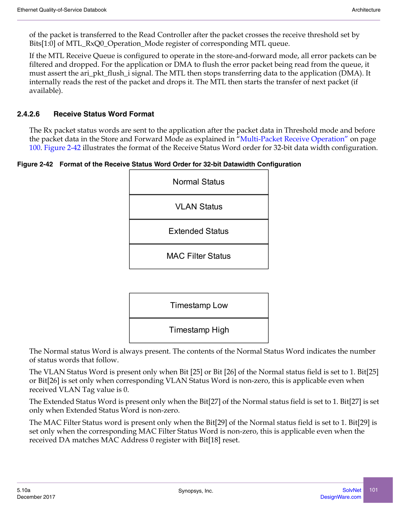

Normal Status
VLAN Status
Extended Status
MAC Filter Status
Timestamp Low
Timestamp High
The Normal status Word is always present. The contents of the Normal Status Word indicates the number
of status words that follow.
The VLAN Status Word is present only when Bit [25] or Bit [26] of the Normal status field is set to 1. Bit[25]
or Bit[26] is set only when corresponding VLAN Status Word is non-zero, this is applicable even when
received VLAN Tag value is 0.
The Extended Status Word is present only when the Bit[27] of the Normal status field is set to 1. Bit[27] is set
only when Extended Status Word is non-zero.
The MAC Filter Status word is present only when the Bit[29] of the Normal status field is set to 1. Bit[29] is
set only when the corresponding MAC Filter Status Word is non-zero, this is applicable even when the
received DA matches MAC Address 0 register with Bit[18] reset.

| Synopsys, Inc. | 101 |
| --- | --- |
| 5.10a Synopsys, Inc. SolvNet December 2017 DesignWare.com |  |

## Page 102

The Timestamp Status Low and Timestamp Status High status words are present only when bit [30] of the
Normal Status Word is set to 1 and bit [15] of the Extended status Word is set to 0.

| 102 | Synopsys, Inc. |
| --- | --- |
|  | SolvNet Synopsys, Inc. 5.10a DesignWare.com December 2017 |

## Page 103

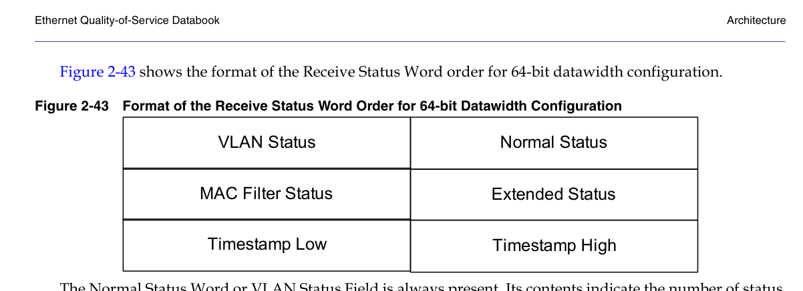

| VLAN Status | Normal Status |
| --- | --- |
| MAC Filter Status | Extended Status |
| Timestamp Low | Timestamp High |

The Normal Status Word or VLAN Status Field is always present. Its contents indicate the number of status
words that follow.
The Extended Status Word or Mac Filter Status word is present only when bit [27] or bit [29] of Normal
status Word is set to 1.
The Timestamp Status Low and Timestamp Status High status words are present only when bit [30] of
Normal Status Field is set to 1 and bit [15] of Extended status Field is set to 0.

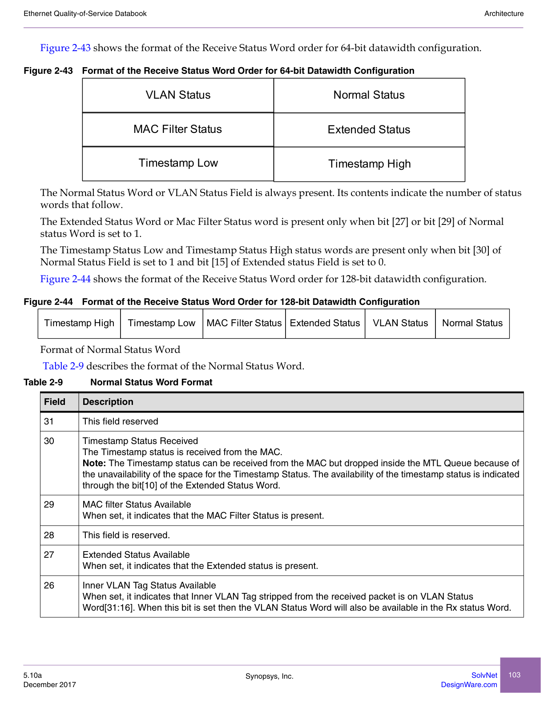

| Timestamp High | Timestamp Low | MAC Filter Status | Extended Status | VLAN Status | Normal Status |
| --- | --- | --- | --- | --- | --- |

Format of Normal Status Word
Table 2-9 describes the format of the Normal Status Word.
Table 2-9
Normal Status Word Format

| Field | Description |
| --- | --- |
| 31 | This field reserved |
| 30 | Timestamp Status Received The Timestamp status is received from the MAC. Note: The Timestamp status can be received from the MAC but dropped inside the MTL Queue because of the unavailability of the space for the Timestamp Status. The availability of the timestamp status is indicated through the bit[10] of the Extended Status Word. |
| 29 | MAC filter Status Available When set, it indicates that the MAC Filter Status is present. |
| 28 | This field is reserved. |
| 27 | Extended Status Available When set, it indicates that the Extended status is present. |
| 26 | Inner VLAN Tag Status Available When set, it indicates that Inner VLAN Tag stripped from the received packet is on VLAN Status Word[31:16]. When this bit is set then the VLAN Status Word will also be available in the Rx status Word. |

| Synopsys, Inc. | 103 |
| --- | --- |
| 5.10a Synopsys, Inc. SolvNet December 2017 DesignWare.com |  |

## Page 104

| Field | Description |
| --- | --- |
| 25 | Outer VLAN Tag Status Available When set, it indicates that Outer VLAN Tag stripped from the received packet is present on VLAN Status Word [15:0]. When this bit is set then the VLAN Status Word is also present in the Rx Status Word. |
| 24 | CRC Error When set, it indicates that a cyclic redundancy check (CRC) error occurred on the received packet. |
| 23 | Giant Frame When set, it indicates that the packet length exceeds the maximum Ethernet specified size of 1518, 1522, or 2000 bytes (9018 or 9022 bytes if jumbo packet enable is set). Giant frame is only a packet length indication, and it does not cause any packet truncation. |
| 22 | Watchdog Timeout When set, it indicates that the RPE module has received a packet with byte count greater than 2,048 (10,240 if Jumbo packet is enabled) bytes (DA + SA + LT + DATA + PAD + FCS). This bit is not set if the watchdog timer is disabled in the MAC Register 0 (MAC Configuration Register). However, even if the watchdog timer is disabled, this bit is set when the frame is greater than 32 KB in size. |
| 21 | Overflow Error When set, this bit indicates that the received frame is damaged because of buffer overflow in Rx Queue.Note: This bit is set only when the MTL transfers a partial frame to the application. This happens only when the Rx FIFO is operating in the threshold mode. In the store-and-forward mode, all received partial frames which encounters overflow are dropped completely in Rx Queue. |
| 20 | GMII Error When set, it indicates that the gmii rxer i was asserted during the reception of this packet. This error also _ _ includes carrier extension error in GMII and half-duplex mode. Error can be of less/no extension, or error (rxd = 1f) during extension. |
| 19 | Dribbling Bit When set, it indicates that the packet contained a non-integer multiple of eight bits (valid only in MII mode). This bit is not valid if a collision is seen or if runt packet bits are set. If this bit is set and the CRC error is reset, then the packet is valid. |
| 18:16 | Length/Type Field This field indicates if the packet received was a length packet or a type packet. The encoding of the 3 bits is as follows: ■ 3'b000: The packet is a length packet ■ 3'b001: The packet is a type packet ■ 3'b100: The packet is a type packet with VLAN Tag ■ 3'b101: The packet is a type packet with Double VLAN Tag ■ 3'b110: The packet is a MAC Control packet type ■ 3'b111: The packet is a OAM packet type ■ 3'b010-3'b011: Reserved Note: The packet type indication in this field is purely based on the LT field of received packet. For example, VLAN Tag or Double VLAN Tag indication does not ensure that corresponding VID match or VLAN filter pass. |

| 104 | Synopsys, Inc. |
| --- | --- |
|  | SolvNet Synopsys, Inc. 5.10a DesignWare.com December 2017 |

## Page 105

| Field | Description |
| --- | --- |
| 15 | Error Summary Indicates the logical OR of the following error bits: ■ CRC Error ■ Dribble Error ■ Receive Error ■ Watchdog Timeout ■ Overflow Error ■ Giant Packet |
| 14:0 | Packet Length Indicates the length, in bytes, of the received packet (including pad if applicable), and/or the FCS field when the Auto Pad/CRC Strip bit is de-asserted. Otherwise, it indicates the length without pad and/or FCS field. It also includes the 2-byte IP Checksum appended after the FCS when the IP Checksum module is present and enabled by setting the IPC bit of MAC Register 0 (MAC Configuration Register),and if the received frame is not a MAC control frame. It indicates the length without FCS field for Type packets (Length/Type >= 0x600), when Type CRCStrip bit is set. It indicates the length without VLAN Tag for VLAN tagged packets, when VLAN Tag stripping is enabled |

Format of VLAN Status Word
Table 2-10 describes the format of the VLAN Status Word.
Table 2-10
VLAN Status Word Format

| Field | Description |
| --- | --- |
| 31:16 | Inner VLAN Tag This field indicated the inner VLAN Tag Value This is valid only when the when bit[26] (outer VLAN tag Available) of the Normal Status Field is set to 1 |
| 15:0 | Outer VLAN Tag This field indicates the outer VLAN Tag value.This is valid only when the when bit[25] (outer VLAN tag Available) of the Normal Status Field is set to 1 |

Format of Extended Status Word
This field is identical to the RDES1 field of the DMA in Write back Format shown in Table 19-23 on page
1341

| Synopsys, Inc. | 105 |
| --- | --- |
| 5.10a Synopsys, Inc. SolvNet December 2017 DesignWare.com |  |

## Page 106

Format of MAC Filter Status Word
Table 2-11 describes the format of the MAC Filter Status Word.
Table 2-11
MAC Filter Status Word Format

| Field | Description |
| --- | --- |
| 31:29 | Layer 3 and Layer 4 Filter Number Matched These bits indicate the number of the Layer 3 and Layer 4 Filters that matched the received frame. ■ 000: Filter 0 ■ 001: Filter 1 ■ 010: Filter 2 ■ 011: Filter 3 ■ 100: Filter 4 ■ 101: Filter 5 ■ 110: Filter 6 ■ 111: Filter 7 This field is valid only when bits 28 or 27 are set high. When more than one filter matches, these bits give only the lowest filter number. |
| 28 | Layer 4 Filter Match When set, this bit indicates that the received frame matches one of the enabled Layer 4 Port Number fields. This status is given only when one of the following conditions is true: ■ Layer 3 fields are not enabled and all enabled Layer 4 fields match. ■ All enabled Layer 3 and Layer 4 filter fields match. When more than one filter matches, this bit gives the layer 4 filter status of the filter indicated by bits [31:29]. |
| 27 | Layer 3 Filter Match When set, this bit indicates that the received frame matches one of the enabled Layer 3 IP Address fields. This status is given only when one of the following conditions is true: ■ All enabled Layer 3 fields match and all enabled Layer 4 fields are bypassed ■ All enabled filter fields match When more than one filter matches, this bit gives the layer 3 filter status of filter indicated by bits [31:29]. |
| 26:19 | MAC Address Match/Hash Value When bit 18, Hash Filter Status is reset, this field contains the number of the MAC address register which matches the Destination address of the received packet. When bit 18, Hash Filter Status is set, this field contains the hash value that is computed by the MAC.The bit corresponding to the hash value in the hash filter register is set, and so the frame passes the hash filter. |
| 18 | Hash Filter Status When set, this bit indicates that the packet passed the MAC address hash filter. The bits [26:19] indicate the hash value. |
| 17 | DA Filter Fail When this bit is set, it indicates that the Destination Address filter failed. This means that this packet did not clear the DA filter. |
| 16 | SA Filter Fail When this bit is set, it indicates that the Source Address filter failed. This means that this packet did not clear the SA filter. |

| 106 | Synopsys, Inc. |
| --- | --- |
|  | SolvNet Synopsys, Inc. 5.10a DesignWare.com December 2017 |

## Page 107

| Field | Description |
| --- | --- |
| 15 | VLAN Filter status When set, this bit indicates that the VLAN Tag of the received packet passed the VLAN filter. This bit is valid only when DWC EQOS ERVFE is not enabled. If DWC EQOS ERVFE is enabled, the bit _ _ _ _ is redefined as Outer VLAN Tag Filter Status (OTS). For more details about OTS bit, see bit[15] “RDES2 Normal Descriptor (Write-Back Format)” on page 1343 |
| 14 | Inner VLAN Tag Filter Status This bit is valid only when DWC EQOS ERVFE is enabled. For more details about ITS bit, see bit[14] _ _ “RDES2 Normal Descriptor (Write-Back Format)” on page 1343 |
| 13:6 | Reserved |
| 5 | ND Advertisement Not Generated When set, it indicates that the MAC has not generated ND Advertisement for the received ND Solicitation packet. This bit is valid when bit 4 (ND Solicitation Packet Received) is set. This bit is set when the MAC receives ND Solicitation Packet with Authentication extension header or non-zero extension headers. This bit is reserved when Enable ND Offload feature is not selected. |
| 4 | ND Solicitation Packet Received When set, it indicates that ND Solicitation packet is received. This bit is reserved when Enable ND Offload feature is not selected. |
| 3 | Reserved |
| 2 | ARP Reply Not Generated When set, it indicates that the MAC has not generated ARP Reply for the received ARP Request packet. This bit is set when the MAC is busy transmitting ARP reply to an earlier ARP request (only one ARP request processed at a time). This bit is reserved when Enable ARP Offload feature is not selected. |
| 1 | Inner VLAN Tag Type When set, it indicates that Inner VLAN type is S-VLAN in the received packet.When reset, it indicates that Inner VLAN type is C-VLAN in the received packet. This field is reserved when Enable Double VLAN feature is not selected. |
| 0 | Outer VLAN Tag Type When set, it indicates that Outer VLAN type is S-VLAN in the received packet.When reset, it indicates that Outer VLAN type is C-VLAN in the received packet. |

Format of Timestamp Status Low Field
This field is identical to the RDES0 field of the Context Descriptor of the DMA shown in Table 19-26 on page
1348.
Format of Timestamp Status High Field
This field is identical to the RDES1 field of the Context Descriptor of the DMA shown in Table 19-27 on page
1348.

| Synopsys, Inc. | 107 |
| --- | --- |
| 5.10a Synopsys, Inc. SolvNet December 2017 DesignWare.com |  |

## Page 108

2.4.2.7
Receive Path Timing Diagrams
Timing specifications for the MAC Transaction layer (MTL) interface signals in the receive path are
illustrated in detail in the following sections. The timing diagrams are organized to show the sequence of
transactions that occur when a received packet is transferred from the MAC to the application.
2.4.2.7.1
Receive FIFO Write Interface
A packet received by the MAC is transferred to the MTL over the MRI interface. The transferred data is
accepted and written to the Rx Queue by the write control logic. (See Figure 2-45.)
1. The MAC starts transferring the received packet to the MTL by asserting mri_val_o and mri_sop_o
along with the corresponding 128-bit data on mri_data_o.
This is directly transferred to the Rx queue in the next clock cycle. This can be seen by the assertion of
rwc_csn_o and rwc_wr_en_o along with the corresponding address and data. The MSB 5 bits of
rwc_wr_data correspond to the value on mri_eop_o and mri_be_o signals accepted by the MTL.
In store-and-forward mode, the MTL reserves locations for the status word before writing the first
packet data. In Threshold mode, the MTL does not reserve any locations for the status because the
status is stored after the packet data.
2. The MAC completes the packet transfer by the asserting the mri_eop_o signal along with the valid data.
The Receive packet status on mri_rxstatus_val_o is also valid with mri_eop_o.
3. After writing the EOP data, the Rx Queue Write logic transfers the received status to the external RAM
in the next clock cycle.
In Threshold mode, the status words are written after the packet data. In store-and-forward mode, the
status is written to the locations that were reserved earlier (before the packet data).

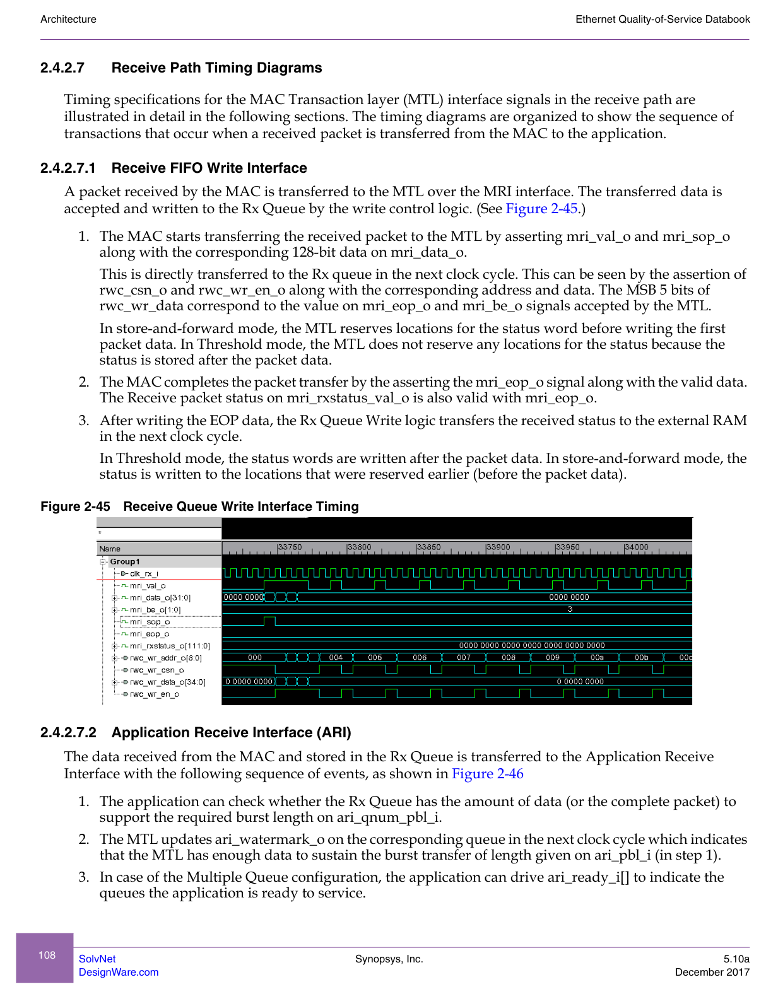

2.4.2.7.2
Application Receive Interface (ARI)
The data received from the MAC and stored in the Rx Queue is transferred to the Application Receive
Interface with the following sequence of events, as shown in Figure 2-46
1. The application can check whether the Rx Queue has the amount of data (or the complete packet) to
support the required burst length on ari_qnum_pbl_i.
2. The MTL updates ari_watermark_o on the corresponding queue in the next clock cycle which indicates
that the MTL has enough data to sustain the burst transfer of length given on ari_pbl_i (in step 1).
3. In case of the Multiple Queue configuration, the application can drive ari_ready_i[] to indicate the
queues the application is ready to service.

| 108 | Synopsys, Inc. |
| --- | --- |
|  | SolvNet Synopsys, Inc. 5.10a DesignWare.com December 2017 |

## Page 109

4. In configurations with multiple Rx queues, the MTL Read controller performs the arbitration among all
non-empty queues, and all Queues for which ari_ready_i is asserted, and then selects one queue. The
selected queue number is indicated through ari_qnum_o[] signal. The MTL indicates the availability of
data by asserting the ari_val_o (in Threshold mode) or ari_rxstatus_val_o (in store-and-forward mode)
signal along with the data. The ARI transfers the data or status in every clock cycle as long as data or
status is available in the Rx queue.
5. The application accepts the data from the MTL by asserting ari_ack_i. The MTL updates the data in the
next clock cycle if it is continuing the burst transfer. The application can pause the transfer by deas-
serting ari_ack_i, as shown in Figure 2-46.
6. The MTL transfers the remaining data by asserting the ari_val_o, ari_rxstatus_val_o, or ari_time-
stamp_val_o signal and the corresponding data or status. When the last few bytes of packet (less bytes
than the data bus width) are being transferred, ari_eop_o is also asserted along with ari_be_o, indi-
cating a valid number of bytes in that data phase.
7. In Threshold mode, the Receive packet status (indicated with the assertion of ari_rxstatus_val_o or ari_-
timestamp_val_o) is transferred after the EOP data. Packet transfer is complete only after the ari_ack_i
acknowledgment for status.

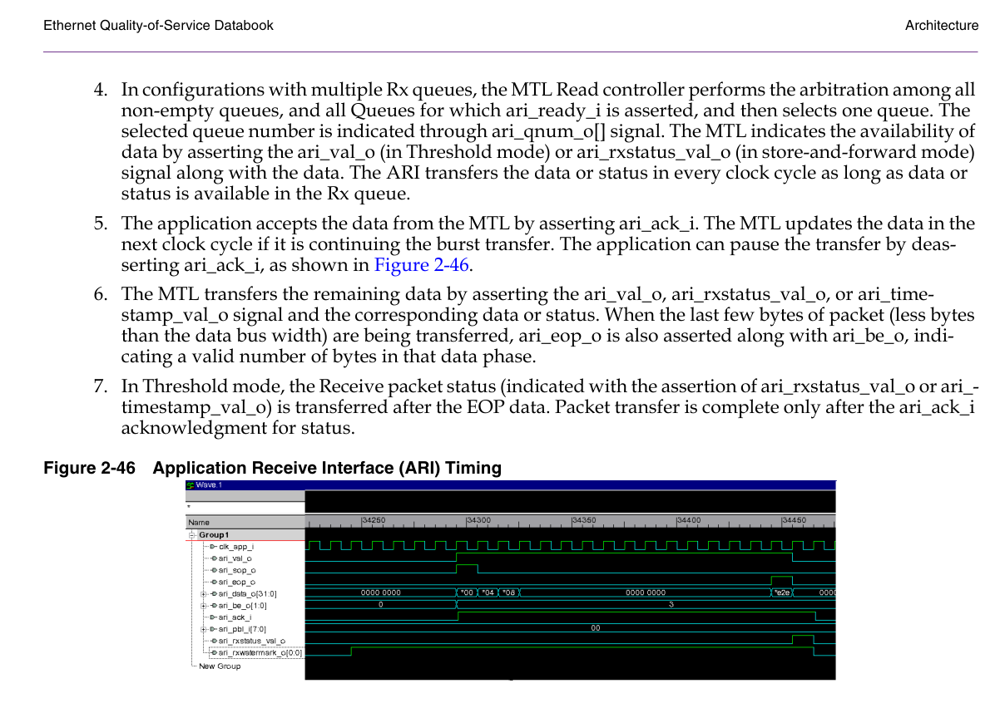

2.4.2.7.3
ARI With Timestamp Feature in Threshold Mode
Figure 2-47 shows the ARI timing when IEEE 1588 Timestamp feature is enabled. After the ARI outputs the
EOP data, as indicated by ari_eop_o high, it gives the timestamp value on ari_data_o. Asserting
ari_timestamp_val_o validates the timestamp. In this figure, the 64-bit timestamp is output in two cycles,
because the data bus is only 32-bits wide. After the application accepts the timestamp (by asserting ari_ack_i
for two clocks), the Rx status is given on the data bus and validated with the assertion of ari_rxstatus_val_o.

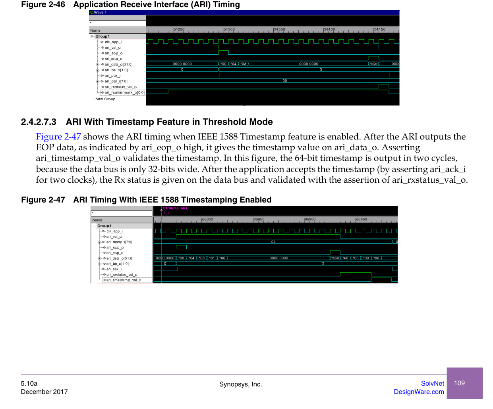

| Synopsys, Inc. | 109 |
| --- | --- |
| 5.10a Synopsys, Inc. SolvNet December 2017 DesignWare.com |  |

## Page 110

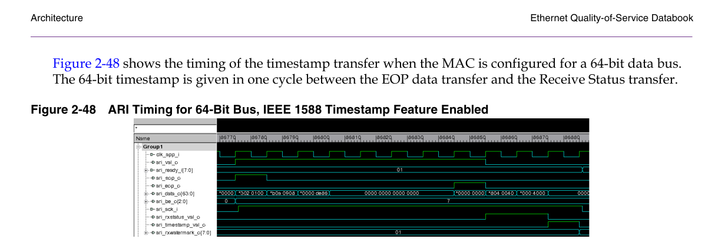

2.4.2.7.4
ARI With Timestamp Feature in Store-and-Forward Mode
In store-and-forward mode, the MTL starts the packet transfer with the status by asserting the
ari_rxstatus_val_o and ari_data_o signals containing the status. After the application accepts the status
words by asserting ari_ack_i, the MTL asserts ari_timestamp_val_o to indicate the availability of the
timestamp on ari_data_o.

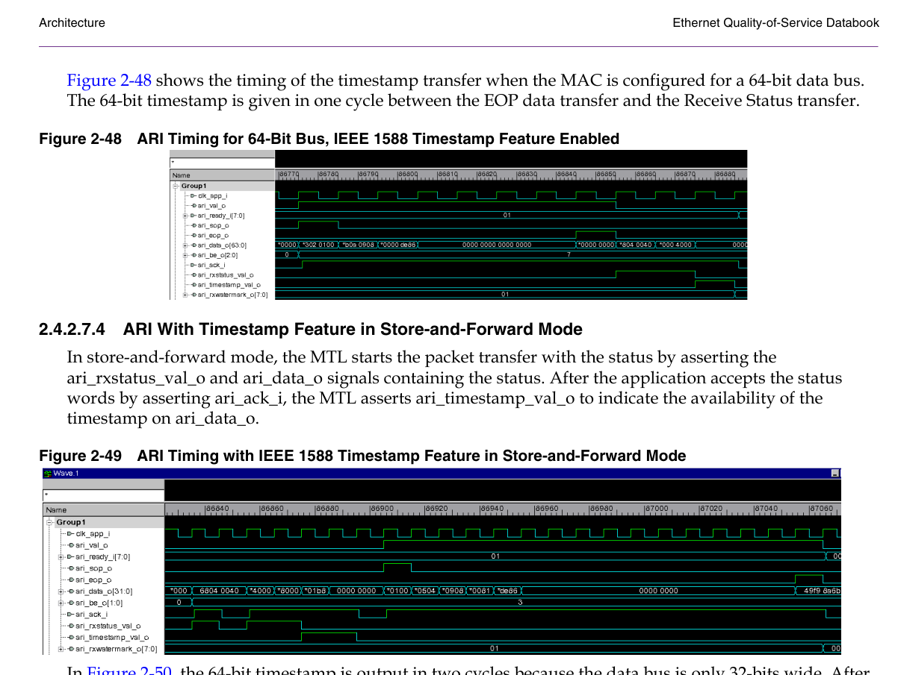

In Figure 2-50, the 64-bit timestamp is output in two cycles because the data bus is only 32-bits wide. After
the application accepts the timestamp (by asserting ari_ack_i for two clocks), the MTL starts driving the
packet data by asserting the ari_val_o, ari_sop_o and ari_data_o.

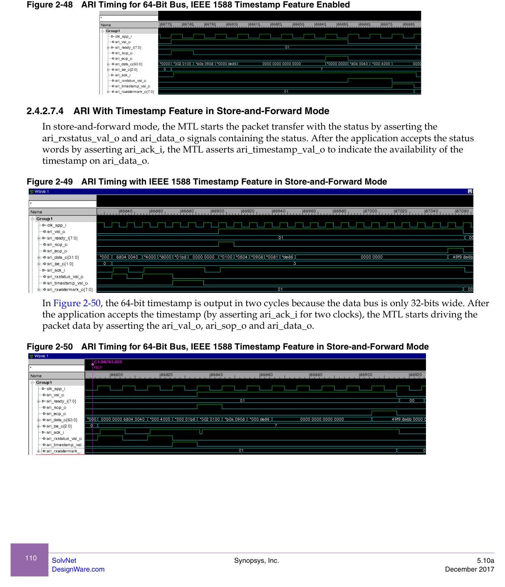

| 110 | Synopsys, Inc. |
| --- | --- |
|  | SolvNet Synopsys, Inc. 5.10a DesignWare.com December 2017 |

## Page 111

2.4.2.7.5
Receive Queue Read Interface
The queue read timing diagrams for the synchronous two-port RAM along with the timing relationship
with signals on the ARI is shown in this section.
The MTL Rx Queue Read Controller pre-fetches the data (rrc_rd_* signals) from the Rx queue when it finds
that the Rx queue is not empty and the application is ready to service the Queue (in case of multiple Queue
configuration). The pre-fetching corresponds to maximum of three locations for three locations for
synchronous RAM interface. This pre-fetching is done to sustain the burst data transfers without any delay
on the ARI interface. The (pre-)fetched data is registered and given out on the ARI with respective ari_*
signals. When the application acknowledges the data with ari_ack_i, further data is read from the queue.
Figure 2-51 shows the Queue read interface timing for synchronous SRAM. The timing relationship of the
rrc_rd_* signals is similar to that of trc_rd_* signals.

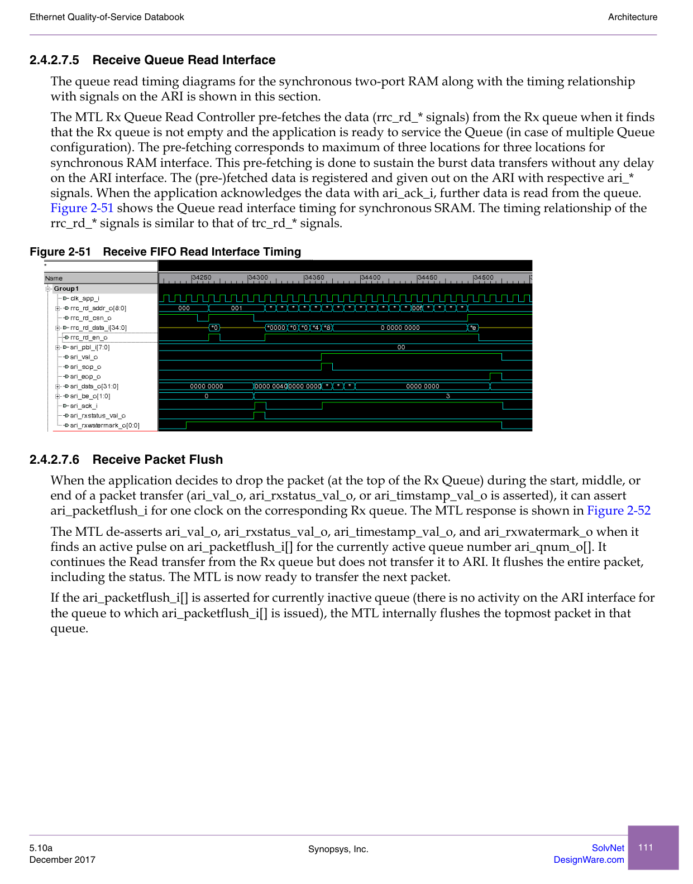

2.4.2.7.6
Receive Packet Flush
When the application decides to drop the packet (at the top of the Rx Queue) during the start, middle, or
end of a packet transfer (ari_val_o, ari_rxstatus_val_o, or ari_timstamp_val_o is asserted), it can assert
ari_packetflush_i for one clock on the corresponding Rx queue. The MTL response is shown in Figure 2-52
The MTL de-asserts ari_val_o, ari_rxstatus_val_o, ari_timestamp_val_o, and ari_rxwatermark_o when it
finds an active pulse on ari_packetflush_i[] for the currently active queue number ari_qnum_o[]. It
continues the Read transfer from the Rx queue but does not transfer it to ARI. It flushes the entire packet,
including the status. The MTL is now ready to transfer the next packet.
If the ari_packetflush_i[] is asserted for currently inactive queue (there is no activity on the ARI interface for
the queue to which ari_packetflush_i[] is issued), the MTL internally flushes the topmost packet in that
queue.

| Synopsys, Inc. | 111 |
| --- | --- |
| 5.10a Synopsys, Inc. SolvNet December 2017 DesignWare.com |  |

## Page 112

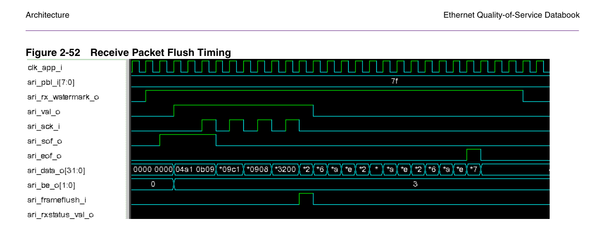

### 2.4.3

### Interfacing With External Two-Port RAMs

The DWC_ether_qos provides a generic memory interface for easy interconnection to any vendor-specific,
two-port RAM for implementing the Tx queue and Rx queue. This section describes how the
DWC_ether_qos can be interconnected with different types of two-port RAMs.
The two memory interfaces provided in DWC_ether_qos for connectivity with Transmit and Receive
two-port RAMs are identical. Therefore, the connections with the Tx queue and Rx queue RAMs are
illustrated in the following sections in a single diagram for each type of RAM. The “x” variable in the signal
names can be replaced with a “t” for the Tx queue interface and an “r” for the Rx queue interface.
2.4.3.1
Low-Power, Synchronous Two-Port SRAM Connection
The synchronous, two-port SRAM shown in Figure 2-53 consists of two ports: Port A and Port B. These
ports can be used for both read and write operations. The DWC_ether_qos (configured for synchronous
RAM interface) uses this SRAM as an asynchronous FIFO for transferring data from one clock domain to
another clock domain. Therefore, a port (Port A, for example) is used to write the packet data and the other
port is used to read the packet data, with the writes and reads happening in different clock domains.
(Consequently, the Read data (DOUT_A) from Port A and write data (DIN_B) to Port B are left unconnected
in Figure 2-53)

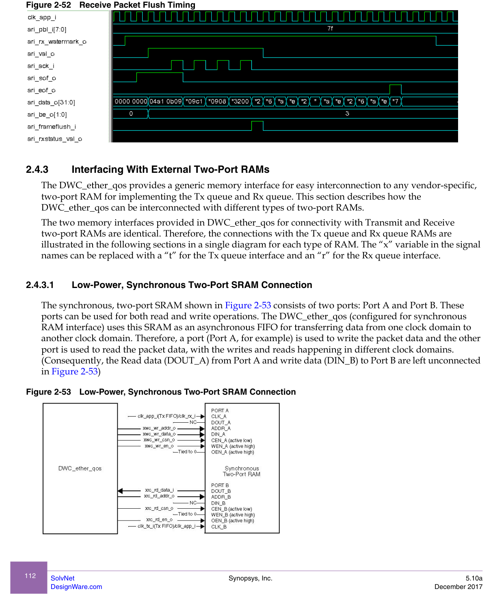

| 112 | Synopsys, Inc. |
| --- | --- |
|  | SolvNet Synopsys, Inc. 5.10a DesignWare.com December 2017 |

## Page 113

The SRAM chip enable (CEN) and write enable (WEN) are connected to chip select (*_csn_o) and write
enable (*_wr_en_o) signals from the MAC. Based on the active states of CEN and WEN, the DWC_ether_qos
memory interface signals are directly connected or have inverted polarity. Connecting the chip select signal
ensures that the SRAM I/O drivers are turned off when read or write operation is not scheduled and
thereby reduces power consumption.
If the memory module (such as Xilinx FPGA Block Select RAM) has a single enable for the read port (No
Output Enable), xrc_rd_csn_o must be connected to the enable, with polarity taken into consideration.
2.4.3.2
High-Speed, Synchronous Two-Port SRAM Connection
For applications where power consumption is not a factor and memory access times are too critical, the chip
enable and read enable signals can always be tied to active high inputs. In such applications, the generic
memory interface signals can be connected to synchronous SRAM as shown in Figure 2-54. The unused
outputs of the generic memory interface are also shown as floating outputs.

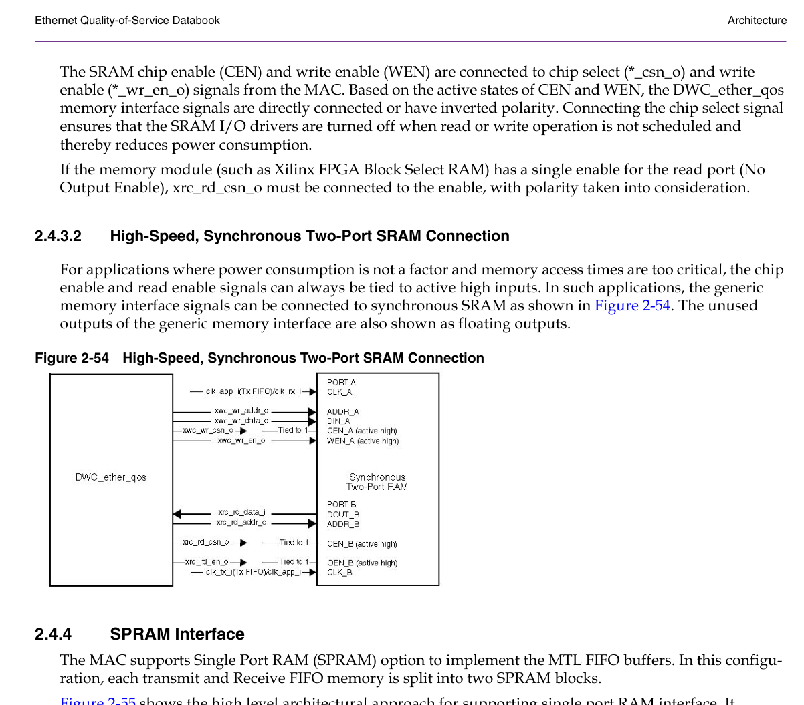

### 2.4.4

### SPRAM Interface

The MAC supports Single Port RAM (SPRAM) option to implement the MTL FIFO buffers. In this configu-
ration, each transmit and Receive FIFO memory is split into two SPRAM blocks.

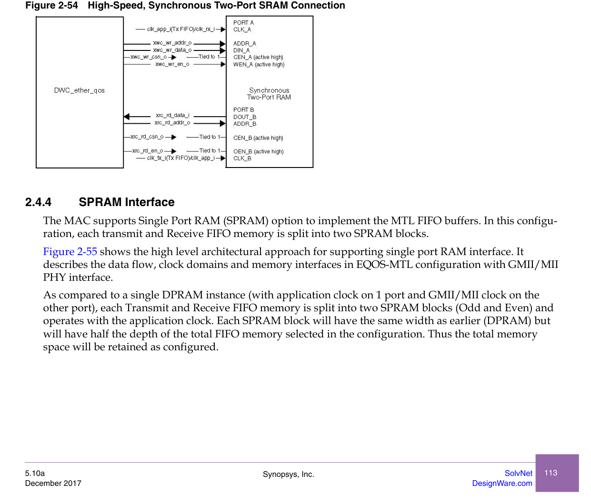

As compared to a single DPRAM instance (with application clock on 1 port and GMII/MII clock on the
other port), each Transmit and Receive FIFO memory is split into two SPRAM blocks (Odd and Even) and
operates with the application clock. Each SPRAM block will have the same width as earlier (DPRAM) but
will have half the depth of the total FIFO memory selected in the configuration. Thus the total memory
space will be retained as configured.

| Synopsys, Inc. | 113 |
| --- | --- |
| 5.10a Synopsys, Inc. SolvNet December 2017 DesignWare.com |  |

## Page 114

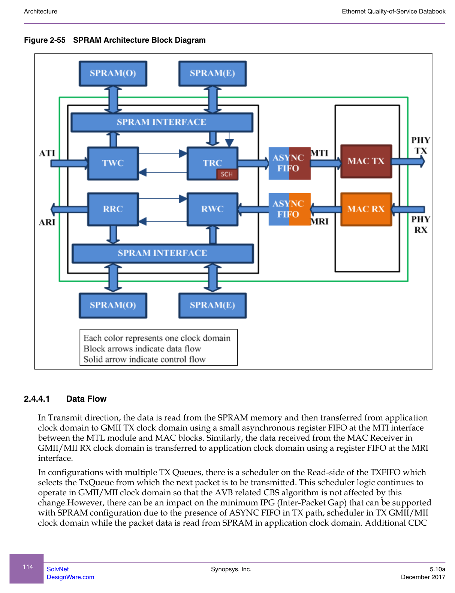

2.4.4.1
Data Flow
In Transmit direction, the data is read from the SPRAM memory and then transferred from application
clock domain to GMII TX clock domain using a small asynchronous register FIFO at the MTI interface
between the MTL module and MAC blocks. Similarly, the data received from the MAC Receiver in
GMII/MII RX clock domain is transferred to application clock domain using a register FIFO at the MRI
interface.
In configurations with multiple TX Queues, there is a scheduler on the Read-side of the TXFIFO which
selects the TxQueue from which the next packet is to be transmitted. This scheduler logic continues to
operate in GMII/MII clock domain so that the AVB related CBS algorithm is not affected by this
change.However, there can be an impact on the minimum IPG (Inter-Packet Gap) that can be supported
with SPRAM configuration due to the presence of ASYNC FIFO in TX path, scheduler in TX GMII/MII
clock domain while the packet data is read from SPRAM in application clock domain. Additional CDC

| 114 | Synopsys, Inc. |
| --- | --- |
|  | SolvNet Synopsys, Inc. 5.10a DesignWare.com December 2017 |

## Page 115

synchronizers will get added as compared to the DPRAM architecture which adds latency delays between
packet transmissions.
The area increase with the SPRAM configuration option is mainly due to this asynchronous register FIFOs.
The data to the FIFO are stored alternatively in the Odd and Even SPRAM blocks based on the odd and
even addresses of the FIFO pointer respectively. As the memory is used as a FIFO structure, data is
normally written and read in a sequential manner (incrementing address). Hence with this organization,
writes and reads will alternate between the two Odd and Even SPRAMs. This architecture enables
simultaneous reads and writes to the FIFO (in 1 clock cycle) so that the data transfer throughput as achieved
by a DPRAM memory architecture is maintained. This also allows continuous burst transfers to the host bus
like AHB, AXI in configurations with DMA and thus utilize the bus bandwidth effectively.
However, as the read and write operations are triggered by independent engines, there can be a contention
between them for accessing a SPRAM block in the same clock. There is an arbiter block between the Read
and Write Engines that handles the contention as given as follows:
For TX FIFO, write operation is given priority over the read operation.
The read operation is delayed by a clock in such cases assuming that the write operation switches to the
other memory in the next clock (due to sequential write).
The MAC transmitter do not need continuous data (For example, in 32-bit configurations and operating in
1Gbps mode, the MAC transmitter needs 32-bit word every 4 Tx clock cycles). The depth of small
asynchronous FIFO towards the MAC is selected to avoid under run, by pre-fetching data whenever there is
opportunity to read from the memory.
For RX FIFO, read operation is given priority over write operation.
The write operation is delayed by a clock in such cases assuming that the read operation switches to the
other memory in the next clock (due to sequential reads).
The MAC receiver does not provide continuous data (For example, in 32-bit configurations and operating in
100Mbps mode, the MAC receiver provides 32-bit word every 8 Rx clock cycles) except at the beginning and
towards end of the Rx packet. The depth of small asynchronous FIFO towards the MTL is selected to avoid
the overrun.
2.4.4.2
Application Clock Frequency Requirements for Memory Transfers
Due to the requirement of simultaneous read and write transfers from the FIFO memories, the application
clock frequency should be such that the data transfer bandwidth of memory must be at least twice the
bandwidth as that of the line.
In addition to the previous requirement, additional bandwidth is required to allow delays due to contention
between read and writes to a single memory block (Odd or Even). The probability of contention increases
with multiple Queues (in Tx Side) especially in EQOS-AXI and EQOS-MTL configurations. These are
mainly due to
Possibility of receiving and writing interleaved data of different queues, all of which are to the same
(odd or even) memory clocks in consecutive clock cycles.
Non-sequential reads & writes of control words for each packet by scheduler in TX side
Non-sequential writes of status words for each packet in RX side.
Considering the above, the minimum application clock frequency estimate in the various
modes/speeds/configurations to avoid underflow in the "Async FIFO" in TX path is given in Table 2-12.

| Synopsys, Inc. | 115 |
| --- | --- |
| 5.10a Synopsys, Inc. SolvNet December 2017 DesignWare.com |  |

## Page 116

Table 2-12
Application Clock Frequency Estimate in Various Modes/Speeds

| Configuration | No of Tx Queues | DW = 32 | DW = 64 | DW = 128 |
| --- | --- | --- | --- | --- |
| EQOS-AXI, EQOS-MTL | 2 or less | 75 MHz | 38 MHz | 19 MHz |
|  | 4 or less | 125 MHz | 62.5 MHz | 31.25 MHz |
|  | 6 or less | 200 MHz | 100 MHz | 50 MHz |
|  | 8 or less | 250 MHz | 125 MHz | 62.5 MHz |
| EQOS-AHB, EQOS-DMA | Any | 62.5 MHz | 31.25 MHz | 16 MHz |

When the speed is 100Mbps (MII mode), the minimum application clock frequency is reduced by factor of
In the RX side, contention can happen if the slave memory does not accept data continuously and in the
worst case there can be a contention for every memory access if the slave memory introduces one busy cycle
after every transfer. However, status word writes steal cycles during the IPG (Inter-packet Gap) of received
packets. The number of status words to be written depends on the configuration (for example, IEEE 1588
requires 64-bit timestamps, VLAN stripping requires 32-bit VLAN tags, etc). The depth (or area) of the
register Asynchronous FIFO has to be larger to avoid overflows.
However, the minimum application clock frequency will be the same in all configurations in 1 Gbps speed
as shown in Table 2-13.
Table 2-13
Minimum Application Clock Frequency in Various Configurations

| Configuration | No of Rx Queues | DW = 32 | DW = 64 | DW = 128 |
| --- | --- | --- | --- | --- |
| Any | Any | 69 MHz | 36 MHz | 21 MHz |

For 100Mbps operating mode, the application clock frequency can be reduced by a factor of 10.
The previous tables are pessimistic and estimated with a worst case scenario assumptions. These
will be validated in simulation and updated later.

|  | Note |
| --- | --- |

To handle valid frames of size < 64 bytes received in the line, increase the application clock
frequency further, as the overhead due to status is considerably large on Rx side.
The previous computation assumes 12 bytes of IPG and 8 bytes of preamble+SFD. To handle
reduced IPG and preamble, increase the application clock frequency further, to transfer the status
in the available gaps between packets on the application interface (MRI)

| 116 | Synopsys, Inc. |
| --- | --- |
|  | SolvNet Synopsys, Inc. 5.10a DesignWare.com December 2017 |

## Page 117

2.4.4.3
SPRAM Timing
Timing of the SPRAM memory is same as the TSO memory, as shown in Figure 2-56.

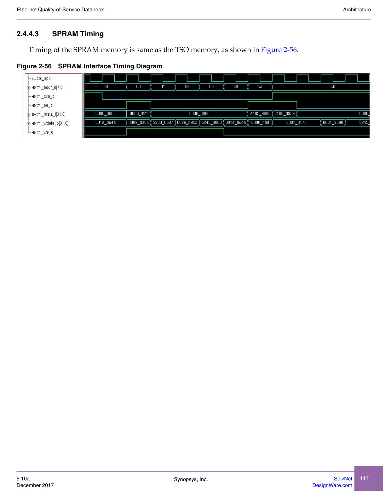

| Synopsys, Inc. | 117 |
| --- | --- |
| 5.10a Synopsys, Inc. SolvNet December 2017 DesignWare.com |  |

## Page 118

The MAC supports many interfaces towards the PHY chip. The PHY interface can be selected only once
after reset. The MAC communicates with the application side with the MAC Transmit Interface (MTI), MAC
Receive Interface (MRI), and MAC Control Interface (MCI).

### 2.5.1

### MAC Transmission

The MAC supports many interfaces towards the PHY chip. The PHY interface can be selected only once after
reset. The MAC communicates with the application side with the MAC Transmit Interface (MTI), MAC
Receive Interface (MRI), and MAC Control Interface (MCI).
The MAC transmission process is as follows:
1. Transmission is initiated when the MTL application pushes in data with the SOP (mti_sop_i) signal
asserted.
2. When the SOP signal is detected, the MAC accepts the data and begins transmitting to the GMII or MII.
The time required to transmit the packet data to the GMII or MII after the application initiates the trans-
mission depends on delay factors such as IPG delay, time to transmit preamble or SFD, and any back-off
delays for half-duplex mode. While the packets data is being transmitted, the MAC can stop accepting
the data received from the MTL by de-asserting the mti_rdy_o signal.
3. After the EOP (mti_eop_i) is transferred to the MAC, the MAC does one of the following:
The MAC completes the normal transmission and gives the transmission status to the MTL.
If a normal collision (in half-duplex mode) occurs during transmission, the MAC gives the Transmit
Status with retry bit set to the MTL. The MAC gives the Retry request till one of the following is true:
Packet is successfully transmitted
Maximum retry requests expire
When maximum retry requests expire, the MAC aborts the packet transmission with Excessive
Collision Transmit Status. The MAC accepts and drops all further data until the next SOP is
received. The MTL block should retransmit the same packet from SOP on observing a Retry
request (in the Status) from the MAC.
If any one of the following happens, the MAC aborts the packet transmission:
No carrier (half-duplex mode)
Loss of carrier (half-duplex mode)
Excessive deferral (half-duplex mode)
Late collisions (half-duplex mode)
Jabber
The MAC accepts and drops all further data until the next SOP is received.
4. The MAC issues an underflow status if the MTL is not able to provide the data continuously during the
transmission. The MAC accepts and drops all further data until the next SOP is received.
5. During the normal transfer of a packet from MTL, if the MAC receives a SOP without getting an EOP
for the previous packet, it ignores the SOP and considers the new packet as continuation of the previous
packet.

| 118 | Synopsys, Inc. |
| --- | --- |
|  | SolvNet Synopsys, Inc. 5.10a DesignWare.com December 2017 |

## Page 119

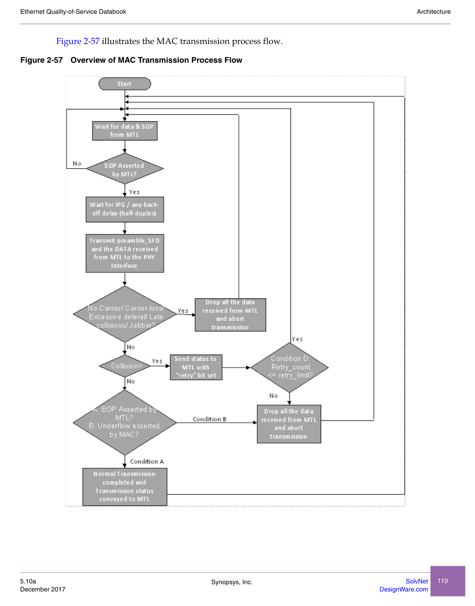

| Synopsys, Inc. | 119 |
| --- | --- |
| 5.10a Synopsys, Inc. SolvNet December 2017 DesignWare.com |  |

## Page 120

The following six modules constitute the transmission function of the MAC:
“Transmit Bus Interface Module” on page 120
“Transmit Packet Controller Module” on page 120
“Transmit Protocol Engine Module” on page 121
“Transmit Module” on page 122
“Transmit CRC Generator Module” on page 123
“MAC Transmit Flow Control Module” on page 123
2.5.1.1
Transmit Bus Interface Module
The MAC Transmit Bus Interface (TBU) accepts data in 32, 64, or 128-bit wide bus and runs on the clk_tx_i
clock of GMII interface.
The Transmit Bus Interface (TBU) module connects the Transmit path of the MAC with an external packet
through a FIFO interface.
The TBU accepts data in 32, 64, or 128-bit wide bus and runs on the clk_tx_i clock of GMII interface. The
TBU module performs the following functions:
Outputs the (32-bit) Transmit status to the application at the end of normal transmission or collision
Outputs the Transmit snapshot register value to the mti_timestamp_o signal and asserts the mti_sta-
tus_valid signal
Performs the Endian conversion of data bus by swapping the byte lanes and corresponding byte
enables
Converts the input data into an 8-bit bus towards the Transmit Packet Controller
2.5.1.2
Transmit Packet Controller Module
The Transmit Packet Controller (TPC) module consists of eight registers to hold the data and the last data
control received from the TBU.
The register provides a buffer between the application and the Transmit Protocol Engine (TPE) to regulate
data flow.
When the number of bytes received from the application are less than 60 (DA+SA+LT+DATA), the state
machine that interfaces with TBU automatically appends zeros to the packet being transmitted. This is done
to make the data length exactly 46 bytes (provided mti_crc_pad_ctrl_i is 2’b00) to meet the minimum data
field requirement of IEEE 802.3. To program the MAC to not append any padding, you can use the
mti_crc_pad_ctrl_i sideband signal from the MTI.
The cyclic redundancy check (CRC) for the Frame Check Sequence (FCS) field is calculated before
transmission to the TPE module. This value is computed by the CTX module. The TPC module receives the
computed CRC and appends it to the data being transmitted to the TPE module. When the MAC is
programmed (through mti_crc_pad_ctrl_i sideband signal from the application interface) to not append the
CRC value to the end of Ethernet packets, the TPC module ignores the computed CRC and transmits only
the data received from the TBU module to the TPE module. An exception to this rule is that when the MAC
is programmed to append pads for packets (DA+SA+LT+DATA) less than 60 bytes sent by the TBU
module, the TPC module appends the CRC at the end of padded packet irrespective of the value on the
mti_crc_pad_ctrl_i signal.

| 120 | Synopsys, Inc. |
| --- | --- |
|  | SolvNet Synopsys, Inc. 5.10a DesignWare.com December 2017 |

## Page 121

2.5.1.3
Transmit Protocol Engine Module
The Transmit Protocol Engine (TPE) module consists of a Transmit State Machine that controls the
operation of Ethernet packet transmission.
The Transmit State Machine of this module contains the following features to meet the IEEE 802.3/802.3z
specification:
Generates preamble and SFD
Generates jam pattern in the half-duplex mode after normal collision
Generates carrier extension in the half-duplex (only in the GMII) mode when packet is smaller than
512 bytes
Supports packet bursting in the half-duplex (only in the GMII) mode
Supports jabber timeout
Supports flow control for the half-duplex mode (backpressure)
Generates Transmit packet status
Contains timestamp snapshot logic for IEEE 1588 support
When the TPC module requests the TPE module for a new packet transmission, the Transmit State Machine
sends out the preamble and SFD, followed by the data received. The preamble is defined as 7 bytes of
8’b10101010 pattern and the SFD is defined as 1 byte of 8b’10101011 pattern.
The collision window is defined as 1 slot time (512-bit times for 10/100 Mbps Ethernet and 4,096 bit times
for 1,000 Mbps Ethernet). The jam pattern generation is applicable only to half-duplex mode, not to full
duplex mode. In full-duplex mode, the Transmit State Machine ignores the phy_col_i signal from the PHY.
In MII mode, if a collision occurs any time from the beginning of the packet to the end of the CRC field, the
Transmit State Machine sends a 32-bit jam pattern of 32’h55555555 on MII to inform all other stations that a
collision has occurred. If the collision is seen during the preamble transmission phase, the Transmit state
machine completes the transmission of preamble and SFD, and then sends the jam pattern.
In GMII mode, if a collision occurs any time between the beginning of the packet and the end of the
extension field, the Transmit State Machine sends a 32-bit jam pattern of 32’h55555555 on GMII to inform all
other stations of the collision. If the collision is seen during the preamble transmission phase, the Transmit
State Machine completes the transmission of preamble and SFD, and then sends the jam pattern. If a
collision occurs during the extension field, the Transmit State Machine sends a 32-bit jam pattern of
32'h1F1F1F1F.
If the collision occurs after the collision window and before the end of the FCS field (or the end of Burst if
the Packet Burst mode is enabled), the Transmit State Machine sends a 32-bit jam pattern and sets the late
collision bit in the Transmit packet status.
At the GMII or MII interface, the collision signal (phy_col_i) being asynchronous is checked by the
transmitter after it is double-synchronized to clk_tx domain. This additional latency delays the
recognition of collision or late-collision event. When the output of phy_col_i synchronizer is asserted
after the complete packet is transmitted, it is not recognized as collision even if the COL signal is high
at the GMII interface before the end of transmission. Similarly, an assertion of COL signal at the GMII
input at the last byte of normal collision window might be identified as late collision because of the
synchronizer delay.

|  | Note |
| --- | --- |

| Synopsys, Inc. | 121 |
| --- | --- |
| 5.10a Synopsys, Inc. SolvNet December 2017 DesignWare.com |  |

## Page 122

In GMII half-duplex mode (1000 Mbps), the Transmit State Machine ensures that all valid carrier events
exceed a slot time of 4,096 bit times. To accomplish this, any Transmit packet shorter than 512 bytes from the
TFC module is extended using a carrier extension. On GMII, this is signaled to the PHY by asserting
phy_txer_o, de-asserting phy_txen_o, and setting phy_txd_o[7:0] to 8h’0F.
When the Packet Burst mode is enabled, only the first packet of the burst is carrier extended if it is shorter
than 512 bytes. The carrier extension is not applicable for MII half-duplex and GMII or MII full-duplex
modes. When the Packet Burst mode is enabled, the Transmit State Machine transmits a burst of packets (as
long as packets are available from the TFC module) without releasing the carrier of the PHY. To accomplish
this, the state machine inserts the carrier extension for a minimum IPG period (96 bit times) between the
packets. The Transmit State Machine continues to burst packets as long as additional packets are available
from the TPC module and a burst limit of 8,192 byte times has not been exceeded. If an additional packet is
not available at the end of the IPG period in the middle of the burst, the Transmit State Machine releases the
carrier by de-asserting the phy_txer_o and phy_txen_o signals on GMII.
Packet bursting is applicable only for the GMII half-duplex mode. It is not applicable in the MII and GMII
full-duplex modes. In the GMII half-duplex mode, the size of the first packet in a packet burst should at
least be equal to the slot time. If the first packet (including carrier extension) is less than the slot time, the
MAC considers all data bytes, received for the first packet and subsequent packets, which end immediately
after the slot time is reached as first packet in the burst. This may result in CRC error. However, if the packet
burst ends (both RXDV and RXER go low) before the slot time, the subsequent packet is considered as a new
packet. This behavior is according the IEEE 802.3.
The TPE module maintains a jabber timer to stop the transmission of Ethernet packets if the TFC module
transfers more than 2,048 (default) bytes. The timeout is changed to 10,240 bytes when the Jumbo packet is
enabled.
The Transmit State Machine uses the deferral mechanism for flow control (backpressure) in the half-duplex
mode. When the application requests to stop receiving packets, the Transmit State Machine sends a JAM
pattern of (8'h55) 32 bytes whenever it senses a reception of a packet, provided the Transmit flow control is
enabled. This results in a collision and the remote station backs off. The application requests the flow control
through a sideband signal mti_flowctrl_i (or by setting BPA bit of the Flow Control Register of
corresponding MTL queue). If the application requests a packet to be transmitted, it is scheduled and
transmitted even when the backpressure is activated. If the backpressure is kept activated for a long time
(and more than 16 consecutive collision events occur), the remote stations abort their transmissions because
of excessive collisions.
If IEEE 1588 timestamp is enabled for the Transmit packet, this block takes a snapshot of the system time
when the SFD is put onto the Transmit GMII or MII bus. The system time source is either an external input
or it is internally generated according to the configuration selected.
The Collision input is an asynchronous signal and should be asserted for at least 32-bit times (4 clocks
for 1Gbps, and 8 clocks for slower speeds).

|  | Note |
| --- | --- |

2.5.1.4

### Transmit Module

The Transmit (STX) module is responsible for scheduling the packet transmission on GMII or MII. It
provides an enable signal to the TPE module after satisfying the IPG and back-off delays. The STX module
performs the following functions:

| 122 | Synopsys, Inc. |
| --- | --- |
|  | SolvNet Synopsys, Inc. 5.10a DesignWare.com December 2017 |

## Page 123

Maintains the inter-packet gap between two transmitted packets
The STX module maintains an idle period of the configured inter-packet gap (IPG bits of MAC_Con-
figuration register) between any two transmitted packets. If packets from the TPC arrive at the TPE
module sooner than the configured IPG time, the TPE module waits for the enable signal from the STX
module before starting the transmission on GMII or MII. The STX module starts its IPG counter as
soon as the carrier signal of GMII or MII goes inactive. At the end of programmed IPG value, the
module issues an enable signal to the TPE module in the full-duplex mode.
In the half-duplex mode and when IPG is configured for 96-bit times, the STX module follows the rule
of deference specified in the IEEE 802.3, Section 4.2.3.2.1. The module resets its IPG counter if a carrier
is detected during the first two-thirds (64-bit times for all IPG values) of the IPG interval. If the carrier
is detected during the final one-third of the IPG interval, the STX module continues the IPG count and
enables the transmitter after the IPG interval.
Implements the Truncated Binary Exponential Back-off algorithm
The STX module implements the Truncated Binary Exponential Back-off algorithm when it operates
in the half-duplex mode.
2.5.1.5
Transmit CRC Generator Module
The MAC Transmit CRC Generator (CTX) module interfaces with the TFC module to generate CRC for the
FCS field of the Ethernet packet.
The Transmit CRC Generator (CTX) module interfaces with the TFC module to generate CRC for the FCS
field of the Ethernet packet.
The TPC module sends the packet data and any necessary padding to the CTX module through an 8-bit
interface.
The CTX module calculates the 32-bit CRC for the FCS field of the Ethernet packet. The encoding is defined
by the following generating polynomial:
G (x) = x32 + x26 + x23 + x22 + x16 + x12 + x11 + x10 + x8 + x7 + x5 + x4 + x2 + x + 1
The CTX module gets the byte data of Ethernet packet from the TPC module (DA + SA + LT + DATA +
PAD) qualified with a Data Valid signal. The TPC also indicates to the CTX when to reset the previously
calculated CRC and to start the new CRC calculation for the coming packet. The TPC module issues the start
command before sending the new packet data for calculation. The calculated CRC is valid on the next clock
after the data is received.
In GMII mode, the Data Valid signal is valid for every clock, from the first data byte through the last data
byte. In MII mode, this signal is valid every alternate clock.
2.5.1.6
MAC Transmit Flow Control Module
The Transmit Flow Control (FTX) module generates and transmits the Pause packets to the TFC module
based on the flow control triggers in full-duplex mode. The TFC module receives the Pause packet from the
FTX module, appends the calculated CRC, and sends the packet to the TPE module.For more information
about flow control, see “Flow Control” on page 389.

| Synopsys, Inc. | 123 |
| --- | --- |
| 5.10a Synopsys, Inc. SolvNet December 2017 DesignWare.com |  |

## Page 124

### 2.5.2

### MAC Transmit Interface Protocol

The MAC Transmit Interface (MTI) connects the application (MTL module in DWC_ether_qos) with the
MAC to provide the Ethernet data for transmission.
The MAC Transmit Interface (MTI) connects the application (MTL module in DWC_ether_qos) with the
MAC to provide the Ethernet data for transmission.
The application initiates the Ethernet packet transmission by writing the first data (mti_sop_i) of the packet
to the MAC, provided the MAC is ready to accept data (indicated by mti_rdy_o). Each valid data transfer is
indicated by an active mti_valid_i signal. The application can push-in data as long as the MAC is ready to
accept it. Therefore, the application can assume a successful data transfer if the mti_rdy_o signal is asserted.
The application indicates the last data of the packet by asserting the end-of-packet mti_eop_i signal, along
with the last data and byte enables (mti_be_i). The number of valid byte lanes for last transfer is decoded
with the mti_be_i signal as shown in Table 2-14. At the end of normal transmission of the Ethernet packet,
the MAC outputs the Transmit status to the application. This is indicated by an active mti_txstatus_val_o
signal.
Table 2-14
mti_be_i Function

| mti be i _ _ | Valid byte lanes (Little-Endian) | Valid byte lanes (Big Endian) |
| --- | --- | --- |
| 128-Bit Databus |  |  |
| 0000 | mti data i[7:0] – Byte lane 0 _ _ | mti data i[127:120] – Byte lane 15 _ _ |
| 0001 | mti data i[15:0] – Byte lane 0-1 _ _ | mti data i[127:112] – Byte lane _ _ 15-14 |
| 0010 | mti data i[23:0] – Byte lane 0-2 _ _ | mti data i[127:104] – Byte lane _ _ 15-13 |
| ... |  |  |
| 1110 | mti data i[119:0] – Byte lane 0-14 _ _ | mti data i[127:8] – Byte lane 15-1 _ _ |
| 1111 | mti data i[127:0] – Byte lane 0-15 _ _ | mti data i[127:0] – Byte lane 15-0 _ _ |
| 64-Bit Databus |  |  |
| 000 | mti data i[7:0] – Byte lane 0 _ _ | mti data i[63:56] – Byte lane 7 _ _ |
| 001 | mti data i[15:0] – Byte lane 0-1 _ _ | mti data i[63:48] – Byte lane 7-6 _ _ |
| 010 | mti data i[23:0] – Byte lane 0-2 _ _ | mti data i[63:40] – Byte lane 7-5 _ _ |
| ... |  |  |
| 110 | mti data i[55:0] – Byte lane 0-6 _ _ | mti data i[63:8] – Byte lane 7-1 _ _ |
| 111 | mti data i[63:0] – Byte lane 0-7 _ _ | mti data i[63:0] – Byte lane 7-0 _ _ |
| 32-Bit Databus |  |  |
| 00 | mti data i[7:0] – Byte lane 0 _ _ | mti data i[31:24] – Byte lane 3 _ _ |
| 01 | mti data i[15:0] – Byte lane 0-1 _ _ | mti data i[31:16] – Byte lane 3-2 _ _ |

| 124 | Synopsys, Inc. |
| --- | --- |
|  | SolvNet Synopsys, Inc. 5.10a DesignWare.com December 2017 |

## Page 125

| mti be i _ _ | Valid byte lanes (Little-Endian) | Valid byte lanes (Big Endian) |
| --- | --- | --- |
| 10 | mti data i[23:0] – Byte lane 0-2 _ _ | mti data i[31:8] – Byte lane 3-1 _ _ |
| 11 | mti data i[31:0] – Byte lane 0-3 _ _ | mti data i[31:0] – Byte lane 3-0 _ _ |

If the packet transmission is not successful (because of underflow, collision, jabber timeout, or excessive
deferral events), the MAC asserts the Transmit status even before the EOP is received. The application takes
the appropriate action as per the status. The MAC drops all further data input to it until the next SOP.
Table 2-15
Transmit Status at the MAC Interface

| Bit | Description |
| --- | --- |
| 31 | Packet Retry Requested When set, this bit indicates that the MAC transmitter requested retransmission of the entire packet from the application. This bit has a higher priority than the Bit 0 (Packet Aborted). The MAC expects a retransmission of the packet when this bit is set irrespective of the value of Packet Aborted bit. |
| 30 | Timestamp Status When set, this bit indicates that the MAC transmitter has captured the IEEE1588 timestamp of transmitted packet. The captured timestamp is available along with the Transmit status on the mti timestamp o[63:0]output. This bit is enabled only when the IEEE1588 Timestamp feature is enabled. _ _ Otherwise, it is reserved. |
| 29 | VLAN Packet When set, this bit indicates to the application that the transmitted packet is a VLAN tagged packet, that is, the Type field is equal to one of the following: 16'h88a8 when Bit 18 of the MAC VLAN Tag register is set to 16’fh8100. _ _ |
| 28:27 | Address Type This field indicates the type of destination address transmitted: 2’fb00: Unicast 2’fb01: Multicast 2’fb10: Reserved 2’fb11: Broadcast |
| 26:13 | Transmit Byte Count This 14-bit counter indicates the number of bytes transmitted. |
| 12:9 | Collision Count This 4-bit counter indicates the number of collisions that occurred before the packet was transmitted. The count is not valid when the Excessive Collisions bit is set. |
| 8 | Deferred When set, this bit indicates that the MAC defers before transmission because of the presence of carrier. |
| 7 | Underflow When set, this bit indicates that the MAC aborted the transmission because of data underflow. The Underflow error indicates that no more data is available for transmission in the middle of transmission. |
| 6 | Excessive Collisions When set, this bit indicates that the transmission is aborted after 16 successive collisions while attempting to transmit the current packet. If Bit 8 in the MAC Configuration register is set, this bit is set after the first _ collision. The transmission of the packet is aborted. |

| Synopsys, Inc. | 125 |
| --- | --- |
| 5.10a Synopsys, Inc. SolvNet December 2017 DesignWare.com |  |

## Page 126

| Bit | Description |
| --- | --- |
| 5 | Late Collision When set, this bit indicates that the packet transmission was aborted because a collision occurred after the collision window (64 bytes including Preamble in MII mode and 512 bytes including Preamble and Carrier Extension in GMII mode). This bit is not valid if the Underflow error is set. |
| 4 | Excessive Deferral This bit is set when Bit 4 is set high in the MAC Configuration register. When set, this bit indicates that the _ transmission has ended because of excessive deferral of over 24,288 bit times (155,680 in 1000 Mbps mode or if Jumbo packet is enabled). |
| 3 | Loss of Carrier When set, this bit indicates that the loss of carrier occurred while transmitting the packet, that is, the phy crs i signal was inactive for one or more transmission clock periods during packet transmission. This _ _ bit is valid only for packets transmitted without collision in the half-duplex mode. |
| 2 | No Carrier When set, this bit indicates that the carrier signal from the PHY was not present at the end of preamble transmission. This bit is valid only when the MAC operates in the half-duplex mode. |
| 1 | Jabber Timeout When set, this bit indicates the MAC transmitter has experienced a jabber timeout. This bit is set only when Bit 17 of the MAC Configuration register is not disabled (de-asserted). _ |
| 0 | Packet Aborted When set, this bit indicates that the transmission of the current packet is aborted because of one or more of the following conditions: ■ Jabber Timeout ■ No Carrier ■ Loss of Carrier ■ Excessive Deferral ■ Late Collision ■ Retry Count exceeds the attempt limit ■ Data underrun When reset, this bit indicates that the current packet was successfully transmitted on the GMII or MII interface (provided Bit 31 is zero). |

### 2.5.3

### MAC Transmit Timing

The following sections describe the timing specifications for MAC (EQOS-CORE) interface signals in the
Transmit path:
“MAC Transmit Interface (MTI)” on page 127
“MTI With Timestamp Feature” on page 128
“Collision During Transmission” on page 129
“Underflow During Transmission” on page 130

| 126 | Synopsys, Inc. |
| --- | --- |
|  | SolvNet Synopsys, Inc. 5.10a DesignWare.com December 2017 |

## Page 127

2.5.3.1
MAC Transmit Interface (MTI)

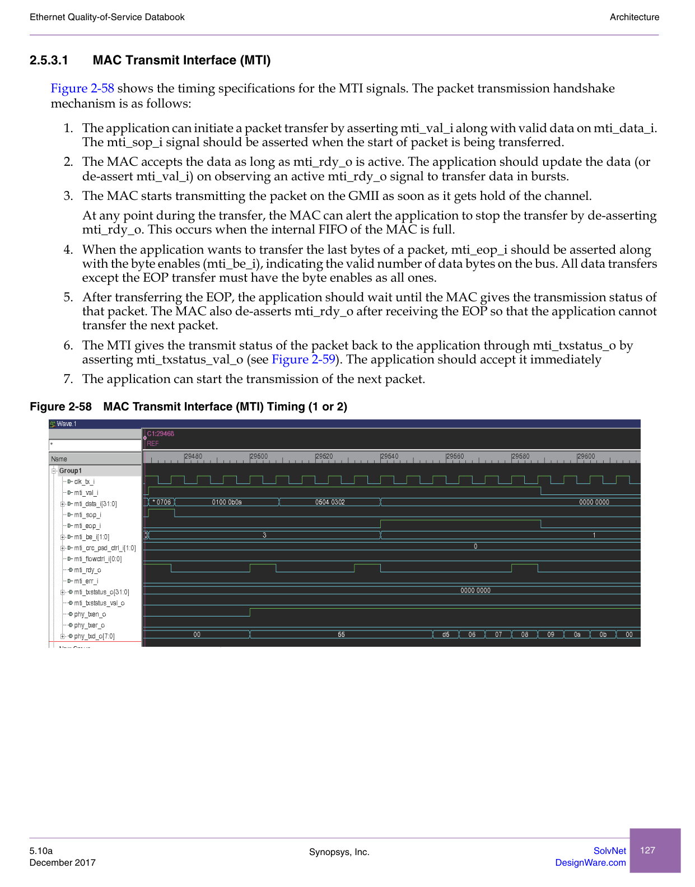

1. The application can initiate a packet transfer by asserting mti_val_i along with valid data on mti_data_i.
The mti_sop_i signal should be asserted when the start of packet is being transferred.
2. The MAC accepts the data as long as mti_rdy_o is active. The application should update the data (or
de-assert mti_val_i) on observing an active mti_rdy_o signal to transfer data in bursts.
3. The MAC starts transmitting the packet on the GMII as soon as it gets hold of the channel.
At any point during the transfer, the MAC can alert the application to stop the transfer by de-asserting
mti_rdy_o. This occurs when the internal FIFO of the MAC is full.
4. When the application wants to transfer the last bytes of a packet, mti_eop_i should be asserted along
with the byte enables (mti_be_i), indicating the valid number of data bytes on the bus. All data transfers
except the EOP transfer must have the byte enables as all ones.
5. After transferring the EOP, the application should wait until the MAC gives the transmission status of
that packet. The MAC also de-asserts mti_rdy_o after receiving the EOP so that the application cannot
transfer the next packet.
6. The MTI gives the transmit status of the packet back to the application through mti_txstatus_o by
asserting mti_txstatus_val_o (see Figure 2-59). The application should accept it immediately
7. The application can start the transmission of the next packet.

| Synopsys, Inc. | 127 |
| --- | --- |
| 5.10a Synopsys, Inc. SolvNet December 2017 DesignWare.com |  |

## Page 128

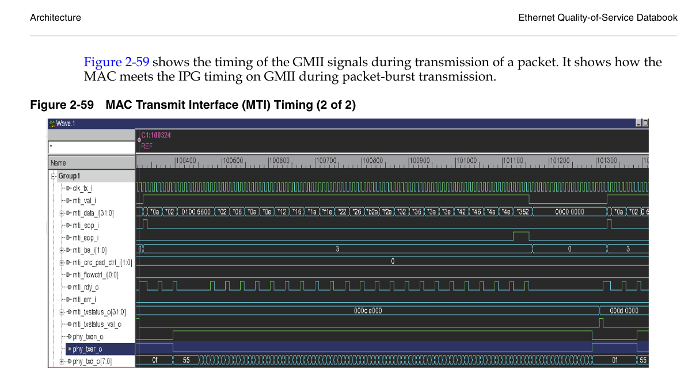

2.5.3.2
MTI With Timestamp Feature
Figure 2-60 shows the MTI timing when the IEEE 1588 timestamp feature is enabled. The
mti_ena_timestamp_i signal is sampled along with the mti_sop_i signal for an input packet. When the
packet status (0x40080000) is given on mti_txstatus_o, the timestamp captured for the packet is also output
on mti_timestamp_o. The validity of the timestamp is indicated by mti_txstatus_o[30] being asserted when
mti_txstatus_val_o is high.

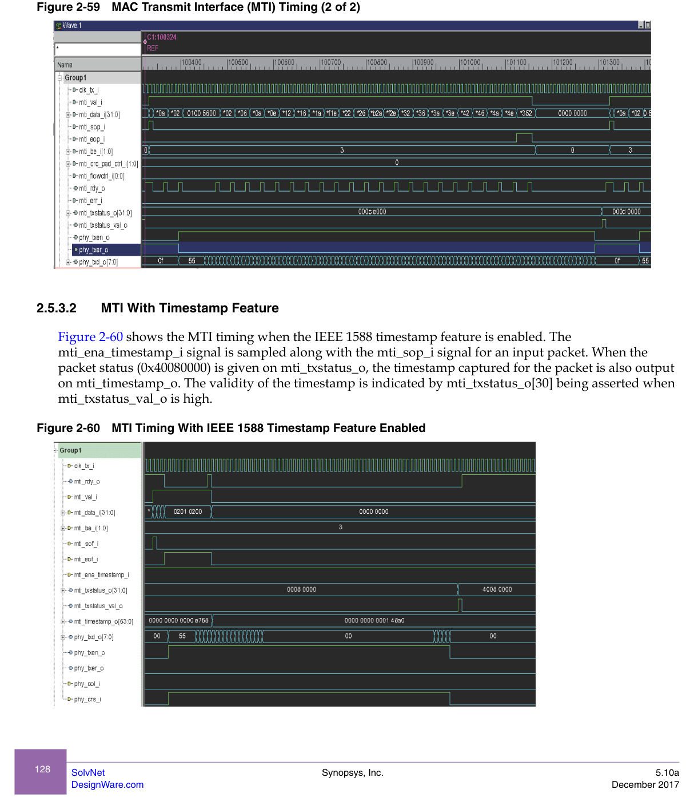

| 128 | Synopsys, Inc. |
| --- | --- |
|  | SolvNet Synopsys, Inc. 5.10a DesignWare.com December 2017 |

## Page 129

2.5.3.3
Collision During Transmission

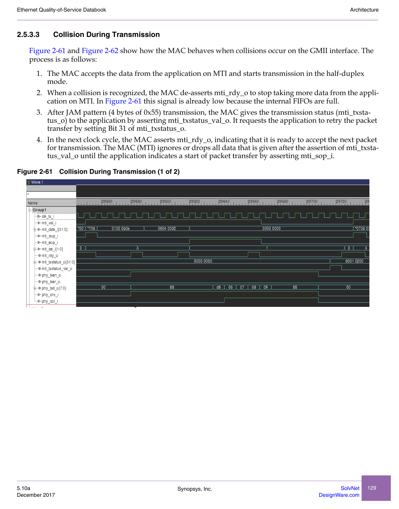

1. The MAC accepts the data from the application on MTI and starts transmission in the half-duplex
mode.
2. When a collision is recognized, the MAC de-asserts mti_rdy_o to stop taking more data from the appli-
cation on MTI. In Figure 2-61 this signal is already low because the internal FIFOs are full.
3. After JAM pattern (4 bytes of 0x55) transmission, the MAC gives the transmission status (mti_txsta-
tus_o) to the application by asserting mti_txstatus_val_o. It requests the application to retry the packet
transfer by setting Bit 31 of mti_txstatus_o.
4. In the next clock cycle, the MAC asserts mti_rdy_o, indicating that it is ready to accept the next packet
for transmission. The MAC (MTI) ignores or drops all data that is given after the assertion of mti_txsta-
tus_val_o until the application indicates a start of packet transfer by asserting mti_sop_i.

| Synopsys, Inc. | 129 |
| --- | --- |
| 5.10a Synopsys, Inc. SolvNet December 2017 DesignWare.com |  |

## Page 130

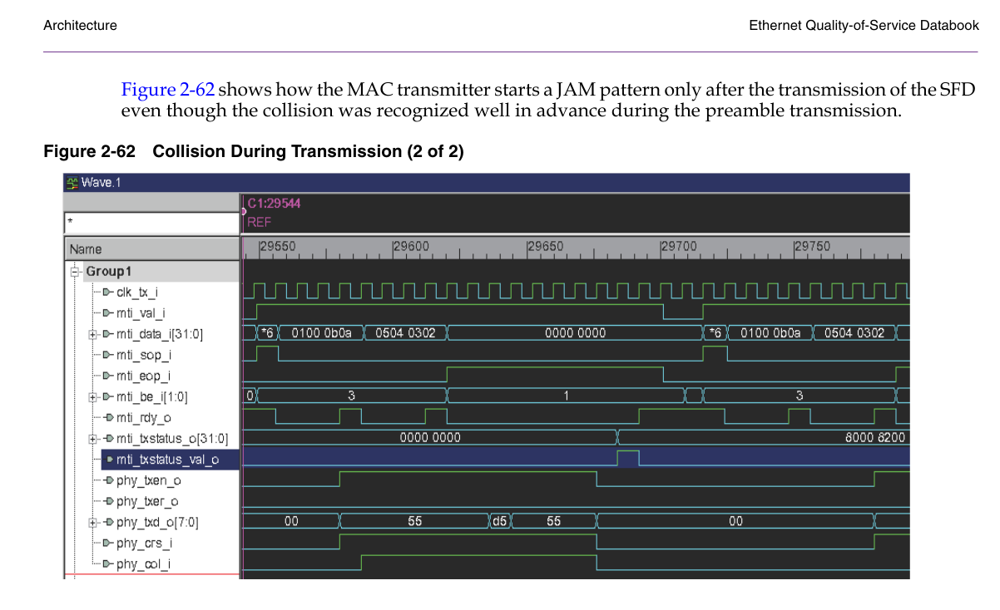

2.5.3.4
Underflow During Transmission

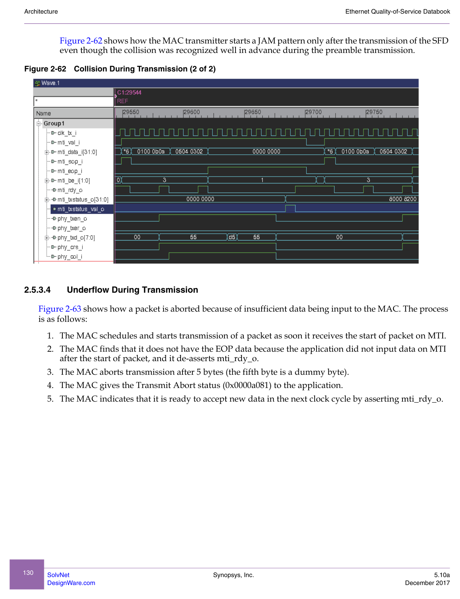

1. The MAC schedules and starts transmission of a packet as soon it receives the start of packet on MTI.
2. The MAC finds that it does not have the EOP data because the application did not input data on MTI
after the start of packet, and it de-asserts mti_rdy_o.
3. The MAC aborts transmission after 5 bytes (the fifth byte is a dummy byte).
4. The MAC gives the Transmit Abort status (0x0000a081) to the application.
5. The MAC indicates that it is ready to accept new data in the next clock cycle by asserting mti_rdy_o.

| 130 | Synopsys, Inc. |
| --- | --- |
|  | SolvNet Synopsys, Inc. 5.10a DesignWare.com December 2017 |

## Page 131

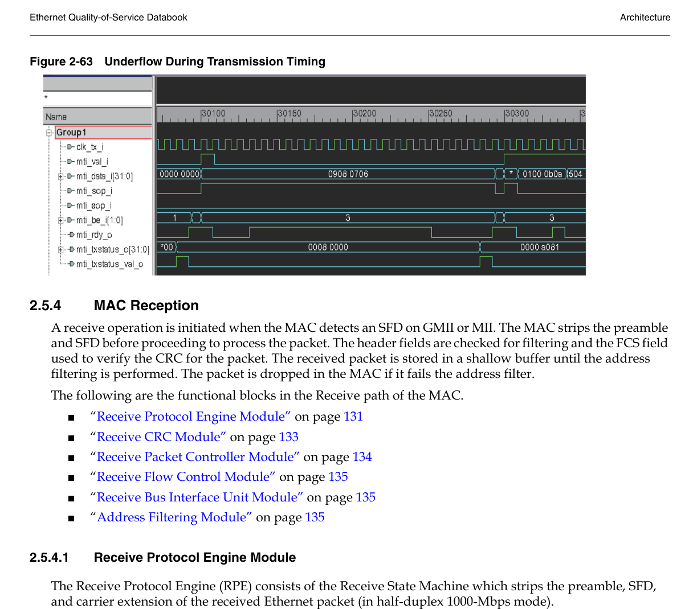

### 2.5.4

### MAC Reception

A receive operation is initiated when the MAC detects an SFD on GMII or MII. The MAC strips the preamble
and SFD before proceeding to process the packet. The header fields are checked for filtering and the FCS field
used to verify the CRC for the packet. The received packet is stored in a shallow buffer until the address
filtering is performed. The packet is dropped in the MAC if it fails the address filter.
The following are the functional blocks in the Receive path of the MAC.
“Receive Protocol Engine Module” on page 131
“Receive CRC Module” on page 133
“Receive Packet Controller Module” on page 134
“Receive Flow Control Module” on page 135
“Receive Bus Interface Unit Module” on page 135
“Address Filtering Module” on page 135
2.5.4.1
Receive Protocol Engine Module
The Receive Protocol Engine (RPE) consists of the Receive State Machine which strips the preamble, SFD,
and carrier extension of the received Ethernet packet (in half-duplex 1000-Mbps mode).

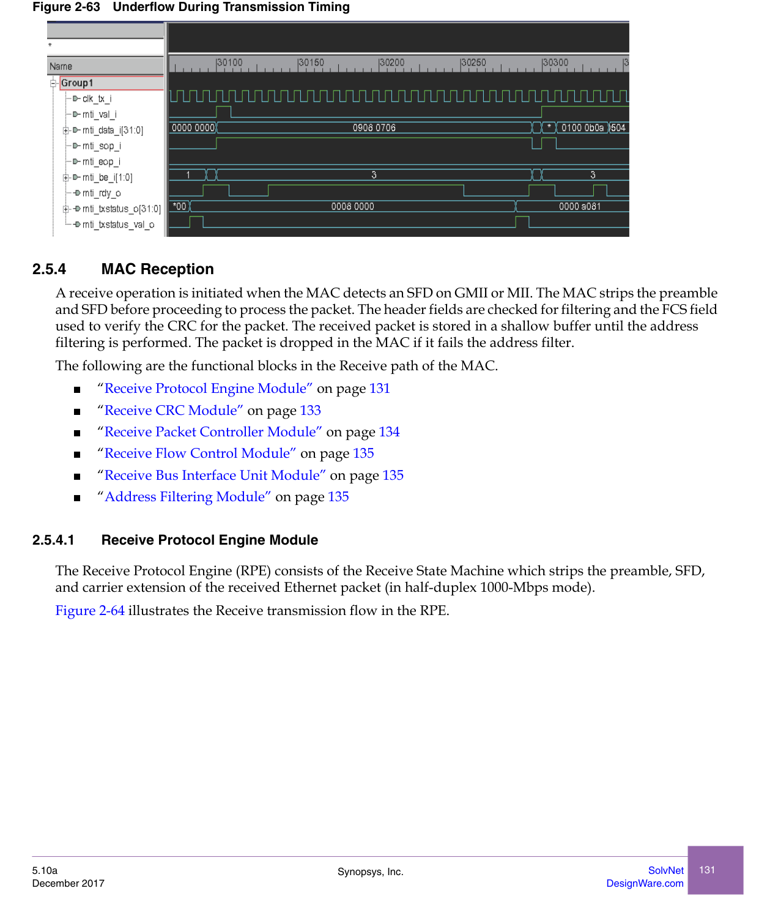

| Synopsys, Inc. | 131 |
| --- | --- |
| 5.10a Synopsys, Inc. SolvNet December 2017 DesignWare.com |  |

## Page 132

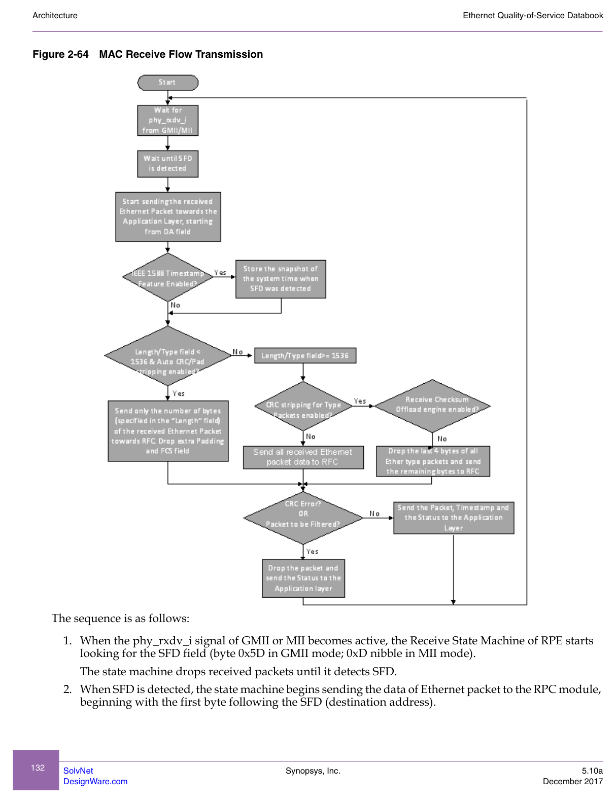

The sequence is as follows:
1. When the phy_rxdv_i signal of GMII or MII becomes active, the Receive State Machine of RPE starts
looking for the SFD field (byte 0x5D in GMII mode; 0xD nibble in MII mode).
The state machine drops received packets until it detects SFD.
2. When SFD is detected, the state machine begins sending the data of Ethernet packet to the RPC module,
beginning with the first byte following the SFD (destination address).

| 132 | Synopsys, Inc. |
| --- | --- |
|  | SolvNet Synopsys, Inc. 5.10a DesignWare.com December 2017 |

## Page 133

3. If IEEE 1588 Timestamp feature is enabled, the RPE takes a snapshot of the system time at which SFD
of any packet is detected on GMII or MII. If this packet is not dropped during MAC filtering, the time-
stamp is passed to the application. In MII mode, the RPE converts the received nibble data into bytes
and forwards the valid packet data to the RFC module.
4. The Receive State Machine of the RPE module decodes the Length/Type field of the receiving Ethernet
packet.
If the Length/Type field is less than 1,536 and if the MAC is programmed for the Auto CRC/Pad Strip-
ping (Bit 20 of the MAC_Configuration register), the state machine sends the data of the packet up to
the count specified in the Length/Type field and starts dropping bytes (including the FCS field). The
state machine of the RPE module decodes the Length/Type field and checks for the Length interpreta-
tion.
In Audio Video (AV) or Data Center Bridging (DCB) mode, when you select additional Rx queues, the
packets that are less than or equal to 16 bytes in length after pad stripping, always get dropped inside
the MAC receiver. This happens even if the packets have passed the address filter and have no CRC
error.

|  | Note |
| --- | --- |

If the Length/Type field is greater than or equal to 1,536, the RPE module sends all received Ethernet
packet data to the RFC module if you have not enabled the CRC stripping for Type packet in Bit 21 of
the MAC_Configuration register. However, if you have enabled the CRC stripping for Type packets
and not enabled the Receive Checksum Offload Engine, the MAC strips and drops the last 4 bytes of all
packets of Ether type before forwarding the packets to the application.
5. By default, the MAC is programmed for watchdog timer to be enabled, that is, packets above 2,048
(10,240 if Jumbo Packet is enabled) bytes (DA + SA + LT + DATA + PAD + FCS) are cut off at the RPE
module. In addition, you can use a programmable watchdog timer (Bit 16 of MAC_Watchdog_Timeout
register) to override the fixed timeout of 2,048 or 10,240 bytes. You can disable the watchdog timer by
programming Bit 19 of MAC_Configuration register. However, even if the watchdog timer is disabled,
a packet greater than 32 KB size is cut off and a watchdog timeout status is given.
At the end of every received packet, the RPE module generates received packet status and sends it to the
RPC module. Control, missed packet, and filter fail status are added to the receive status in the RPC
module.
In half-duplex mode, the first packet in a burst should be at least slot time in length. If the first packet
is smaller than the slot time, the MAC considers the bytes received up to the slot time as first packet,
which results in CRC error for the packet.

|  | Note |
| --- | --- |

Packet bursting is applicable only for the GMII half-duplex mode. It is not applicable in the MII and
GMII full-duplex modes. In the GMII half-duplex mode, the size of the first packet in a packet burst
should at least be equal to the slot time. If the first packet (including carrier extension) is less than
the slot time, the MAC considers all data bytes, received for the first packet and subsequent
packets, which end immediately after the slot time is reached as first packet in the burst. This may
result in CRC error. However, if the packet burst ends (both RXDV and RXER go low) before the
slot time, the subsequent packet is considered as a new packet. This behavior is according the
IEEE 802.3.
2.5.4.2
Receive CRC Module
The MAC Receive CRC (CRX) interfaces with the RPE module to check any CRC error in the packet being
received.

| Synopsys, Inc. | 133 |
| --- | --- |
| 5.10a Synopsys, Inc. SolvNet December 2017 DesignWare.com |  |

## Page 134

The Receive CRC (CRX) interfaces with the RPE module to check any CRC error in the packet being
received. This module calculates the 32-bit CRC for received packet that includes the Destination address
field through the FCS field.
The encoding is defined by the following generating polynomial:
G (x) = x32 + x26 + x23 + x22 + x16 + x12 + x11 + x10 + x8 + x7 + x5 + x4 + x2 + x + 1
The module gets the data from the RPE module (DA+SA+LT+DATA+PAD+FCS). The RPE module also
sends a control signal that indicates the validity of the data. Irrespective of the Auto Pad or CRC strip, the
CRX module receives the entire packet to compute the CRC check for received packet.
2.5.4.3
Receive Packet Controller Module
The MAC Receive Packet Controller (RPC) receives the Ethernet packet data and status from the RPE
module.
The Receive Packet Controller (RPC) receives the Ethernet packet data and status from the RPE module.
The RPC module consists of a FIFO of parameterized depth (default set to 4 deep and 33-bits wide) and two
state machines for writing and reading the FIFO. The FIFO holds the received Ethernet packet data and byte
enables, along with a control bit to indicate the last data. The state machines manage the FIFO and provide a
packet buffering for the Ethernet packet being received from the RPE module. The following are main
functions of the RPC module:
Converting Data path — converts 8-bit data to 32-bit data to the RBU module
Packet filtering
Attaching the calculated IP Checksum input from IPC
Updating the Receive Status and forwarding it to RBU
If RA bit of the MAC_Packet_Filter register is set, the RPC module initiates the data transfer to the RBU
module when 4 bytes of Ethernet data are received from the RPE module. At the end of the data transfer, the
RPC module sends out the received packet status that includes the packet filter bits (SA Filterfail and DA
Filterfail) and status from the RPC module. These bits are generated based on the filter-fail signals from the
AFM module. This status bit indicates to the application whether the received packet has passed the filter
controls (both address filter and Packet Filter controls from CSR). The RPC module does not drop any
packet on its own in this mode.
If the RA bit is reset, the RPC module performs packet filtering based on the destination or source address.
If the application does not want to receive any bad packets such as runt, CRC error packets, the application
still needs to perform another level of filtering. The RPC module waits to receive the first 14 bytes of
received data (type field) from the RPE module. Until then, the module does not initiate any transfers to the
RBU module. After receiving the destination or source address bytes, the RPC checks the filter-fail signal
from the AFM module for an address match. On detecting filter-fail from AFB, the packet is dropped at the
RPC module and not transferred to the application.
On a delayed filter response from the AFM (this can only occur if you change the AFM logic), the RPC
module waits until the FIFO is full, and then proceeds with the packet transfer to the RBU module.
However, the RPC module still takes the delayed response from the AFM module and if it is a (DA or SA)
filter failure, it drops the rest of the packet and sends the Rx Status Word (with zero packet-length, CRC
Error and Runt Error bits set) immediately indicating the filter fail. If there is no response from the AFM
until EOP is transmitted, the filter fail status in the Rx Status Word is updated accordingly.

| 134 | Synopsys, Inc. |
| --- | --- |
|  | SolvNet Synopsys, Inc. 5.10a DesignWare.com December 2017 |

## Page 135

When the optional PMT module is present and configured for power-down mode, this block drops all
received packets and does not forward the packets to the application.
2.5.4.4
Receive Flow Control Module
The Receive Flow Controller (FRX) detects the Pause packet being received and pauses the packet
transmission for the delay specified within the received Pause packet. The FRX module is enabled only in
the full-duplex mode.
2.5.4.5
Receive Bus Interface Unit Module
The Receive Bus Interface Unit (RBU) converts the 32-bit data received from the RPC module into a 32-bit,
64-bit, or 128-bit FIFO protocol on the Application side. The RBU module interfaces with the application
through the MAC receive interface (MRI). This block also performs the endian conversion if the EQOSCORE
is configured for big-endian mode.
If IEEE 1588 Timestamp feature is enabled, the RBU module also outputs the timestamp captured from the
received packet, along with the status on the mri_timestamp_o bus in EQOS-CORE configuration. The
value on this bus is valid when the mri_eop_o signal is asserted.
2.5.4.6
Address Filtering Module
The Address Filtering (AFM) module performs the destination and source address checking function on all
received packets and reports the address filtering status to the RPC module.
The address checking is done based on different parameters (Packet Filter register) chosen by the
application. These parameters are inputs to the AFM module as control signals, and the AFM module
reports the status of the address filtering based on the combination of these inputs. The AFM module does
not filter the receive packets but reports the status of the address filtering (whether to drop the packet or
not) to the RFC module. The AFM module also reports address filter status and whether the received packet
is a multicast packet or a broadcast packet.
The AFM module probes the 8-bit receive data path between the RPE module and the RFC module and
checks the destination and source address field of each incoming packet. In GMII mode, the module takes
8/14 clocks (from the start of packet) to compare the destination/source address of the packet being
received. Similarly, in MII mode, the module takes 14/26 clocks (from the start of packet) to compare the
destination or source address of the receiving packet. The AFM module gets the physical (MAC) address of
the station and the Multicast Hash table from CSR module for address checking. The CSR module provides
the Packet Filter register parameters to AFM.

### 2.5.5

### MAC Receive Interface Protocol

The MRI interface connects the application to the receive data path of the MAC with a simple FIFO-protocol
interface. The RBU initiates an Ethernet packet transfer by asserting the mri_sop_o along with the data
(mri_data_o). All valid data transfers are indicated by an active high on the mri_val_o signal. The RBU
module transfers the last data of the packet by driving the signal mri_eop_o along with the data. The
number of byte lanes having valid data in the last transfer (EOP) is indicated by the mri_be_o[3:0] signal.
The encoded values of mri_be_o is the same as for mti_be_i as given in Table 2-16. The 112-bit Receive status
(mri_rxstatus_o, described in Table 2-16) is also valid along with the EOP data transfer.

| Synopsys, Inc. | 135 |
| --- | --- |
| 5.10a Synopsys, Inc. SolvNet December 2017 DesignWare.com |  |

## Page 136

The MAC always assumes that the application accepts the data output by it in one clock cycle. Therefore, it
does not have any acknowledgment from the application before performing the next data transfer.
Table 2-16
Receive Status at the MAC Interface

| Bit | Description |
| --- | --- |
| 127:112 | Inner VLAN Tag These bits contain the Inner VLAN Tag stripped from the received packet and validated by Bit 26. This field is not available when the Enable Double VLAN Processing option is not selected. |
| 111:96 | Outer VLAN Tag These bits contain the Outer VLAN Tag stripped from the received packet and validated by Bit 25. |
| 95:80 | OAM Sub-Type Code, or MAC Control Packet opcode ■ OAM Sub-Type Code: If Bits[18:16] are set to 3'b111, this field contains the OAM sub-type and code fields. ■ MAC Control Packet opcode: If Bits[18:16] are set to 3'b110, this field contains the MAC Control packet opcode field. |
| 79 | Reserved |
| 78 | Timestamp Available If timestamp is present, when set, this bit indicates that the timestamp comes after the Rx status. The timestamp on Rx status is capture and provided in Rx status only for the valid Ethernet packets, that do not have any of the following errors: ■ Gaint packet error ■ Length error ■ CRC error ■ Invalid code error ■ watchdog timeout error |
| 77 | PTP Version When set, this bit indicates that the received PTP message has the IEEE 1588 version 2 format in the version field. When reset, it indicates the version 1 format in the version field. This bit is valid only if the Message Type is non-zero. |
| 76 | PTP Packet Type When set, this bit indicates that the PTP message is sent directly over Ethernet. |

| 136 | Synopsys, Inc. |
| --- | --- |
|  | SolvNet Synopsys, Inc. 5.10a DesignWare.com December 2017 |

## Page 137

| Bit | Description |
| --- | --- |
| 75:72 | PTP Message Type These bits are encoded to give the type of the message received: ■ 0000: No PTP message received ■ 0001: SYNC (all clock types) ■ 0010: Follow Up (all clock types) _ ■ 0011: Delay Req (all clock types) _ ■ 0100: Delay Resp (all clock types) _ ■ 0101: Pdelay Req (in peer-to-peer transparent clock) _ ■ 0110: Pdelay Resp (in peer-to-peer transparent clock) _ ■ 0111: Pdelay Resp Follow Up (in peer-to-peer transparent clock) _ _ _ ■ 1000: Announce ■ 1001: Management ■ 1010: Signaling ■ 1011-1110: Reserved ■ 1111: PTP packet with Reserved message type |
| 71 | IP Payload Error When this bit is set, it indicates either of the following: ■ The 16-bit IP payload checksum (that is, the TCP, UDP, or ICMP checksum) calculated by the MAC does not match the corresponding checksum field in the received segment. ■ The TCP, UDP, or ICMP segment length does not match the payload length value in the IP Header field. ■ The TCP, UDP, or ICMP segment length is less than minimum allowed segment length for TCP, UDP, or ICMP. Bit 15 (ES) of RDES3 is not set when this bit is set. |
| 70 | IP Checksum Bypassed When set, this bit indicates that the checksum offload engine is bypassed. |
| 69 | IPv6 Packet Received When set, this bit indicates that the received packet is an IPv6 packet. |
| 68 | IPv4 Packet Received When set, this bit indicates that the received packet is an IPv4 packet. |
| 67 | IP Header Error When this bit is set, it indicates either of the following: ■ The 16-bit IPv4 header checksum calculated by the MAC does not match the received checksum bytes. ■ The IP datagram version is not consistent with the Ethernet Type value. ■ Ethernet packet does not have the expected number of IP header bytes. This bit is valid when either Bit 5 or Bit 4 is set. This bit is available when you select the Enable Receive TCP/IP Checksum Check feature. |

| Synopsys, Inc. | 137 |
| --- | --- |
| 5.10a Synopsys, Inc. SolvNet December 2017 DesignWare.com |  |

## Page 138

| Bit | Description |
| --- | --- |
| 66:64 | Payload Type These bits indicate the type of payload, encapsulated in the IP datagram, processed by the Receive Checksum Offload Engine (COE). These bits also indicate received AV frame type. ■ 3'b000: Unknown Type or COE did not process the IP or AV payload ■ 3'b001: UDP ■ 3'b010: TCP ■ 3'b011: ICMP ■ 3'b110: AV Tagged data packet ■ 3'b111: AV Tagged control packet ■ 3'b101: AV Untagged control packet ■ 3'b100: IGMP if IPv4 Packet Received status bit is set else, DCB (LLDP) Control Packet If the COE does not process the payload of IP datagram because of an IP header error or fragmented IP, it sets these bits to 3?fb000. |
| 63:61 | Layer 3 and Layer 4 Filter Number Matched These bits indicate the number of the Layer 3 and Layer 4 Filters that matched the received packet: ■ 000: Filter 0 ■ 000: Filter 1 ■ 010: Filter 2 ■ 011: Filter 3 ■ 100: Filter 4 ■ 101: Filter 5 ■ 110: Filter 6 ■ 111: Filter 7 This field is valid only when Bit 60 or Bit 59 is set high. When more than one filter matches, these bits give only the lowest filter number. |
| 60 | Layer 4 Filter Match When set, this bit indicates that the received packet matches one of the enabled Layer 4 Port Number fields.This status is given only when one of the following conditions is true: ■ Layer 3 fields are not enabled and all enabled Layer 4 fields match ■ All enabled Layer 3 and Layer 4 filter fields match When more than one filter matches, this bit gives the layer 4 filter status of filter indicated by Bits[63:61]. |
| 59 | Layer 3 Filter Match When set, this bit indicates that the received packet matches one of the enabled Layer 3 IP Address fields.This status is given only when one of the following conditions is true: ■ All enabled Layer 3 fields match and all enabled Layer 4 fields are bypassed ■ All enabled filter fields match When more than one filter matches, this bit gives the layer 3 filter status of filter indicated by Bits[63:61]. |
| 58:51 | MAC Address Match or Hash Value When Bit 50 is reset, this field contains the number of the MAC address register that matched the Destination address of the received packet. When Bit 50 is set, this field contains the hash value computed by the MAC. The bit corresponding to the hash value is set in the hash filter register indicating that the frame passed the hash filter. |

| 138 | Synopsys, Inc. |
| --- | --- |
|  | SolvNet Synopsys, Inc. 5.10a DesignWare.com December 2017 |

## Page 139

| Bit | Description |
| --- | --- |
| 50 | Hash Filter Status When set, this bit indicates that the packet passed the MAC address hash filter. Bits[58:51] indicate the hash value. |
| 49 | DA Filter Fail When set, this bit indicates that the Destination Address filter failed, that is, the packet did not pass the DA filter. |
| 48 | SA Filter Fail When set, this bit indicates that the Source Address filter failed, that is, the packet did not pass the SA filter. |
| 47 | VLAN Filter Status When set, this bit indicates that the VLAN Tag has matched one of the VLAN Tag Filters. If this bit is reset, it indicates that the VLAN Tag of the received packet passed the filter. This bit is valid only when DWC EQOS ERVFE is not enabled. _ _ If DWC EQOS ERVFE is enabled, the bit is redefined as Outer VLAN Tag Filter Status (OTS). _ _ For more details about OTS bit, see bit[15] “RDES2 Normal Descriptor (Write-Back Format)” on page 1343 |
| 46 | Inner VLAN Tag Filter Status This bit is valid only when DWC EQOS ERVFE is enabled. _ _ For more details about ITIS bit, see bit[14] “RDES2 Normal Descriptor (Write-Back Format)” on page 1343 |
| 45:35 | Reserved |
| 34 | ARP Reply Not Generated When set, it indicates that the MAC did not generate the ARP reply for received ARP request packet. This bit is set when the MAC is busy transmitting ARP reply to earlier ARP request (only one ARP request processed at a time). This bit is reserved when the Enable IPv4 ARP Offload option is not selected. |
| 33 | Inner VLAN Tag Type When set, it indicates that the Inner VLAN type is S-VLAN in the received packet. When reset, it indicates that the Inner VLAN type is C-VLAN in the received packet. This field is reserved when the Enable Double VLAN Processing option is not selected. |
| 32 | Outer VLAN Tag Type When set, it indicates that the Outer VLAN type is S-VLAN in the received packet. When reset, it indicates that the Outer VLAN type is C-VLAN in the received packet. |
| 31:27 | Reserved |
| 26 | Inner VLAN Tag Available When set, this bit indicates that the Inner VLAN Tag stripped from the received packet is available in Bits[127:112]. This field is reserved when the Enable Double VLAN Processing option is not selected. |
| 25 | Outer VLAN Tag Available When set, this bit indicates that Outer VLAN Tag stripped from the received packet is available in Bits[111:96]. |

| Synopsys, Inc. | 139 |
| --- | --- |
| 5.10a Synopsys, Inc. SolvNet December 2017 DesignWare.com |  |

## Page 140

| Bit | Description |
| --- | --- |
| 24 | CRC Error When set, this bit indicates that a cyclic redundancy check (CRC) error occurred on the received packet. |
| 23 | Giant Packet When set, this bit indicates that the packet length exceeds the maximum Ethernet specified size of 1,518, 1,522, or 2,000 bytes (9,018 or 9,022 bytes if jumbo packet enable is set). Giant packet indicates the length of a packet, and it does not cause any packet truncation. |
| 22 | Watchdog Timeout When set, this bit indicates that the RPE module received a packet with byte count greater than 2,048(10,240 if Jumbo packet is enabled) bytes (DA + SA + LT + DATA + PAD + FCS). This bit is not set if the watchdog timer is disabled in MAC Configuration register. However, even if the _ watchdog timer is disabled, this bit is set when the packet is greater than 16 KB in size. |
| 21 | Runt Packet When this bit is set, it indicates that the MAC received packets of less than 64 bytes or a collision was observed before receiving the 64th byte. |
| 20 | GMII Error When set, this bit indicates that gmii rxer i was asserted during the reception of this packet. This error _ _ also includes carrier extension error in the GMII and half-duplex mode. Error can be less/no extension error (rxd = 1f) during extension |
| 19 | Dribbling Bit When set, this bit indicates that the packet contained a non-integer multiple of eight bits (valid only in MII mode). This bit is not valid if a collision is seen or runt packet bits are set. If this bit is set and the CRC error is reset, the packet is valid. |
| 18:16 | Length/Type Field This field indicates the type of the received packet: Length packet or Type packet. The encoding is as follows: ■ 3'b000: The packet is a length packet ■ 3'b001: The packet is a type packet ■ 3'b100: The packet is a type packet with VLAN Tag ■ 3'b101: The packet is a type packet with Double VLAN Tag ■ 3'b110: The packet is a MAC Control packet type ■ 3'b111: The packet is a OAM packet type ■ 3'b010 - 3'b011: Reserved The packet type indication in this field is based on the LT field of received packet. For example, VLAN Tag or Double VLAN Tag indication does not ensure that corresponding VID matched or VLAN filter passed. |
| 15 | Reserved |

| 140 | Synopsys, Inc. |
| --- | --- |
|  | SolvNet Synopsys, Inc. 5.10a DesignWare.com December 2017 |

## Page 141

| Bit | Description |
| --- | --- |
| 14:0 | Packet Length When set, this field indicates the length (in bytes) of one or both of the following: ■ Received packet (including pad if applicable) ■ FCS field when the Auto Pad/CRC Strip bit is de-asserted When reset, it indicates the length without pad and/or FCS field. When the IP Checksum module is present and enabled by setting Bit 10 of MAC Configuration register and the received packet is not a _ MAC control packet, this field also includes the 2-byte IP Checksum appended after FCS.When Type CRC Strip bit is set, this field indicates the length without FCS field for Type packets (Length/Type >= 0x600). When VLAN Tag stripping is enabled, it indicates the length without VLAN Tag for VLAN tagged packets. For more details, see Table 2-18 on page 142 |

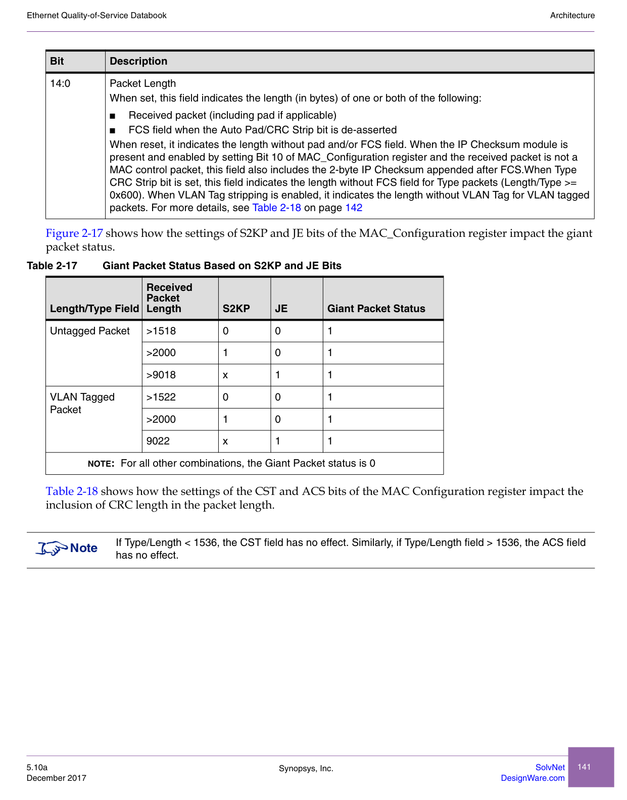

Table 2-17
Giant Packet Status Based on S2KP and JE Bits

| Length/Type Field | Received Packet Length | S2KP | JE | Giant Packet Status |
| --- | --- | --- | --- | --- |
| Untagged Packet | >1518 | 0 | 0 | 1 |
|  | >2000 | 1 | 0 | 1 |
|  | >9018 | x | 1 | 1 |
| VLAN Tagged Packet | >1522 | 0 | 0 | 1 |
|  | >2000 | 1 | 0 | 1 |
|  | 9022 | x | 1 | 1 |
| NOTE: For all other combinations, the Giant Packet status is 0 |  |  |  |  |

Table 2-18 shows how the settings of the CST and ACS bits of the MAC Configuration register impact the
inclusion of CRC length in the packet length.
If Type/Length < 1536, the CST field has no effect. Similarly, if Type/Length field > 1536, the ACS field
has no effect.

|  | Note |
| --- | --- |

| Synopsys, Inc. | 141 |
| --- | --- |
| 5.10a Synopsys, Inc. SolvNet December 2017 DesignWare.com |  |

## Page 142

Table 2-18
Packet Length Based on CST and ACS Bits

| Receive Checksum Offload Engine | Received Packet Length | CST | ACS | FCS Stripping Done |
| --- | --- | --- | --- | --- |
| IPCKSUM EN = 0 and _ IPC FULL OFFLOAD = 0 or _ _ IPCHKSUM EN = 1 and _ IPC FULL OFFLOAD = 1 _ _ | <1536 | x | 0 | No |
|  |  | x | 1 | Yes (for Ethernet packets) |
|  | >=1536 | 0 | x | No |
|  |  | 1 | x | Yes (for Type packets) |
| IPCKSUM EN = 1and _ IPC FULL OFFLOAD = 0 _ _ | <1536 | x | 0 | No |
|  |  | x | 1 | Yes (for Ethernet packets) |
|  | >= 1536 | x | x | No |

### 2.5.6

### MAC Receive Timing

This section provides timing specifications for the MAC (EQOS-CORE) interface signals in the receive path.
2.5.6.1
MAC Receive Interface (MRI)
The timing diagrams show the timing specifications for MRI signals and GMII receive interface. The
sequence of events is as follows:
1. The MAC receives packets on the (G)MII interface.
2. The MAC stores the packet until it makes the decision to filter the packet (if configured). When the
packet is passed by the filter, the MAC puts the data on mri_data_o and indicates the validity by
asserting mri_val_o. If the data corresponds to the start of a packet, the MAC also asserts mri_sop_o.
3. The application must accept the data as soon as the MAC presents it because the MAC may output the
next data (if available) in the next clock cycle.
4. The MAC indicates transfer of the end-of-packet data with the assertion of mri_eop_o. The mri_be_o
signal may also have a non all-one value during the EOP, showing how many lanes on the data bus
have valid data.
5. The MAC updates the receive status bits on mri_rxstatus_o during the transfer of the EOP.

| 142 | Synopsys, Inc. |
| --- | --- |
|  | SolvNet Synopsys, Inc. 5.10a DesignWare.com December 2017 |

## Page 143

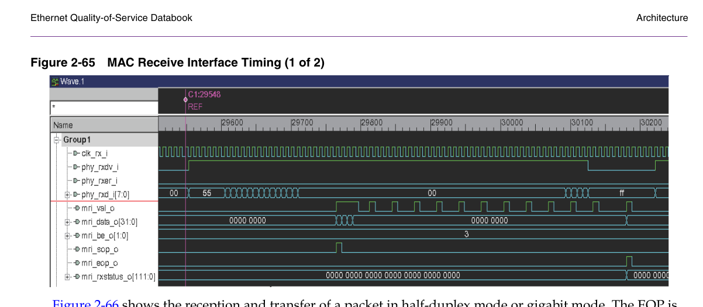

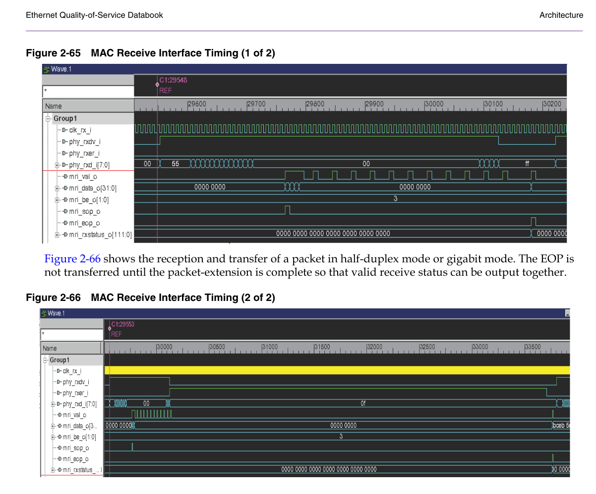

2.5.6.2
Packet Reception With Timestamp Feature Enabled

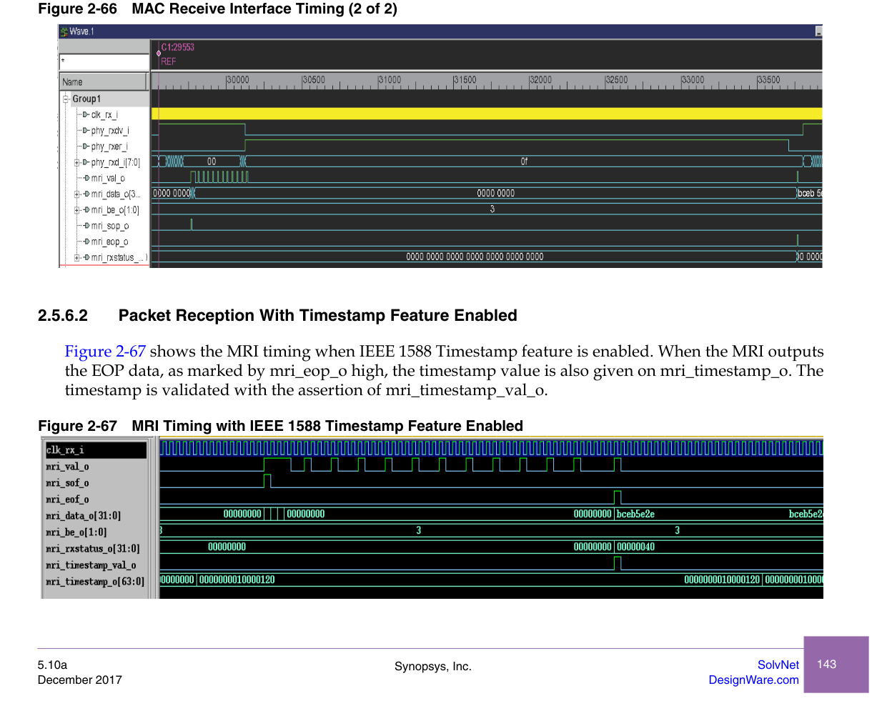

| Synopsys, Inc. | 143 |
| --- | --- |
| 5.10a Synopsys, Inc. SolvNet December 2017 DesignWare.com |  |

## Page 144

2.5.6.3
Packet Transmission and Reception

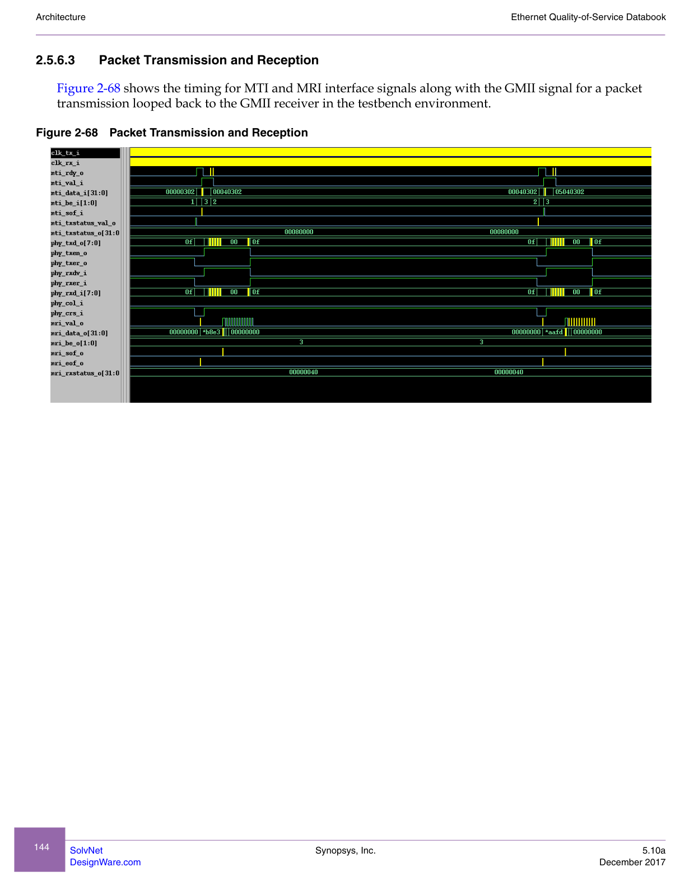

| 144 | Synopsys, Inc. |
| --- | --- |
|  | SolvNet Synopsys, Inc. 5.10a DesignWare.com December 2017 |

## Page 145

### Interrupts

Interrupts can be generated as a result of various events in the DWC_ether_qos controller. These events are
captured in status registers, and interrupt enables are provided for each source of an interrupt such that the
interrupt signal (sbd_intr_o) is asserted for an event only when the corresponding interrupt enable is set.
In EQOS-AXI configuration, the interrupt status and corresponding enable registers are organized in an
hierarchical manner so that it is easier for software to traverse and identify the source of an interrupt event
quickly. When sbd_intr_o is asserted, the DMA_Interrupt_Status register is the first level that indicates the
major blocks for the interrupt event source. This register is read-only, and it contains bits corresponding to
each DMA channel (TX and RX pair), the MTL, and the MAC. The software application must then read one
(or more) of the following registers corresponding to the bits that are set:
MAC_Interrupt_Status register
MTL_Interrupt_Status register
DMA_CH(#i)_Status (for i = 0; i <= DWC_EQOS_NUM_DMA_TX_CH-1) register

### 2.6.1

### Interrupts from the MAC

Interrupts can be generated from the MAC as a result of various events in the MAC Receiver, Transmitter,
or the optional modules/functions such as RMON counters, EEE and so on.
In EQOS-CORE and EQOS-MTL configurations, mci_intr_o is the interrupt signal. In EQOS-DMA and
EQOS-AHB configurations, these interrupt events are combined with the events in the DMA on the
sbd_intr_o signal. The MAC interrupts are of level type, that is, the interrupt remains asserted (high) until it
is cleared by the application or software.
The MAC_Interrupt_Status register describes the events that can cause an interrupt from the MAC. The
MAC interrupts are disabled by default. Each event can assert the interrupt on the mci_intr_o or sbd_intr_o
signals when the corresponding bit is set in the MAC_Interrupt_Enable register.
The interrupt register bits only indicate the block from which the event is reported. You must read the
corresponding status registers and other registers to clear the interrupt. For example, when set high, Bit 0 of
the MAC_Interrupt_Status register indicates that the link status on the RGMII, SGMII, or SMII interface has
changed. You must read the MAC_PHYIF_Control_Status register to clear this interrupt event.
The interrupts from the RGMII, SGMII, SMII, and PCS blocks and the optional General Purpose Inputs are
combined (OR’ed) and given as the GLI bit in the DMA_Interrupt_Status register.

| Synopsys, Inc. | 145 |
| --- | --- |
| 5.10a Synopsys, Inc. SolvNet December 2017 DesignWare.com |  |

## Page 146

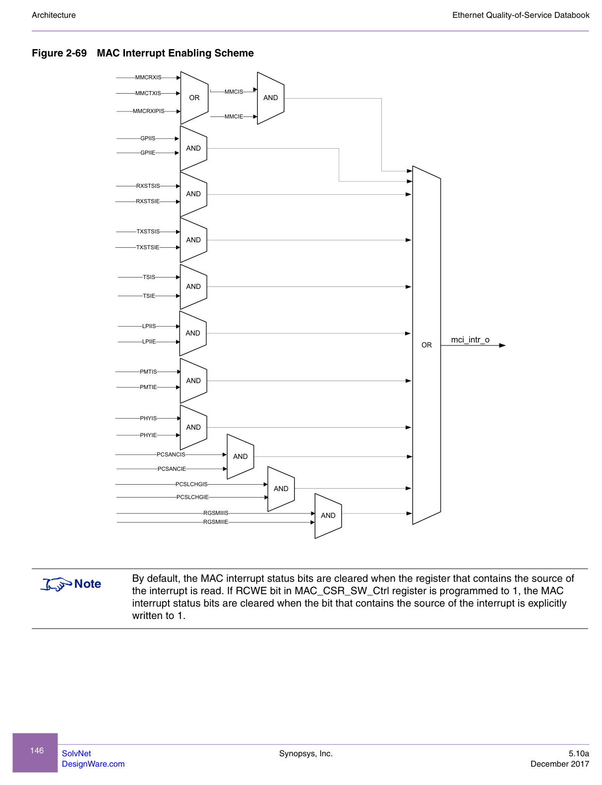

MMCRXIS
MMCIS
MMCTXIS
MMCRXIPIS
MMCIE
GPIIS
GPIIE
RXSTSIS
RXSTSIE
TXSTSIS
TXSTSIE
TSIS
TSIE
LPIIS
mci_intr_o
LPIIE
PMTIS
PMTIE
PHYIS
PHYIE
PCSANCIS
PCSANCIE
PCSLCHGIS
PCSLCHGIE
RGSMIIIS
RGSMIIIE
By default, the MAC interrupt status bits are cleared when the register that contains the source of
the interrupt is read. If RCWE bit in MAC_CSR_SW_Ctrl register is programmed to 1, the MAC
interrupt status bits are cleared when the bit that contains the source of the interrupt is explicitly
written to 1.

|  | Note |
| --- | --- |

| 146 | Synopsys, Inc. |
| --- | --- |
|  | SolvNet Synopsys, Inc. 5.10a DesignWare.com December 2017 |

## Page 147

### 2.6.2

### Interrupts from MTL

DWC_ether_qos can generate interrupts as a result of events in the MAC layer or in the MTL modules. In
the EQOS-MTL configuration, the mci_intr_o output is the interrupt signal, which is a level signal (asserted
until the interrupt source is read and cleared). In the MTL, the interrupts are mainly related to exception
events in the TxQ or RxQ in the Transmit and Receive paths respectively. The interrupt status are captured
and organized in a hierarchical manner in order to identify the root cause quickly.
The MTL_Interrupt_Status register identifies the top level modules that can cause the interrupt to be
asserted.
Bits[7:0] identify 8 Queues (Tx or Rx). They are read-only bits and the application should read the
corresponding MTL_Q[n]_Interrupt_Status register to identify the exact cause and set the corre-
sponding bits to 1’b1 to clear the interrupt event. The assertion of mci_intr_o due to these events is
enabled by the corresponding enable bits in MTL_Q[n]_Interrupt_Enable register.
Bit[16] is made high in case the event is present in the MAC core. The application should in turn read
the MTL_Interrupt_Status register to identify the cause. For more information, see “Interrupts from
the MAC” on page 145.
Bit[17] is related to indirect access completion events to the TxFIFO and RxFIFO memory in Debug
Mode. For more information, see “Accessing Memory In Slave/Debug Mode” on page 161.

### 2.6.3

### Interrupts from DMA

As shown in Figure 2-70, sbd_intr_o interrupt is a level signal and gets de-asserted only when all the
enabled interrupt events are cleared in their respective status registers and correspondingly all the bits in
the DMA_Interrupt_Status register are cleared.

| Synopsys, Inc. | 147 |
| --- | --- |
| 5.10a Synopsys, Inc. SolvNet December 2017 DesignWare.com |  |

## Page 148

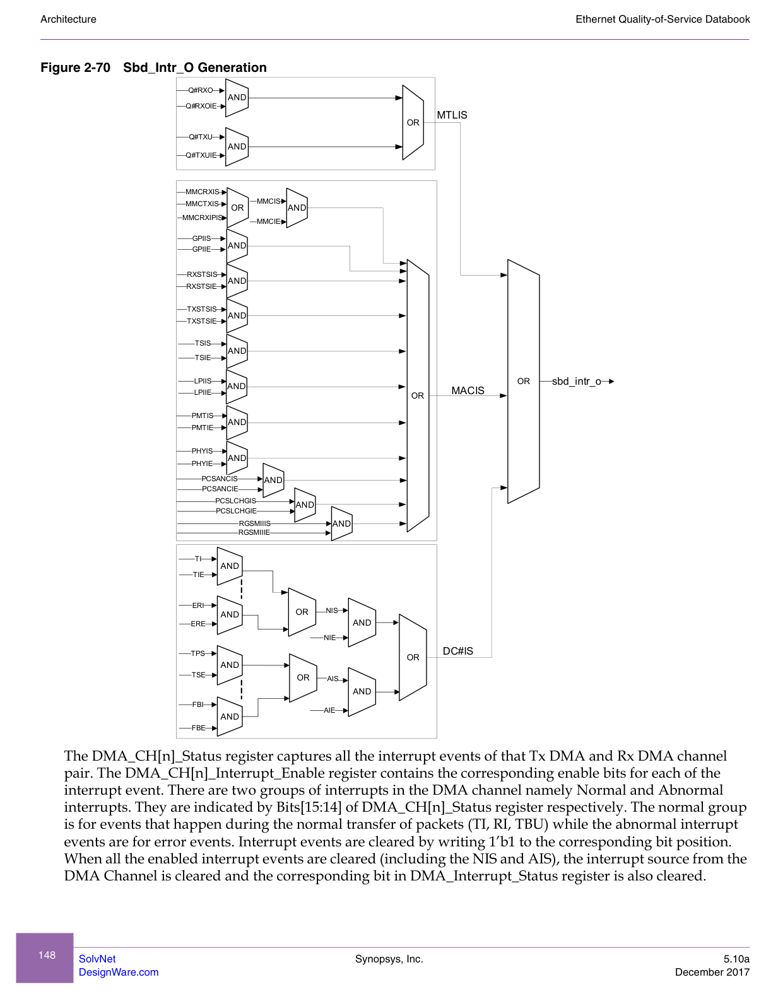

Q#RXO
Q#RXOIE
MTLIS
Q#TXU
Q#TXUIE

| MMCRXIS MMCTXIS OR MMCIS AND MMCRXIPIS MMCIE GPIIS GPIIE AND RXSTSIS AND RXSTSIE TXSTSIS AND TXSTSIE TSIS AND TSIE LPIIS AND LPIIE OR PMTIS AND PMTIE PHYIS AND PHYIE PCSANCIS AND PCSANCIE PCSLCHGIS AND PCSLCHGIE RGSMIIIS AND RGSMIIIE |  |  |  |
| --- | --- | --- | --- |
|  | PCSANCIS |  |  |
|  | PCSANCIE |  |  |
|  |  | CSLCHGIS |  |
| P |  | CSLCHGIE |  |
| RGSMIIIS |  |  |  |
|  |  |  | RGSMIIIS |
| R |  |  |  |
|  |  |  | GSMIIIE |
|  |  |  |  |
| TI AND TIE ERI AND OR NIS ERE AND NIE TPS OR AND TSE OR AIS AND FBI AIE AND FBE |  |  |  |

|  | MCRXIS |
| --- | --- |
|  |  |
| MMCTXIS MMCRXIPI |  |
| GPIIS |  |
|  |  |
| GPIIE RXSTSIS |  |
| R | XSTSIE |
| TXSTSIS |  |
|  | XSTSIS |
| T |  |
|  | XSTSIE |
| TSIS |  |
| TSIE |  |
| LPIIS |  |
|  | LPIIE |
|  |  |
|  | PMTIS PMTIE |
| PHYIS |  |
| PHYIE |  |

sbd_intr_o
MACIS
DC#IS
The DMA_CH[n]_Status register captures all the interrupt events of that Tx DMA and Rx DMA channel
pair. The DMA_CH[n]_Interrupt_Enable register contains the corresponding enable bits for each of the
interrupt event. There are two groups of interrupts in the DMA channel namely Normal and Abnormal
interrupts. They are indicated by Bits[15:14] of DMA_CH[n]_Status register respectively. The normal group
is for events that happen during the normal transfer of packets (TI, RI, TBU) while the abnormal interrupt
events are for error events. Interrupt events are cleared by writing 1’b1 to the corresponding bit position.
When all the enabled interrupt events are cleared (including the NIS and AIS), the interrupt source from the
DMA Channel is cleared and the corresponding bit in DMA_Interrupt_Status register is also cleared.

| 148 | Synopsys, Inc. |
| --- | --- |
|  | SolvNet Synopsys, Inc. 5.10a DesignWare.com December 2017 |

## Page 149

Interrupts are not queued. If the same interrupt event occurs again before the driver responds to the
previous one, no additional interrupts are generated. For example, Receive Interrupt Bit[6] of
DMA_CH[n]_Status register indicates that one or more packets were transferred to the application buffer.
The driver must scan all descriptors, from the last recorded position to the first one, owned by the DMA to
determine how many packets are received.
An interrupt is generated only once for multiple events. The driver must scan the DMA_Interrupt_Status
register for the cause of the interrupt and clear the source in the respective Status register. The sbd_intr_o is
cleared only when all the bits of DMA_Interrupt_Status register are cleared.
2.6.3.1
Periodic Scheduling of Transmit and Receive Interrupt
To improve the throughput and performance, DWC_ether_qos supports interrupt timer and transmit
descriptor to generate interrupts periodically, instead of every DMA transfer.
It is not preferable to generate interrupts for every packet transferred by DMA (RI and TI) for system
throughput performance reasons. The DWC_ether_qos gives the flexibility to schedule the interrupt at
regular intervals using two methods:
Set Interrupt on Completion bit in Transmit descriptor (TDES2[31]) once for every “required” number
of packets to be transmitted.
Similarly, set the IOC (RDES3[30] in Table 19-21) bit only at some specific intervals of Receive descrip-
tors. This way, whenever a received packet transfer to system memory is complete and any of the
descriptors used for that packet transfer has the IOC bit set, only then the RI event is generated.
In addition to above, an interrupt timer (DMA_CH[n]_Rx_Interrupt_Watchdog_Timer) is given for flexible
control and periodic scheduling of Receive Interrupt. When this interrupt timer is programmed with a
nonzero value, it gets activated as soon as the Rx DMA completes a transfer of a received packet to system
memory without asserting the Receive Interrupt because the corresponding interrupt of completion IOC bit
(RDES3[30] in Table 19-21) is not set. When this timer runs out as per the programmed value, RI bit is set
and the interrupt is asserted if the corresponding RIE is enabled in DMA_CH[n]_Interrupt_Enable
register.The timer is stopped and cleared before it expires, if the RI is set for a packet transfer whose
descriptor’s IOC was set. The timer is reactivated automatically after the next packet transfer is complete
without the RI event being generated.
2.6.3.2
Per Channel Transfer Complete Interrupt
The Transmit Transfer complete interrupt (TI) and Receive Transfer complete interrupt (RI) is reflected in
DMA_CH[n]_Status register. The TI bit is set whenever the Tx DMA channel closes the transmit descriptor
in which the IOC (Interrupt On Completion - TDES2[31]) bit is set. Similarly, the RI bit is set whenever the
Rx DMA channel closes the receive descriptor with LD bit set and in any of the descriptors used for
transferring that packet, IOC (Interrupt Enable on completion - RDES3[30]) bit is set.
The common sbd_intr_o output signal is asserted for the Transfer complete interrupts only when the
corresponding interrupts are enabled in DMA_CH[n]_Interrupt_Enable register.
EQOS-AXI also supports the following per Channel Transfer Complete interrupt signals.
sbd_perch_tx_intr_o[] (Transmit Per Channel Interrupts)
sbd_perch_rx_intr_o[] (Receive Per Channel Interrupts)

| Synopsys, Inc. | 149 |
| --- | --- |
| 5.10a Synopsys, Inc. SolvNet December 2017 DesignWare.com |  |

## Page 150

The behavior of the RI/TI/ sbd_perch_tx_intr_o[]/sbd_perch_rx_intr_o[] changes depending on the
settings of INTM field bit[17:16] in DMA_Mode. Table 2-19 explains the Transfer Complete Interrupt
behavior.
Table 2-19
DWC_ether_qos Transfer Complete Interrupt Behavior

| Sl No | Interrupt Mode | Behavior of the sbd perch tx intr o[] and _ _ _ _ sbd perch rx intr o[] _ _ _ _ | Behavior of TI/RI and sbd intr o _ _ |
| --- | --- | --- | --- |
| 1. | INTRM=0 | A pulse is asserted on these output signals when corresponding TX/RX transfer complete event (for which IOC descriptor bits are enabled) is detected, irrespective of the corresponding interrupt status. | The TI/RI status signals are set whenever the “Transfer complete” event is detected. The bits get cleared whenever the software driver writes‘1’ to these bits. The sbd intr o is _ _ asserted when ever the corresponding interrupts are also enabled inDMA CH[n] Interrupt Enable register. _ _ _ |
| 2. | INTM=1 | These signals reflect the value of corresponding TI/RI bits in DMA CH[n] Status register when _ _ the corresponding interrupt enable is set. Hence they are level signals and are cleared by the application by writing 1’b1 to the RI/TI status bits. This signal will not be asserted when the corresponding interrupt enable bit is not set. | The TI/RI is set as explained above.However, the sbd intr o signal and NIS status bit are not _ _ asserted for any RI/TI events. |
| 3. | INTM=2 | In this mode, RI/TI interrupts are queued. These signals reflect the value of corresponding TI/RI bits inDMA CH[n] Status register when the _ _ corresponding interrupt enable is set. They are level signals and cleared by software by writing 1’b1 to the RI/TI status bits. However, it is set again if another TI/RI event(s) is detected before the TI/RI bits are cleared forthe previous event. | The RI/TI status bits are set whenever the Transfer Complete event is detected and gets reset whenever software driver clears those bits by writing 1. However, if another Transfer Complete event is detected before it is cleared (serviced) by the software, then DWC ether qos automatically set these status _ _ bits again.However, the sbd intr o signal is not _ _ generated based on TI/RI |

| 150 | Synopsys, Inc. |
| --- | --- |
|  | SolvNet Synopsys, Inc. 5.10a DesignWare.com December 2017 |
